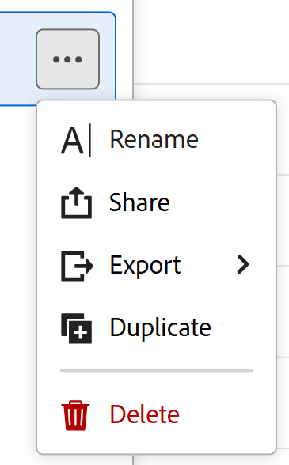

# Export records from the table view

<!--The information on this page refers to functionality not yet generally available. It is available only in the Preview environment for all customers. After the monthly releases to Production, the same features are also available in the Production environment for customers who enabled fast releases.    

For information about fast releases, see [Enable or disable fast releases for your organization](/help/quicksilver/administration-and-setup/set-up-workfront/configure-system-defaults/enable-fast-release-process.md). -->

{{planning-important-intro}}

You can export records and their information from the table view to an Excel or a CSV file in Adobe Workfront Planning. 

## Access requirements

+++ Expand to view the access requirements for the functionality in this article. 

<table style="table-layout:auto"> 
<col> 
</col> 
<col> 
</col> 
<tbody> 
    <tr> 
<tr> 
</tr>   
<tr> 
   <td role="rowheader">
Adobe Workfront package
</td> 
   <td> 

Any Workfront and any Planning package
 
Any Workflow and any Planning package

For more information about what is included in each Workfront Planning package, contact your Workfront account representative. 
 
   </td> 
  <tr> 
   <td role="rowheader">
Adobe Workfront license
</td> 
   <td>
Light or higher

   </td> 
  </tr> 
  <tr> 
   <td role="rowheader">
Object permissions
</td> 
   <td> 
View or higher permissions to a workspace and a record type
   
   
View or higher permissions to a view
  
   
   </td> 
  </tr> 
  <tr>
   <td role="rowheader">
Layout template
</td>
   <td> Users with a Light or Contributor license must be assigned a layout template that includes Planning.
   
Standard users and System Administrators have the Planning areas enabled by default.

</li></ul>
</td>
  </tr>  
</tbody> 
</table> 

For more information about Workfront access requirements, see [Access requirements in Workfront documentation](/help/quicksilver/administration-and-setup/add-users/access-levels-and-object-permissions/access-level-requirements-in-documentation.md).

+++   

<!--Old:
<table style="table-layout:auto"> 
<col> 
</col> 
<col> 
</col> 
<tbody> 
    <tr> 
<tr> 
<td> 
   
 Products
 </td> 
   <td> 
   <ul><li>
 Adobe Workfront
</li> 
   <li>
 Adobe Workfront Planning
</li></ul></td> 
  </tr>   
<tr> 
   <td role="rowheader">
Adobe Workfront plan*
</td> 
   <td> 

Any of the following Workfront plans:
 
<ul><li>Select</li> 
<li>Prime</li> 
<li>Ultimate</li></ul> 

Workfront Planning is not available for legacy Workfront plans
 
   </td> 
<tr> 
   <td role="rowheader">
Adobe Workfront Planning package*
</td> 
   <td> 

Any 
 

For more information about what is included in each Workfront Planning plan, contact your Workfront account manager. 
 
   </td> 
 <tr> 
   <td role="rowheader">
Adobe Workfront platform
</td> 
   <td> 

Your organization's instance of Workfront must be onboarded to the Adobe Unified Experience to be able to access Workfront Planning.
 

For more information, see <a href="/help/quicksilver/workfront-basics/navigate-workfront/workfront-navigation/adobe-unified-experience.md">Adobe Unified Experience for Workfront</a>. 
 
   </td> 
   </tr> 
  </tr> 
  <tr> 
   <td role="rowheader">
Adobe Workfront license*
</td> 
   <td>
 Light or higher 

   
Workfront Planning is not available for legacy Workfront licenses
 
  </td> 
  </tr> 
  <tr> 
   <td role="rowheader">
Access level configuration
</td> 
   <td> 
There are no access level controls for Adobe Workfront Planning
   
</td> 
  </tr> 
<tr> 
   <td role="rowheader">
Object permissions
</td> 
   <td>   
View or higher permissions to a view
  
   </td> 
  </tr> 
</tbody> 
</table> -->

## Export records from the table view

Consider the following when exporting the table view:

* The information exported to an Excel file preserves the filters, groupings, and sorts applied to the table view in Workfront Planning. Groupings are not visible in the CSV file.

* Thumbnails and custom row colors are not supported in exported files.  

* Only fields made visible in the Workfront interface are exported. Hidden fields are not exported.

To export information from the table view or a record type:

1. Go to a record type page and click a table view tab. 
1. Do one of the following:

    * Hover over the table view tab's name, then click the **More** menu  to the right of the view name, then click **Export**.

    

    * Click **Share** > **Export the current view**. This option is available only when you display the table view. 

    

1. Select one of the following formats:

    * **Excel**
    * **CSV**

    >[!IMPORTANT]
    >
    >You cannot export information from the table view when you display a different view on the screen. You must display the table view that you want to export in order to access the Export option in the More menu. 

    The file is downloaded to your computer. 

1. (Optional) Go to the downloads folder on your computer and find the downloaded file. 

    The name of the exported file follows the following format: 

    `Name of the view - name of the record type`

    For example, a table view for the Campaigns record type generates a file named `Table view - Campaigns`.

    The file displays the following information: 
    
    * The column headers are highlighted in black, in the Excel file
    * All the fields visible in the Workfront interface, sorted and filtered by the same criteria
    * Groupings are preserved in the Excel file

    You can now share the exported files with others, or attach them to any communication. 
    
 

