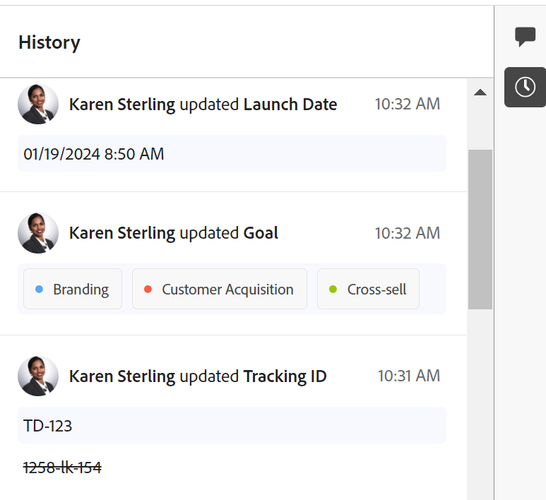

# History section overview

<!--The highlighted information on this page refers to functionality not yet generally available. It is available only in the Preview environment for all customers, or in the Production environment for customers who enabled fast releases.

For information about fast releases, see [Enable or disable fast releases for your organization](/help/quicksilver/administration-and-setup/set-up-workfront/configure-system-defaults/enable-fast-release-process.md).-->

{{planning-important-intro}}

You can collaborate on Adobe Workfront Planning records, by adding comments or replies in the right panel of a record. You can also view other changes made to the record and recorded by the system in this area.

The right panel of a record displays the following sections:

* **Comments**: Displays comments and replies users add to records. For more information about managing comments in Workfront Planning records, see [Manage record comments](/help/quicksilver/planning/records/manage-record-comments.md). 
* **History**: Displays system-recorded changes that users  make to the record fields. 

## Access requirements

+++ Expand to view the access requirements for the functionality in this article. 

<table style="table-layout:auto"> 
<col> 
</col> 
<col> 
</col> 
<tbody> 
    <tr> 
<tr> 
</tr>   
<tr> 
   <td role="rowheader">
Adobe Workfront package
</td> 
   <td> 

Any Workfront and any Planning package
 
Any Workflow and any Planning package

For more information about what is included in each Workfront Planning package, contact your Workfront account representative. 
 
   </td> 
  <tr> 
   <td role="rowheader">
Adobe Workfront license
</td> 
   <td>
Contributor or higher

   </td> 
  </tr> 
  <tr> 
   <td role="rowheader">
Object permissions
</td> 
   <td>   
View or higher permissions to a workspace and record type
  
   
System Administrators have permissions to all workspaces, including the ones they did not create
 </td> 
  </tr> 
  </tr> 
  <tr>
   <td role="rowheader">
Layout template
</td>
   <td> Users with a Light or Contributor license must be assigned a layout template that includes Planning.
   
Standard users and System Administrators have the Planning areas enabled by default.

</li></ul>
</td>
  </tr>  
</tbody> 
</table> 

For more information about Workfront access requirements, see [Access requirements in Workfront documentation](/help/quicksilver/administration-and-setup/add-users/access-levels-and-object-permissions/access-level-requirements-in-documentation.md).

+++  

<!--Old:
<table style="table-layout:auto"> 
<col> 
</col> 
<col> 
</col> 
<tbody> 
    <tr> 
<tr> 
<td> 
   
 Products
 </td> 
   <td> 
   <ul><li>
 Adobe Workfront
</li> 
   <li>
 Adobe Workfront Planning
</li></ul></td> 
  </tr>   
<tr> 
   <td role="rowheader">
Adobe Workfront plan*
</td> 
   <td> 

Any of the following Workfront plans:
 
<ul><li>Select</li> 
<li>Prime</li> 
<li>Ultimate</li></ul> 

Workfront Planning is not available for legacy Workfront plans
 
   </td> 
<tr> 
   <td role="rowheader">
Adobe Workfront Planning package*
</td> 
   <td> 

Any 
 

For more information about what is included in each Workfront Planning plan, contact your Workfront account manager. 
 
   </td> 
 <tr> 
   <td role="rowheader">
Adobe Workfront platform
</td> 
   <td> 

Your organization's instance of Workfront must be onboarded to the Adobe Unified Experience to be able to access Workfront Planning.
 

For more information, see <a href="/help/quicksilver/workfront-basics/navigate-workfront/workfront-navigation/adobe-unified-experience.md">Adobe Unified Experience for Workfront</a>. 
 
   </td> 
   </tr> 
  </tr> 
  <tr> 
   <td role="rowheader">
Adobe Workfront license*
</td> 
   <td> 
Contributor or higher license

   
Workfront Planning is not available for legacy Workfront licenses
 
  </td> 
  </tr> 
  <tr> 
   <td role="rowheader">
Access level configuration
</td> 
   <td> 
There are no access level controls for Adobe Workfront Planning
   
</td> 
  </tr> 
<tr> 
   <td role="rowheader">
Object permissions
</td> 
   <td>   
View or higher permissions to a workspace and record type
  
   
System Administrators have permissions to all workspaces, including the ones they did not create
 </td> 
  </tr> 
<tr>
   <td role="rowheader">
Layout template
</td>
   <td> Users with a Light or Contributor license must be assigned a layout template that includes Planning.
   
Standard users and System Administrators have the Planning areas enabled by default.

</li></ul>
  
</td>
  </tr>
</tbody> 
</table> -->

## Locate the History section of a record

{{step1-to-planning}}

1. Click the card of a workspace. 

    The workspace opens and the record types display on cards. 

1. Click a record type card.
    The record type page opens and all records of that type display. 

1. From any view, click the name of a record. 

    The record's page opens. The Comments area opens by default in the right panel. 
1. Click the **Show History** icon . All changes made to the record's fields display in the right panel, starting with the most recent one. 
1. (Optional) Click the **Hide History** icon  to close the right panel.

## Considerations about the History section 

You can review the changes made to record fields in the History section of the right panel of a record's page. 

* Workfront Planning records the following information in the History section: 

    * Any field changes 

    * The old and the new values of fields, when the values change. The old values display in strikethrough format. 

    * The full name of the user who made the change 

    * A date and time stamp of when the change occurred. 

* Fields of the following types always display the old value (in strikethrough format) and the new value:

    * Text
    * Paragraph
    * Currency
    * Date
    * Number
    * Percentage
    * Single-select

* Fields of the following types show the old value in strikethrough format only if at least one of the multiple values was removed: 

    * Multi-select
    * Linked record fields
    * People
 
    If the change only added values to the field, the old value does not display and only the new field value displays.  

* Checkbox-type fields never display the old value in strikethrough format. If the field is edited, only the current state at the moment the change was made displays. 

    For more information about Workfront Planning fields, see [Create fields](/help/quicksilver/planning/fields/create-fields.md). 

* Changes to fields of the following types do not display in the History section: 

    * Linked (lookup) fields
    * Formula
    * Created by
    * Created on date
    * Last modified by
    * Last modified date

* If a field is removed from the system, the updates made on that field remain in the History section. There is no indication that the field was removed in the History section of a record.
