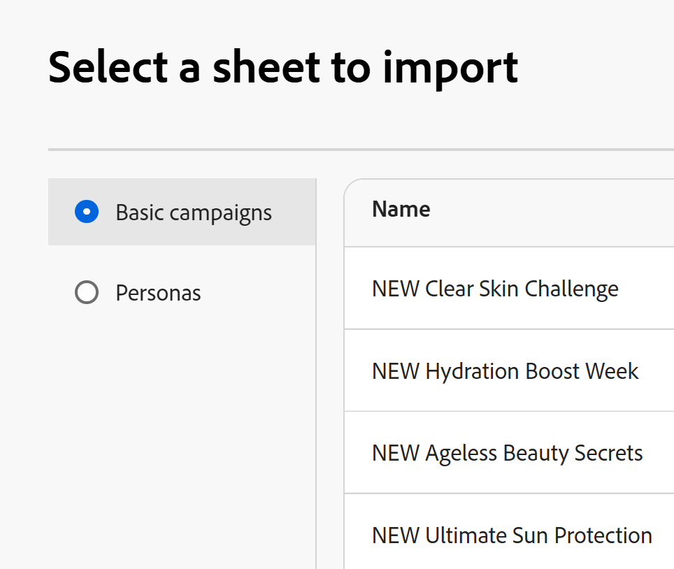
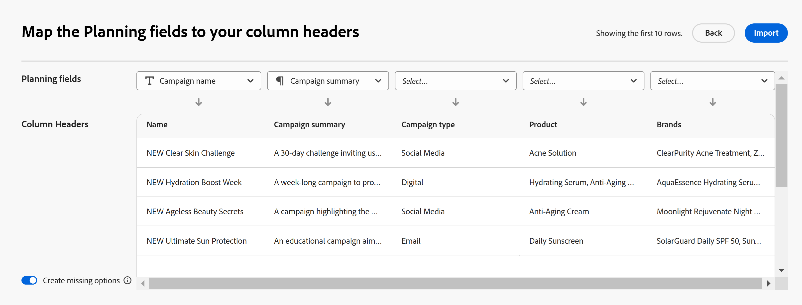

# Create records by importing information from a CSV or Excel file

The information on this page refers to functionality not yet generally available. It is available only in the Preview environment for all customers. After the monthly releases to Production, the same features are also available in the Production environment for customers who enabled fast releases.    

For information about fast releases, see [Enable or disable fast releases for your organization](/help/quicksilver/administration-and-setup/set-up-workfront/configure-system-defaults/enable-fast-release-process.md). 

{{planning-important-intro}}

Records are individual instances of record types, which are the object types of Adobe Workfront Planning. In Workfront Planning, you can create records by importing information from a CSV or Excel file.

For more information about creating records, see [Create records](/help/quicksilver/planning/records/create-records.md). 

## Access requirements

+++ Expand to view access requirements.. 

You must have the following access to perform the steps in this article:  

 <table style="table-layout:auto"> 
<col> 
</col> 
<col> 
</col> 
<tbody> 
    <tr> 
<tr> 
<td> 
   
 Products
 </td> 
   <td> 
   <ul><li>
 Adobe Workfront
</li> 
   <li>
 Adobe Workfront Planning
</li></ul></td> 
  </tr>   
<tr> 
   <td role="rowheader">
Adobe Workfront plan*
</td> 
   <td> 

Any of the following Workfront plans:
 
<ul><li>Select</li> 
<li>Prime</li> 
<li>Ultimate</li></ul> 

Workfront Planning is not available for legacy Workfront plans
 
   </td> 
<tr> 
   <td role="rowheader">
Adobe Workfront Planning package*
</td> 
   <td> 

Any 
 

For more information about what is included in each Workfront Planning plan, contact your Workfront account manager. 
 
   </td> 
 <tr> 
   <td role="rowheader">
Adobe Workfront platform
</td> 
   <td> 

Your organization's instance of Workfront must be onboarded to the Adobe Unified Experience to be able to access all the capabilities of Workfront Planning.
 

For more information, see <a href="/help/quicksilver/workfront-basics/navigate-workfront/workfront-navigation/adobe-unified-experience.md">Adobe Unified Experience for Workfront</a>. 
 
   </td> 
   </tr> 
  </tr> 
  <tr> 
   <td role="rowheader">
Adobe Workfront license*
</td> 
   <td> Standard
   
Workfront Planning is not available for legacy Workfront licenses
 
  </td> 
  </tr> 
  <tr> 
   <td role="rowheader">
Access level configuration
</td> 
   <td> 
There are no access level controls for Adobe Workfront Planning
 
   
Edit access in Workfront for the object types that you want to create (projects, programs, and portfolios) as you connect them from new records  
  
</td> 
  </tr> 
<tr> 
   <td role="rowheader">
Object permissions
</td> 
   <td> 
Contribute or higher permissions to the workspace <!--and record type--> where you want to add records. 
  
   
System Administrators have permissions to all workspaces, including the ones they did not create

   
Manage permissions to Workfront objects (portfolios) to add children objects (projects).

   </td> 
  </tr> 
<tr> 
   <td role="rowheader">
Layout template
</td> 
   <td> 
All users, including Workfront administrators,  must be assigned a layout template that includes the Planning area in the Main Menu 
 </td> 
  </tr> 
</tbody> 
</table> 

 *For more information about Workfront access requirements, see [Access requirements in Workfront documentation](/help/quicksilver/administration-and-setup/add-users/access-levels-and-object-permissions/access-level-requirements-in-documentation.md).   

+++ 

## Considerations about importing records using an Excel or CSV file

* The columns headers in each sheet become the fields associated with records. 
* Each row in each sheet becomes a unique record associated. 
* If the Excel file contains more than one sheet, only the information from one sheet that you select during the importing process is imported. 
* The file should not exceed the following: 
    * 25,000 rows
    * 500 columns
* The file should not be larger than 5MB.
* Empty sheets are not supported.
* Fields of the following types are not supported and cannot be mapped to fields on the import sheet:
    * Connections and lookup fields of connected records <!--or connected Workfront objects-->
    * Formula fields
    * Created date, Created by
    * Last modified date, Last modified by
    * People
    * If a multi- or single-select field is imported and it has more choices than a similar field in Planning, the additional options are created during the import. Only users with Manage permissions to the workspace can import new choices. 

## Create records by importing a CSV or Excel file

{{step1-to-planning}}

1. Click the workspace where you want to create records, 

    Or

    From a workspace, expand the downward-pointing arrow to the right of an existing workspace name, search for a workspace, then select it when it displays in the list.
1. Click the card of the record type where you want to import the records.
1. Click **New record** in the upper-right corner of the screen. 
1. Click **Upload from file**, then **Continue**. <!--add screen shot when all three buttons are added - with the Submit a request button-->
1. Drag and drop an Excel or CSV file previously saved on your computer, or click **Select a CSV or Excel file** to browse for one. 
1. Click **Preview and edit**.
1. (Conditional) If the imported file has more than one sheet, select the radio button of the sheet you want to import in the **Select a sheet to import** box, then click **Next**. Otherwise, continue to the next step.

    
1. In the **Map the Planning fields to your column headers** select the **Planning field** that best matches the information in each of the sheet's columns. 

    
 
    Each row represents a new record. Only the first 10 records display in the Preview and edit box. 

1. (Optional and conditional) If you have Manage permissions to the workspace, select the **Create missing options** in the lower-left corner of the screen. When enabled, the missing choices of single- and multi-select fields are added. 

    >[!NOTE]
    >
    >For example, if the selected record type has a single-select Status field with the choices New, In Progress, and Closed and a Status field imported from a file also has an On Hold Status choice, the On Hold status choice is also added. 
    >
    >If you do not have Manage permissions to the workspace, you can import records, but the additional choices will not be created. Instead, you receive the following message in the upper-right corner of the Map the Planning fields to your column headers box: **The choices that do not exist in connection, single- or multi-select fields will not be added**.

1. Click **Import**. 

    The following information imports in to Workfront Planning:

    * New records that display at the bottom of the table view of the selected record type. 
    * New field values for existing fields associated with each record.
    * New choices of a multi- or single-select field that did not exist in Planning.  <!--when we add connected records - add those here too-->
    
    You can start managing fields and records in the record types page. 
    
    Everyone with access to Workfront Planning and the workspace can now view and edit the imported records and their information.

    <!--when we add connected records and the info icon in the tool changes, also add those items to the Import step and to the NOTE above it-->
