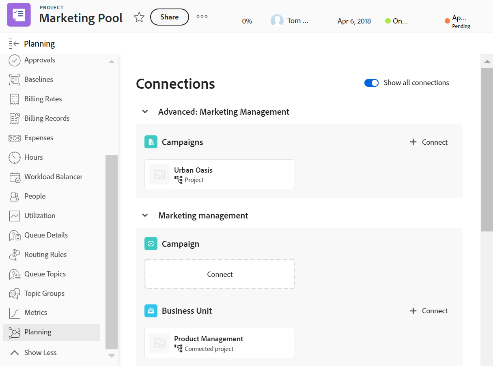

<!--add also Group and Company when they are available-->

# Manage records in the Planning section of Adobe Workfront objects

{{planning-important-intro}}

You can display the Workfront Planning records connected to Adobe Workfront objects in the Planning section of a Workfront object, in the left panel.

The Planning section is available for the following Workfront objects:

* Project
* Portfolio
* Program
<!--* Group
* Company-->

## Access requirements

+++ Expand to view access requirements for Workfront Planning. 

You must have the following to be able to access Workfront Planning: 

<table style="table-layout:auto">
 <col>
 </col>
 <col>
 </col>
 <tbody>
    <tr>
<tr>
<td>
   
 Products
 </td>
   <td>
   <ul><li>
 Adobe Workfront
</li>
   <li>
 Adobe Workfront Planning
</li></ul></td>
  </tr>  
 <tr>
   <td role="rowheader">
Adobe Workfront plan*
</td>
   <td>

Any of the following Workfront plans:

<ul><li>Select</li>
<li>Prime</li>
<li>Ultimate</li></ul>

Workfront Planning is not available for legacy Workfront plans

   </td>

<tr>
   <td role="rowheader">
Adobe Workfront Planning plan*
</td>
   <td>

Any

For more information about what is included in each Workfront Planning plan, contact your Workfront account manager. 

   </td>

<tr>
   <td role="rowheader">
Adobe Workfront platform
</td>
   <td>

Your organization's instance of Workfront must be onboarded to the Adobe Unified Experience to be able to access all the capabilities of Workfront Planning.

For more information, see <a href="/help/quicksilver/workfront-basics/navigate-workfront/workfront-navigation/adobe-unified-experience.md">Adobe Unified Experience for Workfront</a>. 

   </td>

  </tr>
  </tr>
  <tr>
   <td role="rowheader">
Adobe Workfront license*
</td>
   <td>
   
Standard

   
Workfront Planning is not available for legacy Workfront licenses

  </td>
  </tr>
  <tr>
   <td role="rowheader">
Access level configuration
</td>
   <td> 
View or higher access to Projects, Programs, and Portfolios
  
</td>
  </tr>
<tr>
   <td role="rowheader">
Object permissions
</td>
   <td>
   
In Workfront, View or higher permissions to a project, portfolio, or program</a> 
 
   
In Workfront Planning, Contribute or higher permissions to a workspace</a> 
  
   
System Administrators have permissions to all Workfront Planning workspaces, including the ones they did not create
 
  </td>
  </tr>
<tr>
   <td role="rowheader">
Layout template
</td>
   <td> 
All users, including Workfront administrators,  must be assigned a layout template that includes the Planning area in the Main Menu and the Planning area for projects, portfolios, and programs. 
 For more information, see <a href="/help/quicksilver/planning/access/access-overview.md">Access overview</a>. 
  
  
</td>
  </tr>
 </tbody>
</table>

*For more information about Workfront access requirements, see [Access requirements in Workfront documentation](/help/quicksilver/administration-and-setup/add-users/access-levels-and-object-permissions/access-level-requirements-in-documentation.md). 

+++

## Considerations about the Planning section of Workfront objects

* Workfront Planning record types must be connected to Workfront object types. 

   For information, see the following articles:

   * [Connect record types](/help/quicksilver/planning/architecture/connect-record-types.md)
   * [Connect records](/help/quicksilver/planning/records/connect-records.md)
* You can view the Planning section in a Workfront object, even when there are no records associated with the Workfront object.  
* You can connect Planning records with Workfront objects from Workfront, in the Planning section when there is at least one record connected to the Workfront object.

## Manage records in the Planning section

{{step1-to-planning}}

1. Click the card of a workspace. 

    The workspace opens and the record types display as cards. 

1. Click the card of a record type that is connected to a Workfront project, portfolio, or program. 
1. Go to a connected record field that has a connection with a Workfront object, either in the table view or from a record's details page. For information, see [Connect records](/help/quicksilver/planning/records/connect-records.md). 
1. Click the name of a Workfront object in the connected record field.
  The objects's page opens in Workfront.  

1. Click **Planning** in the left panel. 

      >[!NOTE]
      >
      >   Your Workfront or group administrator must add the Planning section to your layout template before it displays for a Worfront project, portfolio, or program. 

   The Planning section displays with the following information: 
   
   * The connected records display on individual cards that contain the following information:
      * Name of the record
      * The record thumbnail
      * The name of the connected record field as it displays in Workfront Planning. 
   * Records display under their respective workspace. 

   

1. (Optional) Click **Show all connections** to show all connected record types, including the ones without connected records. By default, record types without connected records do not display.
1. Click a record card to display more information about the record. The record preview box displays.
1. (Optional) Start modifying fields in the record's preview box. Your changes are saved automatically.
1. (Optional) Click the **Open in a new tab** icon  in the upper-right corner of the preview box to open the record's details page. The record's details page opens in Workfront Planning. 
1. Hover over a record card, then click the disconnect record icon **-**, then click **Disconnect**. 
   The following things occur: 
   * The record is no longer connected to the Workfront object. 
   * The Workfront object is also removed from the record's connected field from Workfront Planning. 
   * The values for the Workfront lookup fields connected to the Planning record are also deleted.
1. Click **Connect** to connect more records for the connected record types. For more information, see [Connect records](/help/quicksilver/planning/records/connect-records.md). 

   The following things occur:

   * The records are immediately connected to the Workfront object and they display in the Planning section. 
   * The Workfront object is added to the Workfront Planning record's connected field. 
   * The values for the Workfront lookup fields connected to the Planning record are populated in Workfront Planning. 

