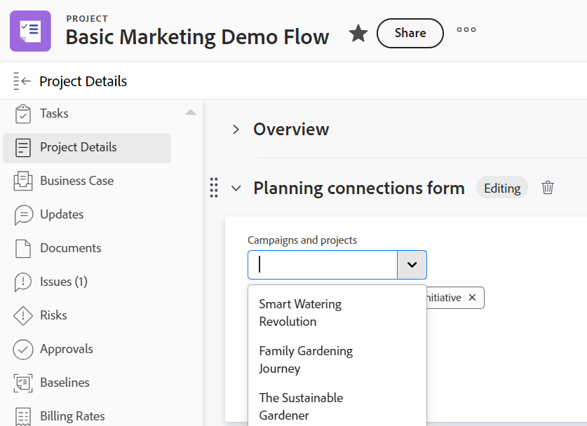
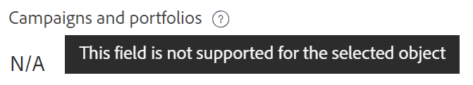
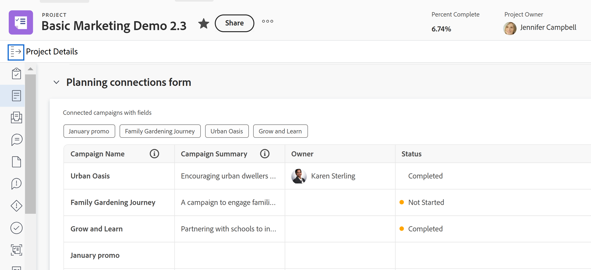

<!--add also Group and Company when they are available-->

# Manage record connections from Workfront objects 

The highlighted information on this page refers to functionality not yet generally available. It is available only in the Preview environment for all customers. After the monthly releases to Production, the same features are also available in the Production environment for customers who enabled fast releases.    

For information about fast releases, see [Enable or disable fast releases for your organization](/help/quicksilver/administration-and-setup/set-up-workfront/configure-system-defaults/enable-fast-release-process.md).

{{planning-important-intro}}

You can display Workfront Planning records in Workfront in the following areas of the objects connected to them: 

* The Planning section of a Workfront object: Displays all record types connected to an object and their respective connected records. 
* A Planning connection custom field: Displays one record type, its respective connected records, and up to 7 lookup fields of the connected records.

## Access requirements

+++ Expand to view access requirements for Workfront Planning. 

You must have the following access to perform the steps in this article: 

<table style="table-layout:auto">
 <col>
 </col>
 <col>
 </col>
 <tbody>
    <tr>
<tr>
<td>
   
 Products
 </td>
   <td>
   <ul><li>
 Adobe Workfront
</li>
   <li>
 Adobe Workfront Planning
</li></ul></td>
  </tr>  
 <tr>
   <td role="rowheader">
Adobe Workfront plan*
</td>
   <td>

Any of the following Workfront plans:

<ul><li>Select</li>
<li>Prime</li>
<li>Ultimate</li></ul>

Workfront Planning is not available for legacy Workfront plans

   </td>

<tr>
   <td role="rowheader">
Adobe Workfront Planning package*
</td>
   <td>

Any

For more information about what is included in each Workfront Planning plan, contact your Workfront account manager. 

   </td>

<tr>
   <td role="rowheader">
Adobe Workfront platform
</td>
   <td>

Your organization's instance of Workfront must be onboarded to the Adobe Unified Experience to be able to access all the capabilities of Workfront Planning.

For more information, see <a href="/help/quicksilver/workfront-basics/navigate-workfront/workfront-navigation/adobe-unified-experience.md">Adobe Unified Experience for Workfront</a>. 

   </td>

  </tr>
  </tr>
  <tr>
   <td role="rowheader">
Adobe Workfront license*
</td>
   <td>
   
Standard

   
Workfront Planning is not available for legacy Workfront licenses

  </td>
  </tr>
  <tr>
   <td role="rowheader">
Access level configuration
</td>
   <td> 
View or higher access to Projects, Programs, and Portfolios
  
   
There is no access level configuration for Workfront Planning. 

</td>
  </tr>
<tr>
   <td role="rowheader">
Object permissions
</td>
   <td>
   
In Workfront, View or higher permissions to a project, portfolio, or program</a> 
 
   
In Workfront Planning, View permissions to a workspace to view any connected records or Contribute or higher permissions to a workspace to connect or disconnect records</a> 
  
   
System Administrators have permissions to all Workfront Planning workspaces, including the ones they did not create
 
  </td>
  </tr>
<tr>
   <td role="rowheader">
Layout template
</td>
   <td> 
To view the Planning area or the Planning section for a Workfront object, all users, including Workfront administrators, must be assigned a layout template that includes the Planning area in the Main Menu and the Planning area for projects, portfolios, and programs. 
 For more information, see <a href="/help/quicksilver/planning/access/access-overview.md">Adobe Planning access overview</a>. 
  
  
</td>
  </tr>
 </tbody>
</table>

*For more information about Workfront access requirements, see [Access requirements in Workfront documentation](/help/quicksilver/administration-and-setup/add-users/access-levels-and-object-permissions/access-level-requirements-in-documentation.md). 

+++

## Manage records in the Planning section

You can use the Planning section of a Workfront object to view all the record types and their respective records connected to the Workfront object. 
The Planning section is available for the following Workfront objects:

* Project
* Portfolio
* Program
<!--* Group
* Company-->

### Considerations about the Planning section of Workfront objects

Consider the following when you view Workfront Planning records from the Planning section of a Workfront object: 

* Workfront Planning record types must first be connected to Workfront object types. 

   For information, see the following articles:

   * [Connect record types](/help/quicksilver/planning/architecture/connect-record-types.md)
   * [Connect records](/help/quicksilver/planning/records/connect-records.md)
* You can view the Planning section from a Workfront object, even when there are no records associated with the Workfront object.  

### Manage record connections from the Planning section

{{step1-to-planning}}

1. Click the card of a workspace. 

    The workspace opens and the record types display as cards. 

1. Click the card of a record type that is connected to a Workfront project, portfolio, or program. 
1. Go to a connected record field that has a connection with a Workfront object, either in the table view or from a record's details page. For information, see [Connect records](/help/quicksilver/planning/records/connect-records.md). 
1. Click the name of a Workfront object in the connected record field.
  The object's page opens in Workfront.  

   >[!NOTE]
   >
   >  If you know of a Workfront object already connected to a Planning record, you can navigate to the Planning section from the Workfront object.

1. Click **Planning** in the left panel. 

      >[!NOTE]
      >
      >   Your Workfront or group administrator must add the Planning section to your layout template before it displays for a Workfront project, portfolio, or program. 

   The Planning section displays with the following information: 
   
   * The connected records display on individual cards that contain the following information:
      * Name of the record
      * The record thumbnail
      * The name of the connected record field as it displays in Workfront Planning. 
   * Records display under their respective workspace and record type. 

   

1. (Optional) Click **Show all connections** to show all connected record types, including the ones without connected records. By default, record types without connected records do not display.
1. Click a record card to display more information about the record. The record preview box displays.
1. (Optional) Start modifying fields in the record's preview box. Your changes are saved automatically.
1. (Optional) Click the **Open in a new tab** icon  in the upper-right corner of the preview box to open the record's details page. The record's details page opens in Workfront Planning. 
1. (Optional) Hover over a record card, then click the disconnect record icon **-**, then click **Disconnect**. 
   The following things occur: 
   * The record is no longer connected to the Workfront object. 
   * The Workfront object is also removed from the record's connected field from Workfront Planning. 
   * The values for the Workfront lookup fields connected to the Planning record are also deleted.
1. Click **Connect** to connect more records for the connected record types. 

   For more information, see [Connect records](/help/quicksilver/planning/records/connect-records.md). 
1. (Optional) If you cannot find a record to connect, and you want to add it, click **+ Add** to add a new record. For more information, see the section "Create records as you connect them from other records" in the article [Create records](/help/quicksilver/planning/records/create-records.md).  

   The following things occur:

   * The records are immediately connected to the Workfront object and they display in the Planning section. 
   * The Workfront object is added to the Workfront Planning record's connected field. 
   * The values for the Workfront lookup fields connected to the Planning record are populated in Workfront Planning. 

## Manage records in the Planning connection field type

You can use a Planning connection custom field on a Workfront object to view one record type and its respective records connected to the Workfront object. 

You can control which Planning record types display for the Workfront object when you create Planning connection custom fields. 

* The Planning connection field displays Planning records after a connection has been established and when the field is attached to forms for the following Workfront objects:

   * Project
   * Portfolio
   * Program
   * Group
   * Company

For more information, see [Create a form](/help/quicksilver/administration-and-setup/customize-workfront/create-manage-custom-forms/form-designer/design-a-form/design-a-form.md). 

### Considerations about the Planning connection field type

Consider the following when you view Workfront Planning records from a Planning connection field of a Workfront object: 

* A Planning connection field displays in the following ways on a Workfront object's custom form, after Planning records are connected to the Workfront object:

   * If only the primary field of the connected record is selected, the Planning connection field displays as a field with multiple values, if the connection allows for multiple records to be linked. For information, see [Connect record types overview](/help/quicksilver/planning/architecture/connect-record-types-overview.md).
   * If any additional lookup fields from the connected record are selected, the Planning connection field displays as a table. Up to 7 fields can be selected for the Planning connection field. The table view is read-only.  

* You can associate only one record type with one Planning connection field. There is no limit to how many Planning connection fields you have on a form. 
* You must have the correct access and permissions to the object, the record, and Workfront Planning to attach a custom form with a Planning connection custom field to a Workfront object. 
* You must have Contribute permissions for a workspace in Workfront Planning to be able to connect or disconnect records from the Planning connection field of a Workfront object.
* Workfront Planning record types must first be connected to Workfront object types. For information, see [Connect record types](/help/quicksilver/planning/architecture/connect-record-types.md).This makes the Workfront Planning records accessible from Workfront.  
* You can connect or disconnect records from the Planning connection field of a Workfront object only for objects that can have Workfront Planning connections. 

   For example, you might be able to attach a custom form with a Planning connection field to tasks, but you cannot connect Workfront Planning objects to tasks. 
* You cannot edit a Planning connection field when editing Workfront objects in bulk. 

### Manage record connections from the Planning connection field type

1. Go to one of the following object types that has been connected with a Workfront Planning record type: 

   * Project
   * Portfolio
   * Program
   * Company
   * Group

1. Click **< Object > Details** in the left panel.
1. (Conditional) Add a custom form with at least one Planning connection field for the object you selected, if one is not present. 

   >[!NOTE]
   >
   >Your Workfront or group administrator must first create the form and add a Planning connection field on it before you can add it to an object. 

1. Click inside the field to add connected records, then click the downward-pointing arrow inside the field, to select records from the list. 

   

   >[!TIP]
   >
   >You cannot add records to Planning connection fields that are associated with Workfront objects other than the object you selected when the field was configured. 
   >
   >For example, you cannot add records to a Planning connection field created for a Portfolio connection from a Project's custom form. 
   >
   >There is an indication that the object of the field and the object you selected don't match.  
   >
   >

1. Click outside the list to close it. 

   The following things occur:

   * The records are immediately connected to the Workfront object and they display in the Planning connection field as well as the Planning section of the Workfront object. 
   * The Workfront object is added to the Workfront Planning record's connected field. 
   * The values for the Workfront lookup fields connected to the Planning record are populated in Workfront Planning. 
   * If your Workfront or group administrator added record lookup fields when they created the custom form, the record's lookup fields populate automatically in a table view. The table view in the Planning connection field is read-only
   
      

1. (Optional) Click the name of a record or hover the name of the record in the table, then click the **Open record** icon  in the Planning connection field to open it in Workfront Planning. 
   The Workfront Planning record details preview box opens. 
1. Review or edit information about the record, or click the **Open in a new tab** icon  to open the record details page. 

1. (Optional) From the custom form in Workfront, click the **Remove** icon  on a record to remove it from the Planning connection field and disconnect it from the Workfront object. 
   The Workfront object is disconnected from the Planning record, and any lookup information from Workfront is removed from the record. 

1. Click **Save Changes** to save the custom form and any other changes you made to the Workfront object.