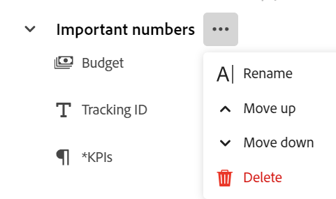

<!--update the metadata with real information when making this avilable in TOC and in the left nav-->

# Manage the record page

{{planning-important-intro}}

You can edit the layout of the record preview and page in Adobe Workfront Planning. 

The record preview is a smaller view of the record page that displays in the view of a record type. 

When you change the layout of a record  preview and page, the changes affect the preview boxes and details pages of all records of the same type. 

This article describes how you can change the layout and appearance of a record preview box or a record page. For information about editing records, see [Edit records](/help/quicksilver/planning/records/edit-records.md). 

You must create record types and records before you can start editing record pages. 

For information, see the following articles: 

* [Create record types](/help/quicksilver/planning/architecture/create-record-types.md)

* [Create records](/help/quicksilver/planning/records/create-records.md)

## Access requirements

You must have the following access to perform the steps in this article: 

<table style="table-layout:auto">
 <col>
 </col>
 <col>
 </col>
 <tbody>
    <tr>
<tr>
<td>
   
 Product
 </td>
   <td>
   
 Adobe Workfront
 </td>
  </tr>  
 <td role="rowheader">
Adobe Workfront agreement
</td>
   <td>

Your organization must be enrolled in the early access stage for Workfront Planning 

   </td>
  </tr>
  <tr>
   <td role="rowheader">
Adobe Workfront plan
</td>
   <td>

Any

   </td>
  </tr>
  <tr>
   <td role="rowheader">
Adobe Workfront license*
</td>
   <td>
   
New: Light or higher

   Or
   
Current: Work or higher
 
  </td>
  </tr>
  
  <tr>
   <td role="rowheader">
Access level configurations
</td>
   <td> 
There are no access controls for Adobe Workfront Planning
  
</td>
  </tr>
<tr>
   <td role="rowheader">
Permissions
</td>
   <td> 
Manage or higher permissions to a workspace</a> 
  
   
System Administrators have permissions to all workspaces, including the ones they did not create

</td>
  </tr>
<tr>
   <td role="rowheader">
Layout template
</td>
   <td> 
Your Workfront or group administrator must add the Planning area in your layout template. For information, see <a href="/help/quicksilver/planning/access/access-overview.md">Access overview</a>. 
  
</td>
  </tr>

 </tbody>
</table>

*For more information, see [Access requirements in Workfront documentation](/help/quicksilver/administration-and-setup/add-users/access-levels-and-object-permissions/access-level-requirements-in-documentation.md). 

## Considerations about editing record pages

* By default, the details and the preview pages of a record display all the fields associated with the record. 

* You cannot add new fields for a record in the preview or details page. You must add new fields in the table view to display them in the preview and details pages. 

* You can add sections to a record preview or details page, to organize the information by common criteria and make it easier to find. 

* The following changes affect all the records of the same type and are visible to all users accessing those records: 

   * Rearranging fields
   * Adding or removing sections

* Display changes that you make in the record preview are immediately visible in the record details page. Changes made in the record page are also visible in the record preview box. 

* Adding a cover image to a record is not part of the overall layout of the record preview or page. You can add unique cover images to each record. For information, see [Add a cover image to a record](/help/quicksilver/planning/records/add-a-cover-image-to-a-record.md).

## Add sections to a record preview or page

Consider the following when adding sections to a record page:

* There is no limit to how many sections you can have on a page. 
* You cannot have an empty section. You must have at least one field in a section. 
* You can drag and drop fields from one section to another. For more information, see the section [Rearrange fields in the record preview or details page](#rearrange-fields-in-the-record-preview-or-details-page) in this article. 
* When you remove all the fields from a section, the section is automatically deleted and cannot be recovered. 

To add a section to a record preview or page: 

{{step1-to-maestro}}

The workspace that you access last opens. 

1. (Optional) Click the downward-pointing arrow to the right of the workspace name to select the workspace whose records you want to update. 
1. Click a record type card. 

    The record type page opens. 

1. From a view of any type, click the name of a record 

    Or 
    
    From the table table view, click the **Open details** icon  to the left of a record name. 
    
    The record's preview opens in the view.

     

    >[!TIP]
    >
    >You can view the **Open details** icon to the left of the Name field of a record in a table view only when the Name field is a primary field. 

1. (Optional) Click the **Open in new tab** icon  in the upper-right corner of the record preview  to open the record's page in a new tab. 

    The record page opens. 

    

1. In the record preview or page, hover over the white space to the left of the fields, then click the **Add section** icon  to add a section. 
1. Click inside the section's name and replace **Untitled section** with a name, then click Enter. The fields displayed under the section are automatically part of the new section. 
1. Start dragging and dropping fields to the new section, as described in the section [Rearrange fields in the record preview or details page](#rearrange-fields-in-the-record-preview-or-details-page) in this article. 

1. (Optional) Hover over the name of a section and click the **More** menu . 

   
1. (Optional) Do one of the following to edit the section: 

   * Click **Rename** to rename the section

      >[!TIP]
      >
      > You can rename a section inline, by clicking the name.
   
   * Click **Move up** to move the section up one position 

      Or 
      
      Click **Move down** to move the section down one position.
      All fields in the section move with the section. 

   * Click **Delete** to delete the section. The section is deleted and it cannot be recovered. All users accessing the records of this type will no longer view the deleted section. 

1. Click the downward-pointing arrow to the left of a section name to collapse it, or the right-pointing arrow  to expand it. 
   All sections are expanded by default. 

1. (Optional) Click the **grab** icon  to the left of a section name, then drag and drop it in a desired spot. 

    The new position of the section updates in both the preview and the page of all records of the same type for all users viewing the records. 

    All changes to sections and field order are saved automatically. 

## Rearrange fields in the record preview or details page

{{step1-to-maestro}}

The workspace that you access last opens. 

1. (Optional) Click the downward-pointing arrow to the right of the workspace name to select the workspace whose records you want to update. 
1. Click a record type card. 

    The record type page opens. 

1. From a view of any type, click the name of a record 

    Or 
    
    From the table table view, click the **Open details** icon  to the left of a record name. 
    
    The record's preview opens in the view.

     

    >[!TIP]
    >
    >You can view the **Open details** icon to the left of the Name field of a record in a table view only when the Name field is a primary field. 

1. (Optional) Click the **Open in new tab** icon  <!--check the icon; they are changing it--> in the upper-right corner of the record preview to open the record's page in a new tab. 

    The record page opens. 

    

1. In the record preview or page, click the **grab** icon  to the left of a field name, then drag and drop it in a desired spot. <!--You can drag and drop fields to another section. You must have at least one field in a section.-->

    The new position of the field is updated in both the preview and the page of all records of the same type for all users viewing the records. 

    All changes to the layout of the record preview or page save automatically. 

