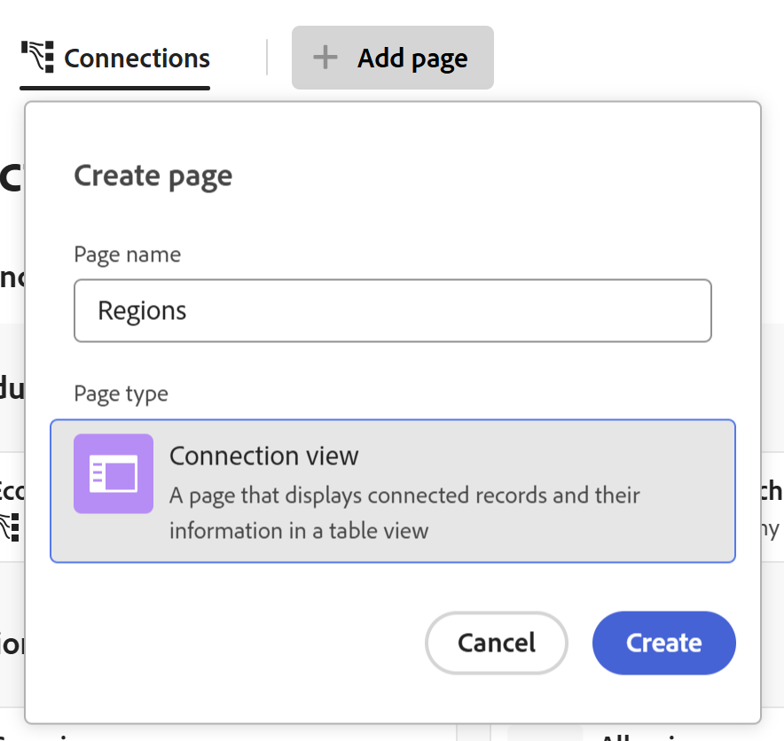
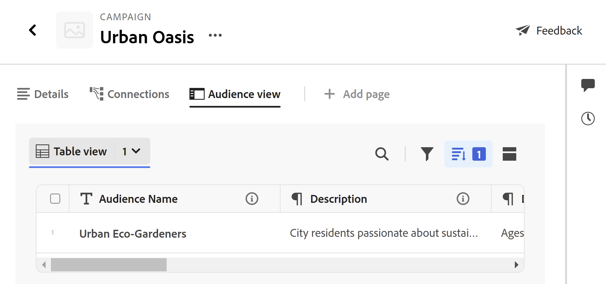

# Manage the record page layout

The information highlighted on this page refers to functionality not yet generally available. It is available only in the Preview environment for all customers. After the monthly releases to Production, the same features are also available in the Production environment for customers who enabled fast releases.    

For information about fast releases, see [Enable or disable fast releases for your organization](/help/quicksilver/administration-and-setup/set-up-workfront/configure-system-defaults/enable-fast-release-process.md). 

{{planning-important-intro}}

You can edit the layout of the record preview and page in Adobe Workfront Planning. 

The record preview is a smaller view of the record page that displays in the view of a record type. 

When you change the layout of a record  preview and page, the changes affect the preview boxes and details pages of all records of the same type. 

This article describes how you can change the layout and appearance of a record preview box or a record page. For information about editing records, see [Edit records](/help/quicksilver/planning/records/edit-records.md). 

You must create record types and records before you can start editing record pages. 

For information, see the following articles: 

* [Create record types](/help/quicksilver/planning/architecture/create-record-types.md)

* [Create records](/help/quicksilver/planning/records/create-records.md)

## Access requirements

+++ Expand to view access requirements.. 

You must have the following access to perform the steps in this article: 

<table style="table-layout:auto">
 <col>
 </col>
 <col>
 </col>
 <tbody>
    <tr>
<tr>
<td>
   
 Products
 </td>
   <td>
   <ul><li>
 Adobe Workfront
</li>
   <li>
 Adobe Workfront Planning
</li></ul></td>
  </tr>  
 <tr>
   <td role="rowheader">
Adobe Workfront plan*
</td>
   <td>

Any of the following Workfront plans:

<ul><li>Select</li>
<li>Prime</li>
<li>Ultimate</li></ul>

Workfront Planning is not available for legacy Workfront plans

   </td>

<tr>
   <td role="rowheader">
Adobe Workfront Planning package*
</td>
   <td>

Any

For more information about what is included in each Workfront Planning plan, contact your Workfront account manager. 

   </td>

<tr>
   <td role="rowheader">
Adobe Workfront platform
</td>
   <td>

Your organization's instance of Workfront must be onboarded to the Adobe Unified Experience to be able to access all the capabilities of Workfront Planning.

For more information, see <a href="/help/quicksilver/workfront-basics/navigate-workfront/workfront-navigation/adobe-unified-experience.md">Adobe Unified Experience for Workfront</a>. 

   </td>

  </tr>
  </tr>
  <tr>
   <td role="rowheader">
Adobe Workfront license*
</td>
   <td>
   
Standard

   
Workfront Planning is not available for legacy Workfront licenses

  </td>
  </tr>
  <tr>
   <td role="rowheader">
Access level configuration
</td>
   <td> 
There are no access level controls for Adobe Workfront Planning
  
</td>
  </tr>
<tr>
   <td role="rowheader">
Object permissions
</td>
   <td>
   
Contribute or higher permissions to a workspace and record type </a> 
  
   
System Administrators have permissions to all workspaces, including the ones they did not create
 
  </td>
  </tr>
<tr>
   <td role="rowheader">
Layout template
</td>
   <td> 
All users, including Workfront administrators,  must be assigned a layout template that includes the Planning area in the Main Menu and the Planning area for projects, portfolios, and programs. 
 For more information, see <a href="/help/quicksilver/planning/access/access-overview.md">Adobe Planning access overview</a>. 
  
  
</td>
  </tr>
 </tbody>
</table>

*For more information about Workfront access requirements, see [Access requirements in Workfront documentation](/help/quicksilver/administration-and-setup/add-users/access-levels-and-object-permissions/access-level-requirements-in-documentation.md).  

+++

<!--replace the layout template info in the table with this at release: 

In the Production environment, all users including the System Administrators must be assigned to a layout template that includes the Planning areas.

In the Preview environment, Standard users and System Administrators have the Planning area enabled by default.

-->

## Considerations about editing record pages

* By default, the details and the preview pages of a record display all the fields associated with the record. 

* You cannot add new fields for a record in the preview or details page. You must add new fields in the table view to display them in the preview and details pages. 

* You can add sections to a record preview or details page, to organize the information by common criteria and make it easier to find. 

* The following changes affect all the records of the same type and are visible to all users accessing those records: 

   * Rearranging fields
   * Adding or removing sections

* Display changes that you make in the record preview are immediately visible in the record details page. Changes made in the record page are also visible in the record preview box. 

* Adding a cover image or a thumbnail to a record is not part of the overall layout of the record preview or page. You can add unique cover images or thumbnails to each record. For information, see [Add a cover image to a record](/help/quicksilver/planning/records/add-a-cover-image-to-a-record.md) and [Add a thumbnail to a record](/help/quicksilver/planning/records/add-thumbnails-to-records.md). 

## Add sections to a record preview or page

Consider the following when adding sections to a record page:

* There is no limit to how many sections you can have on a page. 
* You cannot have an empty section. You must have at least one field in a section. 
* You can drag and drop fields from one section to another. For more information, see the section [Rearrange fields in the record preview or details page](#rearrange-fields-in-the-record-preview-or-details-page) in this article. 
* When you remove all the fields from a section, the section is automatically deleted and cannot be recovered. 

To add a section to a record preview or page: 

{{step1-to-planning}}

1. Click the card of a workspace. 

    The workspace opens and the record types display as cards. 

1. Click a record type card. 

    The record type page opens. 

1. From a view of any type, click the name of a record 

    Or 
    
    From the table table view, click the **Open details** icon  in the first column. 
    
    The record's preview opens in the view.

      

1. (Optional) Click the **Open in new tab** icon  in the upper-right corner of the record preview  to open the record's page in a new tab. 

    The record page opens. The Details tab opens by default.

    

1. In the **Details** tab of the record preview or page, hover over the white space to the left of the fields, then click the **Add section** icon  to add a section. 
1. Click inside the section's name and replace **Untitled section** with a name, then click Enter. The fields displayed under the section are automatically part of the new section. 
1. Start dragging and dropping fields to the new section, as described in the section [Rearrange fields in the record preview or details page](#rearrange-fields-in-the-record-preview-or-details-page) in this article. 

1. (Optional) Hover over the name of a section and click the **More** menu . 

   
1. (Optional) Do one of the following to edit the section: 

   * Click **Rename** to rename the section

      >[!TIP]
      >
      > You can rename a section inline, by clicking the name.
   
   * Click **Move up** to move the section up one position 

      Or 
      
      Click **Move down** to move the section down one position.
      All fields in the section move with the section. 

   * Click **Delete** to delete the section. The section is deleted and it cannot be recovered. All users accessing the records of this type will no longer view the deleted section. 

1. Click the downward-pointing arrow to the left of a section name to collapse it, or the right-pointing arrow  to expand it. 
   All sections are expanded by default. 

1. (Optional) Click the **grab** icon  to the left of a section name, then drag and drop it in a desired spot. 

    The new position of the section updates in both the preview and the page of all records of the same type for all users viewing the records. 

    All changes to sections and field order are saved automatically. 

1. (Optional) Click the **Export** menu  to export the Details tab to a Word or a PDF file. For more information, see [Export a record's details](/help/quicksilver/planning/records/export-the-record-page.md). 

1. (Optional) Click the **Connections** tab next to the **Details** tab. You might have to click **More** before clicking the **Connections** tab.

   All records or objects that are connected to the selected record display under the names of the record type, or the application they belong to. 

      

1. (Optional) Select the **Show all records** setting in the upper-right corner of the Connections tab. All connected record types display, including the ones that don't have any connected records yet. BY default, the toggle is deselected and record types with no connected records are hidden. 

1. (Optional) Click **Connect** to add more records to the connected record types. For more information, see [Connect records](/help/quicksilver/planning/records/connect-records.md).  

1. (Optional) Hover over a record card, then click the disconnect record icon **-**, then click **Disconnect**. <!--this is copied to the Manage the Planning page in Workfront article; update in both articles-->
   The following things occur: 
   * The record is no longer connected to the Workfront object. 
   * The Workfront object is also removed from the record's connected field from Workfront Planning. 
   * The values for the Workfront lookup fields connected to the Planning record are also deleted.

## Rearrange fields in the record's Details tab

{{step1-to-planning}}

1. Click the card of a workspace. 

    The workspace opens and the record types display as cards. 
 
1. Click a record type card. 

    The record type page opens. 

1. From a view of any type, click the name of a record 

    Or 
    
    From the table table view, click the **Open details** icon  in the first column. 
    
    The record's preview opens in the view.

     

1. (Optional) Click the **Open in new tab** icon  <!--check the icon; they are changing it--> in the upper-right corner of the record preview to open the record's page in a new tab. 

    The **Details** tab of the record opens by default. 

   

1. In the record **Details** tab, click the **grab** icon  to the left of a field name, then drag and drop it in a desired spot. 

   >[!TIP]
   >
   >You can drag and drop fields to another section. 
   >You must have at least one field in a section.
   >

   The new position of the field is updated in both the preview and the page of all records of the same type for all users viewing the records. 

   All changes to the layout of the record preview or page save automatically. 

## Add a Connection view page to a record's page

<!--suggested a new name for this type of page: "Connected records details" - check to see if this changed-->

Consider the following when adding a Connection view to a record's page: 

* You can add a Connection view page to a record's page.

* You cannot add a Connection view page to a record's preview area.

* Connection view pages display one connected record type page in the table view.

* After you add a Connection view page to a record's page, the page tab is visible from the record's preview area. You must go to the full page to see the table view for the connected record. <!--this might have changed? check and take disclaimer out--> 

To add a Connection view page:

1. From a record page view, click the name of a record to open it, then click the **Open in new tab** icon  in the upper-right corner of the preview page.
1. Click **Add page** > **Connection view**. 

   
1. Add the **Page name**, click **Connection view**, then click **Create**.

   A new tab is added to the record's page.
1. Search or click the name of a connected record or object type in the list. 
   The table view of the record type you selected displays and the connected records display in the table view. 
   All fields of the connected record display in the table view of the connected record's tab. 
   
   The first five fields from the connected record table display by default. No lookup fields display by default.

   The table view is read-only. 

   <!--replace screen shot below when additional capabilities come to the table view - Fields, etc-->

   

1. (Optional) Double-click the name of the tab

   Or

   Hover over the name of the tab, then click **More** , then click **Rename** to rename to new Connected view tab.
1. (Optional) Use any of the following view elements in the toolbar to manage the table view:

   * Filters
   * Sort
   * Grouping
   * Fields, to display, hide, or rearrange fields

   For information, see [Manage the table view](/help/quicksilver/planning/views/manage-the-table-view.md). 

   >[!NOTE]
   >
   >   You cannot create, edit, or delete fields in the table view of a connected record's tab.
   >

1. Click **Connect** to add or remove records. For information, see [Connect records](/help/quicksilver/planning/records/connect-records.md)
1. (Optional)  Hover over the name of the Connection view tab, click **More** , then click **Delete** to remove to new Connected view tab.

<!--
## Add a Brief page to a record's page

You can add a Brief page to the record's preview or pages. 

Brief pages contain the same information as the Details tab, in a read-only format. <!--edit this when we can remove fields from this page-->

<!--
1. From a record's page view, click the name of a record to open its preview or page.
1. Click **Add page** > **Brief**. 
1. Add the **Page name**, then click **Create**. 
-->

