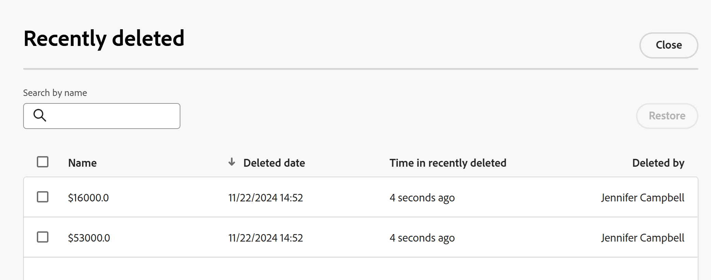

# Restore deleted records 

The information on this page refers to functionality not yet generally available. It is available only in the Preview environment for all customers. After the monthly releases to Production, the same features are also available in the Production environment for customers who enabled fast releases.    

For information about fast releases, see [Enable or disable fast releases for your organization](/help/quicksilver/administration-and-setup/set-up-workfront/configure-system-defaults/enable-fast-release-process.md).    

{{planning-important-intro}}

You can recover deleted records from the Recently deleted area in Adobe Workfront Planning. 

For information about deleting records, see [Delete records](/help/quicksilver/planning/records/delete-records.md). 

## Access requirements

+++ Expand to view access requirements for Workfront Planning. 

You must have the following access to perform the steps in this article:  

 <table style="table-layout:auto"> 
<col> 
</col> 
<col> 
</col> 
<tbody> 
    <tr> 
<tr> 
<td> 
   
 Products
 </td> 
   <td> 
   <ul><li>
 Adobe Workfront
</li> 
   <li>
 Adobe Workfront Planning
</li></ul></td> 
  </tr>   
<tr> 
   <td role="rowheader">
Adobe Workfront plan*
</td> 
   <td> 

Any of the following Workfront plans:
 
<ul><li>Select</li> 
<li>Prime</li> 
<li>Ultimate</li></ul> 

Workfront Planning is not available for legacy Workfront plans
 
   </td> 
<tr> 
   <td role="rowheader">
Adobe Workfront Planning package*
</td> 
   <td> 

Any 
 

For more information about what is included in each Workfront Planning plan, contact your Workfront account manager. 
 
   </td> 
 <tr> 
   <td role="rowheader">
Adobe Workfront platform
</td> 
   <td> 

Your organization's instance of Workfront must be onboarded to the Adobe Unified Experience to be able to access all the capabilities of Workfront Planning.
 

For more information, see <a href="/help/quicksilver/workfront-basics/navigate-workfront/workfront-navigation/adobe-unified-experience.md">Adobe Unified Experience for Workfront</a>. 
 
   </td> 
   </tr> 
  </tr> 
  <tr> 
   <td role="rowheader">
Adobe Workfront license*
</td> 
   <td>
 Standard

   
Workfront Planning is not available for legacy Workfront licenses
 
  </td> 
  </tr> 
  <tr> 
   <td role="rowheader">
Access level configuration
</td> 
   <td> 
There are no access level controls for Adobe Workfront Planning
   
</td> 
  </tr> 
<tr> 
   <td role="rowheader">
Object permissions
</td> 
   <td>   
Manage permissions to a workspace</a> 
  
   
System Administrators have permissions to all workspaces, including the ones they did not create
 </td> 
  </tr> 
<tr> 
   <td role="rowheader">
Layout template
</td> 
   <td> 
All users, including Workfront administrators,  must be assigned a layout template that includes the Planning area in the Main Menu. 
 </td> 
  </tr> 
</tbody> 
</table> 

 *For more information about Workfront access requirements, see [Access requirements in Workfront documentation](/help/quicksilver/administration-and-setup/add-users/access-levels-and-object-permissions/access-level-requirements-in-documentation.md).

+++   

## Considerations about recovering deleted records

* Records are stored in the Recently deleted bin for 30 days. After 30 days, the records are permanently deleted from Workfront Planning. 
* If the deleted records are linked to other records, the linked records are not deleted, but the information from the deleted record is also deleted. Restoring the deleted records will restore the information from the connected records. 
* You can restore records in bulk. 
* When the records are deleted the following information is stored in the Recently deleted bin: 
    * **Name**: This is the information in the Primary field of the record. For more information about record Primary fields, see [Primary field overview](/help/quicksilver/planning/fields/primary-field-overview.md).
    * **Deleted date**: The time and the date when the record was deleted.
    * **Time in recently deleted**: The time since the record was deleted. Records that were deleted more than 30 days before the current date do not display in the Recently deleted bin. 
    * **Deleted by**: The name of the user who deleted the record.

## Restore deleted records

1. Go to the record type page where you have deleted records. 
1. Click the **Undo** icon  in the upper-right corner of any record type page view, then click **Recently deleted**.

    The **Recently deleted** box displays.

    

1. Select the records you want to delete, then click **Restore** > **Restore**. You can select more than one record. 

    If the restore was successful, you receive a success notification at the bottom of the screen. 
1. Go to the table view and review the restored records.
