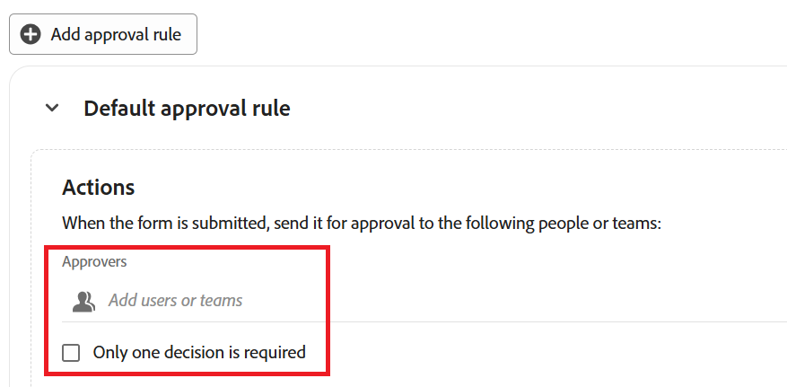

# Add an approval to a request form in Adobe Workfront Planning

<!--update the metadata with real information when making this available in TOC and in the left nav-->

The highlighted information on this page refers to functionality not yet generally available. It is available only in the Preview environment for all customers. After the release to Preview, the same features are also available monthly in the Production environment for customers who enabled fast releases.    

For information about fast releases, see [Enable or disable fast releases for your organization](/help/quicksilver/administration-and-setup/set-up-workfront/configure-system-defaults/enable-fast-release-process.md). 

{{planning-important-intro}}

You can add an approval process to an Adobe Workfront Planning request form, to initiate an approval for every submitted request, before it creates a record.

<!--Multiple stages are supported in the approval process. When all required decisions in a stage are made, the next stage begins and the new stage's approvers receive an email notification.-->

This article describes how a workspace manager can add an approval to a request form associated with a record type. 

For information about creating a request form in Workfront Planning, see [Create and manage a request form in Adobe Workfront Planning](/help/quicksilver/planning/requests/create-request-form.md).

For information about submitting a request to a record type to create a record, see [Submit Adobe Workfront Planning requests to create records](/help/quicksilver/planning/requests/submit-requests.md). 

## Access requirements

+++ Expand to view access requirements for the functionality in this article. 

<table style="table-layout:auto"> 
<col> 
</col> 
<col> 
</col> 
<tbody> 
<tr> 
   <td role="rowheader">
Adobe Workfront package
</td> 
   <td> 
<ul> 
<li>
Any Workfront or Workflow with a Planning package
</li>
Or
<li>
Any Planning package when purchased as a standalone product
</li></ul>
   </td> </tr>
  <tr> 
   <td role="rowheader">
Adobe Workfront license
</td> 
   <td>
Workflow Standard

   </td> 
  </tr> 
<tr> 
   <td role="rowheader">
Adobe Planning license
</td> 
   <td>
Planning Standard

   </td> 
  </tr> 
<tr> 
   <td role="rowheader">
Access level configuration
</td> 
   <td> 
You must add both a Workflow and a Planning license type to the access level when you have both a Workflow and a Planning package
   
</td> 
  </tr>  
  <tr> 
   <td role="rowheader">
Object permissions
</td> 
   <td>   
Manage permissions to a workspace and  record type</a> 
  
   
System Administrators have permissions to all workspaces, including the ones they did not create
  </td> 
  </tr>  
</tbody> 
</table> 

For more information about Workfront access requirements, see [Access requirements in Workfront documentation](/help/quicksilver/administration-and-setup/add-users/access-levels-and-object-permissions/access-level-requirements-in-documentation.md).

+++

## Considerations about adding approvals to a request form

* You can add one or multiple approvers (users or teams) to a request form or to an approval rule.
* Approval rules route requests based on field values in the submitted request (e.g., different approvers for different values of a "Campaign type" field).
* You can display approval info on the created record via the Approved by and Approved date fields. See Create fields.
* If all approvers approve, a record is created for the record type associated with the request form.
* If at least one approver rejects, no record is created for the record type; the request instead remains/lands in the Requests area of Workfront. (This point appeared in both sections with slightly different wording — merged here as one statement.)
* When multiple approvers are required, all of them must make a decision before the request is approved or rejected — unless the Only one decision is required option is enabled.
* If a team is set as an approver, only one decision is needed from one member of that team.
* Approvals are optional — if a request form has no approval attached, Workfront Planning creates the record immediately on submission.
* You can add one or more stages to approvals.

## Add approval rules to a request form 

Approval rules define the approval process based on field values in the submitted requests. 

For example, if a request form has the field "Campaign type," a rule can be created that sends the request to one person when the field has the value "Digital", and a different person when it has the value "Print."

To set approval rules for a request form:

1. Start creating a request form for a record type, as described in the article [Create and manage a request form in Adobe Workfront Planning](/help/quicksilver/planning/requests/create-request-form.md).
1. When the request form opens, click **Settings**.

   The **Settings** tab opens.
   
1. To begin configuring approval rules, click **Approvals**  in the left panel.

1. (Optional) If you want to set a default approval process, add at least one user or team to the **Approvers** field of the **Default approval rule** area, then click the **Only one decision is required** checkbox if you want the record to be created after any one of the default approvers has approved it.  

   

1. (Optional) Start adding approval rules. For each custom approval rule, do the following:

   1. Click **Add approval rule**.
   1. Click the placeholder title **Untitled approval rule** and enter a name for the approval rule.
   1. Click **Select a field** and select the field that activates the rule.
   1. Select the operator for the rule. Operators vary based on the type of field.
   1. If the selected operator requires a value, click the plus icon and add one or more values.
   1. (Optional) Click **Add condition** to add more conditions and connect them by **And** or **Or** statements by configuring the additional conditions as in steps C-E.
   1. In the **Actions** area of the approval rule, in the **Approvers** field, add at least one user or team to be set as the approver when the condition is met.
   1. (Conditional and optional) If you want the record to be created after any one of the approvers has approved it, check the **Only one decision is required** checkbox. Otherwise, all approvers must decide on the approval before the request is accepted or rejected.

   >[!NOTE]
   >
   >   Consider the following when adding approval rules:
   >
   >   * If only a default rule is set up, it applies to every submitted request.
   >   * If a custom rule is met, the default is not applied to the request approval workflow. Only the matched custom rules apply for approvals and the default rule is ignored.
   >   * If multiple custom rules are met, the first one in the order applies. In this case, the default approval does not apply, if there is one.

1. (Optional) Click **Add stage** to add another stage to the approval.

1. Click **Save** to save the approval rules.

1. (Optional) To add more stages to the approval, do the following:

   1. Click **Add stage**.
   
      The **Multi-stage approval** box appears. If you already created a default approval action, those approvers are automatically added to Stage 1.

   1. In the **Add people or teams** field, add at least one user or team to be set as the approver for the stage.
   1. (Conditional and optional) If you want the record to advance to the next stage after any one of the approvers has approved it, check the **Only one decision is required** checkbox. Otherwise, all approvers must decide on the approval before the request moves to the next stage.
   1. Click **Add stage** and repeat from step B to add more stages to the approval.

      When two or more stages exist, you can click the **Drag** icon  to drag and drop them in order.

      Click **Delete this stage** to delete a stage from the approval, or click the **Delete** icon  next to an approver to delete the user or team from the list of approvers in a stage.

      

   1. When you are finished building the approval workflow, click **Save**.

      You can edit or delete the multi-stage approval from the Approvals page.

1. (Optional) Click **Publish** if you have never shared the request form before.

<!--

## Add an approval to a request form in the Production environment

1. Start creating a request form for a record type, as described in [Create and manage a request form in Adobe Workfront Planning](/help/quicksilver/planning/requests/create-request-form.md).
1. Click **Configuration**.

    The **Configuration** area displays.

    
1. In the **Approvers** field, start typing the name of a user or team that you want to set as an approver, then select it when it displays in the list. 
1. (Optional and conditional) If you have set more than one approver, and only need one approver to make a decision, enable the **Only one decision is required** option.

    (****most of the Note below is duplicated in the Create a request form article***)

      >[!NOTE]
      >
      >
      >* You can add one or several approvers to a request form.
      >
      >* If you add more than one approver, and the Only one decision is required option is not enabled, all approvers must approve the request before Workfront Planning creates a record.
      >
      >* If at least one approver rejects the request, the request is rejected and the record is not created. The request remains in the Requests area of Workfront.
      >
      >* If you add more than one approver, and the Only one decision is required option is not enabled, all approvers must make a decision before a request is either approved or rejected.
      >
      >* If a team is set as an approver, only one decision is required from the team.

1. (Optional) Click **Publish** if you have never shared the request form before.

    Or

    Click **Share** to share the form, then **Copy link**. 
1. (Optional) After a user uses the link you share and submits a request, Workfront Planning sends an approval in-app notification and an email to the approvers.

   For information about approving requests, see [Approve a request](/help/quicksilver/planning/requests/approve-request.md).

-->