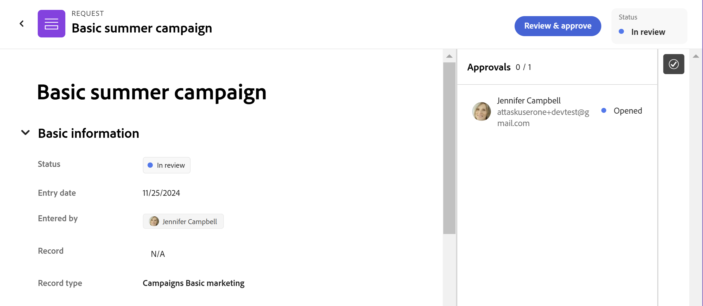

# Approve a request in Adobe Workfront Planning

<!--take Preview and Production references at Production time-->

<!-- do you need to add that only workspace owners can view the Submitted/ Planning tab?? - asking team in slack-->

<!--The information on this page refers to functionality not yet generally available. It is available only in the Preview environment for all customers. After the monthly releases to Production, the same features are also available in the Production environment for customers who enabled fast releases.    

For information about fast releases, see [Enable or disable fast releases for your organization](/help/quicksilver/administration-and-setup/set-up-workfront/configure-system-defaults/enable-fast-release-process.md). -->

{{planning-important-intro}}

When a user submits a request to a request form associated with an approval in Adobe Workfront Planning, approvers receive a notification and an email about the pending approval. They must approve the request before Workfront Planning creates an object. 

This article describes how a workspace manager can approve a request submitted for Workfront Planning to create a record. 

We recommend that you also see the following articles:

* [Create and manage a request form in Adobe Workfront Planning](/help/quicksilver/planning/requests/create-request-form.md)
* [Submit Adobe Workfront Planning requests to create records](/help/quicksilver/planning/requests/submit-requests.md)
* [Add an approval to a request form](/help/quicksilver/planning/requests/add-approval-to-request-form.md)

## Considerations about approving requests and request statuses

Submitted requests display in the Planning tab of the Submitted section in the Requests area of Workfront  with one of the following request statuses: 

* **Pending review**: This status is shown when none of the approvers has opened the request object.
* **In review**: The **Pending review** status changes to **In review** when at least one approver opens the request object. The status of the request remains **In review** until all approvers have approved the request.
* **Approved**: When an approver approves the request object, their individual status becomes **Approved**, but the overall request object status remains **In review** until all approvers have made their decisions. When all approvers approve a request, the request status becomes **Approved**.
* **Completed**: If all approvers approve the request object, its status changes to **Completed**, or if the request did not need an approval.
* **Rejected**: If any approver rejects the request object, the status becomes **Rejected**. No record is created and a new request must be submitted to create the record. 

## Access requirements

+++ Expand to view access requirements for the functionality in this article. 

You must have the following access to perform the steps in this article: 

<table style="table-layout:auto">
 <col>
 </col>
 <col>
 </col>
 <tbody>
    <tr>
<tr>
<td>
   
 Products
 </td>
   <td>
   <ul><li>
 Adobe Workfront
</li>
   <li>
 Adobe Workfront Planning
</li></ul></td>
  </tr>  
 <tr>
   <td role="rowheader">
Adobe Workfront plan*
</td>
   <td>

Any of the following Workfront plans:

<ul><li>Select</li>
<li>Prime</li>
<li>Ultimate</li></ul>

Workfront Planning is not available for legacy Workfront plans

   </td>

<tr>
   <td role="rowheader">
Adobe Workfront Planning package*
</td>
   <td>

Any 
  

For more information about what is included in each Workfront Planning plan, contact your Workfront account manager. </td>

<tr>
   <td role="rowheader">
Adobe Workfront platform
</td>
   <td>

Your organization's instance of Workfront must be onboarded to the Adobe Unified Experience to be able to access all the capabilities of Workfront Planning.

For more information, see <a href="/help/quicksilver/workfront-basics/navigate-workfront/workfront-navigation/adobe-unified-experience.md">Adobe Unified Experience for Workfront</a>. 

   </td>
  </tr>
  </tr>
  <tr>
   <td role="rowheader">
Adobe Workfront license*
</td>
   <td>
   
Standard

   
Workfront Planning is not available for legacy Workfront licenses

  </td>
  </tr>
  <tr>
   <td role="rowheader">
Access level configuration
</td>
   <td> 
There are no access level controls for Adobe Workfront Planning
  
</td>
  </tr>
<tr>
   <td role="rowheader">
Object permissions
</td>
   <td>
   <ul>
   <li>
Manage permissions to a workspace
</li>
    <li>
System Administrators can manage workspaces they did not create. 
</li>
    </ul>
   
For information about sharing permissions for Workfront Planning objects, see  
   <a href="/help/quicksilver/planning/access/sharing-permissions-overview.md">Overview of sharing permissions in Adobe Workfront Planning</a> 
  </td>
  </tr>
<tr>
   <td role="rowheader">
Layout template
</td>
   <td> 
All users, including Workfront administrators,  must be assigned a layout template that includes the Planning area in the Main Menu. 
  
</td>
  </tr>
 </tbody>
</table>

*For more information about Workfront access requirements, see [Access requirements in Workfront documentation](/help/quicksilver/administration-and-setup/add-users/access-levels-and-object-permissions/access-level-requirements-in-documentation.md).  

+++

## Approve a request to create a record

After users add requests to a record type request form that is associated with an approval, the request is sent to the approvers. 

Approvers receive the following notifications about a request pending their approval: 

* An in-app notification
* An email notification

>[!NOTE]
>
>Your organization's instance of Workfront must be onboarded to the Adobe Unified Experience for users to be able to receive email and in-app notifications.

To approve a request:

1. Do one of the following: 

    * If you have access to Workfront Planning and can view at least one workspace, click **Main Menu**  in the upper-right corner of the screen, or the **Main Menu**  in the upper-left corner, if available, then click **Requests** > **Submitted** > **Planning**, and click the request with the status of **Pending review** or **In review**.

      >[!TIP]
      >
      >If you don't have access to Workfront Planning, or if you don't have access to view any workspaces, you can only access a request to approve it using your email or in-app notifications. 
   
    * Click the **Notifications** area icon  in the upper-right corner of the screen and click the notification about a request pending your approval to open the request.
    * Go to the email notification in your email that notifies you about a request pending your approval, then click **Open request** to open the request. <!--add the name of the button here, from the email-->

    The request page opens in read-only mode.

     

1. (Optional) Click the **Approvals** icon  in the upper-right corner of the request to view the approvers.
1. Click **Review and approve**, then choose one of the following: <!--did they fix the button and removed the &??-->

    * **Approve**: This approves the request. A record is immediately created for the record type associated with the request form after all approvers approve the request.
    * **Reject**: This rejects the request, even when you are the only approver that rejects it. No record is created for the record type associated with the request form. 

    The user who submitted the request receives an email and in an-app notifications when their request is approved or rejected. 

    The status of the request changes to the following, depending on the approval decision: 
    
    * **Completed**: The request is approved.
    * **Rejected**: The request is rejected. 

    The request remains in the Planning tab of the Submitted section in the Requests area of Workfront.
