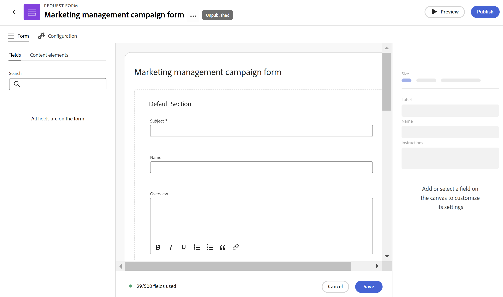
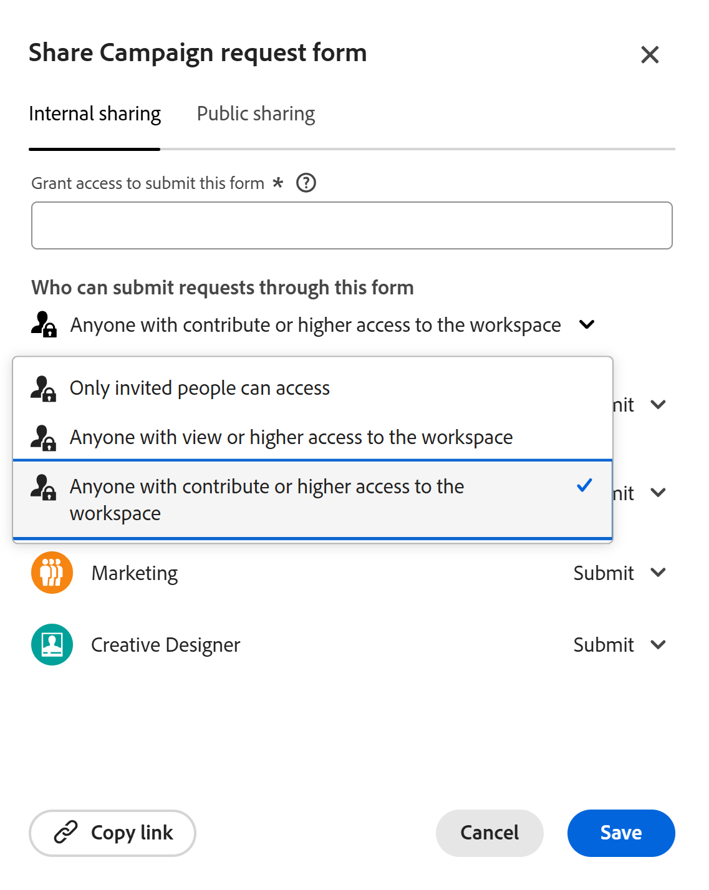
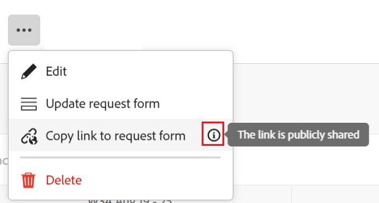

# Create and manage a request form in Adobe Workfront Planning

<!--update the metadata with real information when making this available in TOC and in the left nav-->

{{planning-important-intro}}

You can create a request form and associate it with a record type in Adobe Workfront Planning. You can then share a link to it with other internal or external users. 

Users with a link to the form can update the field values on it, and add new records by submitting it. 

This article describes how a workspace manager can create a request form associated with a record type. 

For information about submitting a request to a record type to create a record, see [Submit Adobe Workfront Planning requests to create records](/help/quicksilver/planning/requests/submit-requests.md). 

## Access requirements

+++ Expand to view access requirements for the functionality in this article. 

You must have the following to be able to access Workfront Planning: 

<table style="table-layout:auto">
 <col>
 </col>
 <col>
 </col>
 <tbody>
    <tr>
<tr>
<td>
   
 Products
 </td>
   <td>
   <ul><li>
 Adobe Workfront
</li>
   <li>
 Adobe Workfront Planning
</li></ul></td>
  </tr>  
 <tr>
   <td role="rowheader">
Adobe Workfront plan*
</td>
   <td>

Any of the following Workfront plans:

<ul><li>Select</li>
<li>Prime</li>
<li>Ultimate</li></ul>

Workfront Planning is not available for legacy Workfront plans

   </td>

<tr>
   <td role="rowheader">
Adobe Workfront Planning plan*
</td>
   <td>

Any 
  

For more information about what is included in each Workfront Planning plan, contact your Workfront account manager. </td>

<tr>
   <td role="rowheader">
Adobe Workfront platform
</td>
   <td>

Your organization's instance of Workfront must be onboarded to the Adobe Unified Experience to be able to access all the capabilities of Workfront Planning.

For more information, see <a href="/help/quicksilver/workfront-basics/navigate-workfront/workfront-navigation/adobe-unified-experience.md">Adobe Unified Experience for Workfront</a>. 

   </td>

  </tr>
  </tr>
  <tr>
   <td role="rowheader">
Adobe Workfront license*
</td>
   <td>
   
Standard

   
Workfront Planning is not available for legacy Workfront licenses

  </td>
  </tr>
  <tr>
   <td role="rowheader">
Access level configuration
</td>
   <td> 
There are no access level controls for Adobe Workfront Planning
  
</td>
  </tr>
<tr>
   <td role="rowheader">
Object permissions
</td>
   <td>
   <ul>
   <li>
Manage permissions to a workspace
</li>
    <li>
System Administrators can manage workspaces they did not create. 
</li>
    </ul>
   
For information about sharing permissions for Workfront Planning objects, see  
   <a href="/help/quicksilver/planning/access/sharing-permissions-overview.md">Overview of sharing permissions in Adobe Workfront Planning</a> 
  </td>
  </tr>
<tr>
   <td role="rowheader">
Layout template
</td>
   <td> 
All users, including Workfront administrators,  must be assigned a layout template that includes the Planning area in the Main Menu. 
  
</td>
  </tr>
 </tbody>
</table>

*For more information about Workfront access requirements, see [Access requirements in Workfront documentation](/help/quicksilver/administration-and-setup/add-users/access-levels-and-object-permissions/access-level-requirements-in-documentation.md).  

+++

## Create a request form for a record type

{{step1-to-planning}}
  
1. Click the workspace where you want to add records.

    The workspace opens and the record types display as cards.

1. Click a record type card. For information about creating a record type, see [Create record types](/help/quicksilver/planning/architecture/create-record-types.md). 

    The record type page opens in the view that you last accessed. By default, a record type page opens in the table view. 

1. Click the **More** menu  to the right of the record type name in the page header, then click **Create request form**.
1. Update the name of the request form. By default, the name of the form is **Untitled request form**. <!--check this; you logged a bug to rename it to this but was it fixed?--> 
1. (Optional) Add a **Description** for the request form. 

   <!--Not possible yet: The Description is visible when you access the request form from the Requests area of Workfront.-->

1. Click **Create**. The request form for the selected record type opens. 

   

   The request form contains the following information, by default:

   * All the record fields available in the table view of the selected record type. 
   * **Default section**: This is the default section break that Workfront applies to the request form. The Default section cannot be renamed or removed. 
   * **Subject** field: The field which will identify the request in Workfront. This capability is not yet available. 
   * All the fields associated with the record type. 

   The fields contained in the request form will be visible to everyone submitting a request to this record type. 

1. (Optional) Hover over any fields on the form that you want to remove, then click the **x** icon to remove them. They are added to the **Fields** tab to the left of the form. 

   For example, remove the **Subject** field, as this is not visible in Workfront Planning. <!--remove this step when we connect intake with the Requests area in Workfront-->
1. Click any field, then use the controls on the right side of the form to define their size, or any of the following information about the fields:

   * **Label**: this is the name of the field as it will appear on the request form. This does not change the name of the record field.
   * **Instructions**: Add more information about the field.
   * **Make a required field**: When selected, the field must have a value. Otherwise, the form cannot be submitted. 
   * **Add logic**: Define what conditions must be met in order for the field to display or be hidden.

1. (Optional) Click the **Content elements** tab on the left side of the form, and add any of the following elements:

   * **Descriptive text**
   * **Section Break** 

   For more information about building a custom form, see [Design a form with the form designer](/help/quicksilver/administration-and-setup/customize-workfront/create-manage-custom-forms/form-designer/design-a-form/design-a-form.md). 

1. (Optional) Click **Preview** to view how the form will display for other users when they will use it to submit a new record.
1. Click **Publish** to publish the form and obtain a unique link for it. 

   The following things occur:

   * The Publish button is removed.
   * The **Unpublish** button is added to the form. Clicking it will prevent the form from being accessible. 
   * A **Share** button is added to the form.

1. Click **Share** to share the form with others. 

      

1. Select from the following options to indicate which types of users can access this form: 

      * Anyone with view or higher access to the workspace
      * Anyone with contribute or higher access to the workspace
      * Anyone with the link

   >[!IMPORTANT]
   >
   >When you select **Anyone with the link**, anyone can access the form and submit a new record, even people outside your organization that don't have a Workfront account. 

1. (Conditional) If you selected **Anyone with the link** in the previous step, select the **Link expiration date** from the available calendar. People will receive an error after the link expires and you must update the link date before they can access the form again. 

   You can select future dates within 180 days from the current date.     

1. Click **Save and copy link** to save the sharing details for the form.

   The form sharing options are saved and the link is copied to your clipboard. You can now share it with others.

   For information about creating records using a link to a request form, see [Submit Adobe Workfront Planning requests](/help/quicksilver/planning/requests/submit-requests.md). 
   
1. Click **Save** in the lower-right corner of the screen to save the form.    
1. Click the left-pointing arrow to the left of the form's name in the header to close the form. 

   The record type page opens. 
1. (Optional) Click the **More** menu  to the right of the record type name in the header, then do one of the following: 
   * Click **Update request form** to make any changes to the request form.
   * Click **Copy link to the request form**  to share the link to the form with others. 

   >[!TIP]
   >
   >There is an indication that the link is publicly shared when this is the case.
   >
         

   
