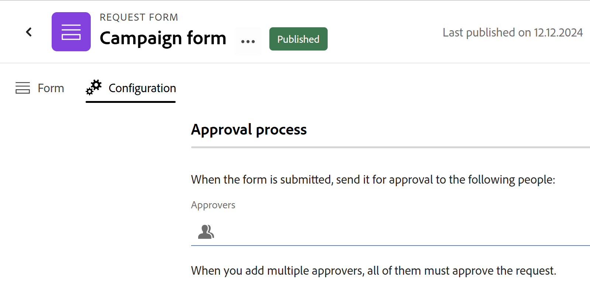
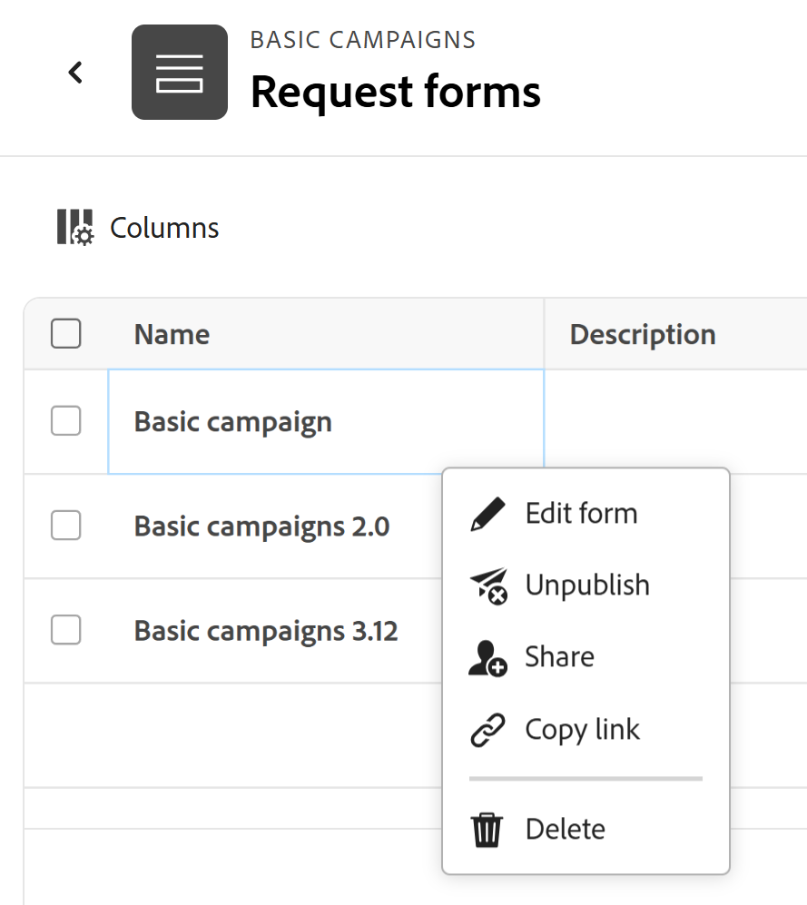

# Create and manage a request form in Adobe Workfront Planning

<!--update the metadata with real information when making this available in TOC and in the left nav-->

<!--take Preview and Production references at Production time-->

<!--The highlighted information on this page refers to functionality not yet generally available. It is available only in the Preview environment for all customers. After the monthly releases to Production, the same features are also available in the Production environment for customers who enabled fast releases.    

For information about fast releases, see [Enable or disable fast releases for your organization](/help/quicksilver/administration-and-setup/set-up-workfront/configure-system-defaults/enable-fast-release-process.md). -->

{{planning-important-intro}}

You can create a request form and associate it with a record type in Adobe Workfront Planning. You can then share the form with others and they can submit requests to create records. 

This article describes how a workspace manager can create a request form associated with a record type. 

For information about submitting a request to a record type to create a record, see [Submit Adobe Workfront Planning requests to create records](/help/quicksilver/planning/requests/submit-requests.md). 

## Access requirements

+++ Expand to view access requirements for the functionality in this article. 

You must have the following access to perform the steps in this article: 

<table style="table-layout:auto">
 <col>
 </col>
 <col>
 </col>
 <tbody>
    <tr>
<tr>
<td>
   
 Products
 </td>
   <td>
   <ul><li>
 Adobe Workfront
</li>
   <li>
 Adobe Workfront Planning
</li></ul></td>
  </tr>  
 <tr>
   <td role="rowheader">
Adobe Workfront plan*
</td>
   <td>

Any of the following Workfront plans:

<ul><li>Select</li>
<li>Prime</li>
<li>Ultimate</li></ul>

Workfront Planning is not available for legacy Workfront plans

   </td>

<tr>
   <td role="rowheader">
Adobe Workfront Planning package*
</td>
   <td>

Any 
  

For more information about what is included in each Workfront Planning plan, contact your Workfront account manager. </td>

<tr>
   <td role="rowheader">
Adobe Workfront platform
</td>
   <td>

Your organization's instance of Workfront must be onboarded to the Adobe Unified Experience to be able to access all the capabilities of Workfront Planning.

For more information, see <a href="/help/quicksilver/workfront-basics/navigate-workfront/workfront-navigation/adobe-unified-experience.md">Adobe Unified Experience for Workfront</a>. 

   </td>

  </tr>
  </tr>
  <tr>
   <td role="rowheader">
Adobe Workfront license*
</td>
   <td>
   
Standard

   
Workfront Planning is not available for legacy Workfront licenses

  </td>
  </tr>
  <tr>
   <td role="rowheader">
Access level configuration
</td>
   <td> 
There are no access level controls for Adobe Workfront Planning
  
</td>
  </tr>
<tr>
   <td role="rowheader">
Object permissions
</td>
   <td>
   <ul>
   <li>
Manage permissions to a workspace <!--and record type--> 
</li>
    <li>
System Administrators can manage workspaces they did not create. 
</li>
    </ul>
   
For information about sharing permissions for Workfront Planning objects, see  
   <a href="/help/quicksilver/planning/access/sharing-permissions-overview.md">Overview of sharing permissions in Adobe Workfront Planning</a> 
  </td>
  </tr>
<tr>
   <td role="rowheader">
Layout template
</td>
   <td> 
All users, including Workfront administrators,  must be assigned a layout template that includes the Planning area in the Main Menu. 
  
</td>
  </tr>
 </tbody>
</table>

*For more information about Workfront access requirements, see [Access requirements in Workfront documentation](/help/quicksilver/administration-and-setup/add-users/access-levels-and-object-permissions/access-level-requirements-in-documentation.md).  

+++

## Field and value display limitations in request forms

There are limitations in how certain fields display on the request form and how their values later display on the records or the request details page, after you submit a request. 

For information about submitting Workfront Planning requests, see [Submit Adobe Workfront Planning requests to create records](/help/quicksilver/planning/requests/submit-requests.md). 

* The following are limitations for how certain fields display in request forms, records created by a request form, or on the request details page: 

   * You cannot add fields of the following types to a request form:
   
      * Created by and Last modified by
      * Created date and Last modified date
      * Formula
      * Workfront objects' lookup fields
      * Workfront Planning connected records' lookup fields

* The following are differences between how field formats display in the request form builder and how the fields' values are formatted on the record or in the request details page:

   * Currency, Number, and Percentage fields display as a Single-line text field type in the form builder. 

      However, the field format is preserved and the field values will display as as currency, numbers, and percentages after the request is submitted, on the record type and in the request details page.

* The following describe how some field values display on request forms and the request details pages: 

   * Special formatting for Currency, Number, and Percentage fields is not preserved. For example, the decimal precision is not preserved for these fields' values in these areas.
   * People field values display as IDs.
   * Formula fields that don't refer to other fields or calculations don't display any values. For example, a field with a `STRING` formula displays a "N/A" value.
   * Formula fields that refer to Currency fields display the values without accounting for exchange rates.
   * The values of Paragraph fields display a "N/A" value on the request form and they display html tags instead of the formatted text in the request details page.

## Create a request form for a record type

{{step1-to-planning}}
  
1. Click the workspace where you want to add records.

    The workspace opens and the record types display as cards.

1. Click a record type card. For information about creating a record type, see [Create record types](/help/quicksilver/planning/architecture/create-record-types.md). 

    The record type page opens in the view that you last accessed. By default, a record type page opens in the table view. 

1. Click the **More** menu  to the right of the record type name in the page header, then click **Create request form** or **Manage request forms**, if you already have a form and you want to create additional ones.
1. (Conditional) If you want to add another form, click **New request form**.
1. Update the name of the request form. By default, the name of the form is **Untitled form**. <!--check this; you logged a bug to rename it to 'Untitled request form' but was it fixed?--> 
1. (Optional) Add a **Description** for the request form. 

   <!--Not possible yet: The Description is visible when you access the request form from the Requests area of Workfront.-->

1. Click **Create**. The request form for the selected record type opens in the Form tab. 

   

   The request form contains the following information, by default:

   * Record fields available in the table view of the selected record type. <!--they are working on removing the limitation below-->
   
   * **Default section**: This is the default section break that Workfront applies to the request form. All record fields display in the **Default section** area. 
   * **Subject** field: The field which will identify the request in Workfront. The configuration and the value of the Subject field are not editable.

      >[!NOTE]
      >
      >* The **Subject** field requires a value when it is visible on the request form. However, you can remove the **Subject** field, if needed, and requestors will not see it on the form when they submit the request.   
      >* When the Subject field is missing on a request form, but there is a Name field for the future record's name, the name of the request is automatically assigned the same name as the created record. 
      >* When both the Subject and the Name fields are missing on the request form, the request is named using the following pattern: `< Record name > request form < Entry date of the request >`; the record is named **Untitled**. 

   * All the fields associated with the record type. 

      The fields contained in the request form will be visible to everyone submitting a request to this record type. 

1. (Optional) Hover over any fields on the form that you want to remove, then click the **x** icon to remove them. They are added to the **Fields** tab to the left of the form. 

   For example, remove the **Subject** field, as this is not visible in Workfront Planning. <!--remove this example if this becomes visible in Planning?-->

1. (Optional) To remove the **Default section** from the form, do the following:

   1. Remove all fields from the Default Section. 
   1. Click **Content elements** and add a new section, then add a name for the section. 
   1. Add fields to the new section. 
   1. Click the **x** icon to remove the **Default section**. 
1. Click any field, then use the controls in the right panel in the form to define their size, or any of the following information:

   * **Label**: This is the name of the field as it will appear on the request form. This does not change the name of the record field.
   * **Instructions**: Add more information about the field.
   * **Make a required field**: When selected, the field must have a value. Otherwise, the form cannot be submitted. 
   * **Add logic**: Define what conditions must be met in order for the field to display or be hidden.

   >[!TIP]
   >
   >   The field type of each field displays at the top of the right panel, after you select the field on the form. 
   >     

1. (Optional) Click the **Content elements** tab on the left side of the form, and add any of the following elements:

   * **Descriptive text**
   * **Section break** 

   For more information about building a custom form, see [Create a custom form](/help/quicksilver/administration-and-setup/customize-workfront/create-manage-custom-forms/form-designer/design-a-form/design-a-form.md). 

1. (Optional) Click **Preview** to view how the form will display for other users when they will use it to submit a new record.

1. (Optional) Click the **Configuration** tab, then add at least one user to the **Approvers** field to approve new requests for this record form. 

   

   <!--below bullet list is duplicated in the Add approval to a request form article-->

   * When you associate a request form with approvers, any new request must first be approved by all approvers before it generates a new record. 
   * You can add one or several approvers to a request form. 
   * If at least one approver rejects the request, the request is rejected and the record is not created. 
   * All approvers must make a decision before a request is either approved or rejected.

      For more information about adding approvals to request forms, see [Add approval to a request form](/help/quicksilver/planning/requests/add-approval-to-request-form.md). 

1. (Optional) Click the **More** menu  to the right of the form's name in the header, then click **Edit** to update the name of the form.
1. Click **Publish** to publish the form and obtain a unique link for it. 

   The following things occur:

   * The **Publish** button is removed.
   * The **Unpublish** button is added to the form. Clicking it will prevent the form from being accessible. 
   * A **Share** button is added to the form.

1. Click **Share** to share the form with others. 

      

1. Select from the following options to indicate which types of users can access this form: 

      * Anyone with view or higher access to the workspace
      * Anyone with contribute or higher access to the workspace
      * Anyone with the link

   >[!WARNING]
   >
   >* When you select **Anyone with the link**, anyone can access the form and submit a new record, even people outside your organization that don't have a Workfront account. 
   >
   >* A form that contains the following field types cannot be shared publicly:
   >
   >     * Workfront or AEM Assets Connections
   >     * People
   >

1. (Conditional) If you selected **Anyone with the link** in the previous step, select the **Link expiration date** from the available calendar. 

   People will receive an error after the link expires and you must update the link date and generate a new link to share before people can access the form again. 

   You can select future dates within 180 days from the current date.  

   >[!TIP]
   >
   >After the sharing date expires, the request form is no longer available in the Requests area of Workfront, and the links shared with other users are no longer accessible.   

1. (Optional) Click **Save and copy link** to save the sharing details for the form. If the form was previously saved, click **Copy link**.

   The form sharing options are saved and the link is copied to your clipboard. You can now share it with others.

   For information about creating records using a link to a request form, see [Submit Adobe Workfront Planning requests](/help/quicksilver/planning/requests/submit-requests.md). 
   
1. Click **Save** in the lower-right corner of the **Form** tab to save the form.  

1. Click the left-pointing arrow to the left of the form's name in the header to close the form. 

   The **Request forms** table view opens and the the form is added to it.

1. (Optional) Hover over the name of a request form in the table view, then click the **More** menu  to the right of the form name, and click one of he following:

   * **Edit form**: Click this to further edit information on the form.
   * **Unpublish**: Click this to unpublish the form which removes it from the Requests area in Workfront.
   * **Share**: Click this to modify who has access to the form.
   * **Copy link**: Click this to quickly copy the request form's link without opening the form.
   * **Delete**: Click this to delete the form. All requests and records added using the form are not deleted. The form cannot be recovered. 

   

1. Click the left-pointing arrow to the left of **Request forms** in the header to close the request forms table.  

   The record type page opens. 
1. (Optional and conditional) Click the **More** menu  to the right of the record type name in the header, then do one of the following: 
   
   1. Click **Update request form** to make any changes to the request form, then click a request form to open and edit it.
   1. Click **Copy link to request form**  to share the link to the form with others. 
 
1. (Optional) Go to the **Requests** area in Workfront and find the shared form to submit a request. For information, see [Submit Adobe Workfront Planning requests to create records](/help/quicksilver/planning/requests/submit-requests.md). 

