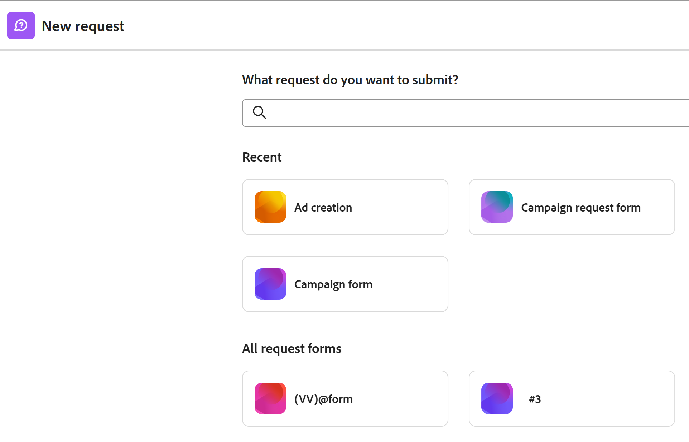
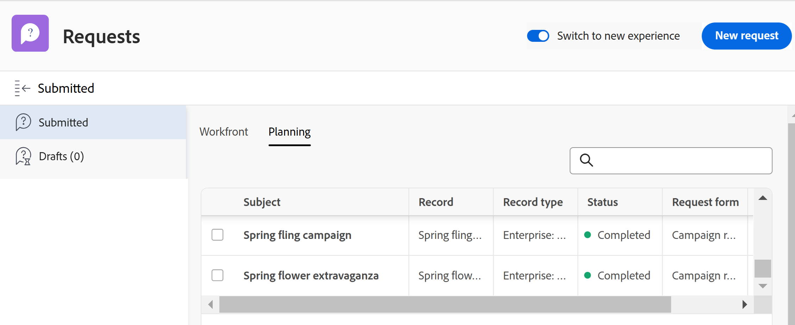
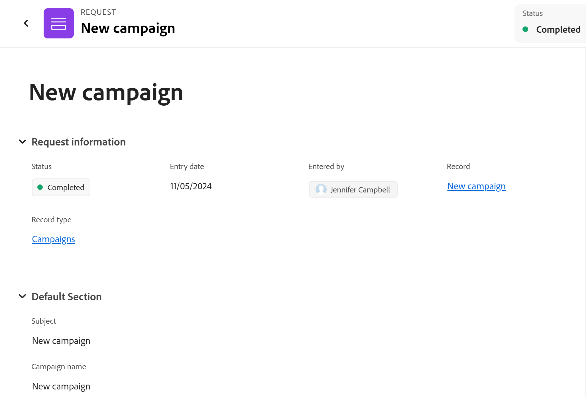
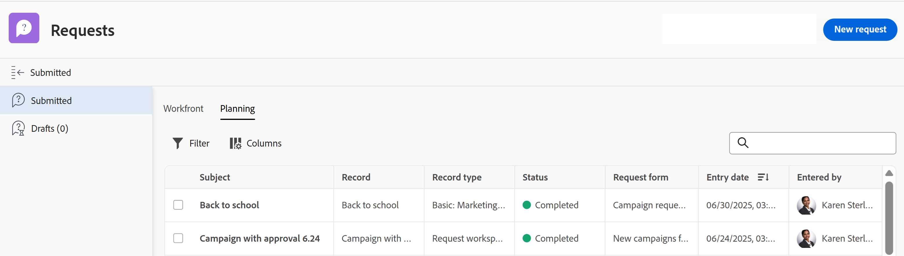

# Submit Adobe Workfront Planning requests to create records

<!--update title when there will be more functionality added to the Planning requests, besides creating records-->
<!--take Preview and Prod references out when releasing to Prod all-->

The highlighted information on this page refers to functionality not yet generally available. It is available only in the Preview environment for all customers. After the monthly releases to Production, the same features are also available in the Production environment for customers who enabled fast releases.    

For information about fast releases, see [Enable or disable fast releases for your organization](/help/quicksilver/administration-and-setup/set-up-workfront/configure-system-defaults/enable-fast-release-process.md). 

{{planning-important-intro}}

After a workspace manager builds a request form for a record type in Adobe Workfront Planning, you can use the form to submit requests that will create records for the record type associated with the form. 

You can submit a Workfront Planning request from the following areas: 

* From the Requests area of Workfront. 
* From a direct link to the request form that was shared. 

   This article describes how you can submit a request to add new records to a record type from the Requests area of Workfront, or from a shared link.
* From the record type page, when you add or request a new record. For information, see [Create records](/help/quicksilver/planning/records/create-records.md).  

Workfront users and external users can submit requests to Planning record types and create records. <!--double check on the external users-->

For information about how a workspace manager can create a request form and associate it with a record type, see [Create and manage a request form in Adobe Workfront Planning](/help/quicksilver/planning/requests/create-request-form.md).

## Access requirements

+++ Expand to view access requirements for the functionality in this article. 

You must have the following access to perform the steps in this article: 

<table style="table-layout:auto">
 <col>
 </col>
 <col>
 </col>
 <tbody>
    <tr>
<tr>
<td>
   
 Products
 </td>
   <td>
   <ul><li>
 Adobe Workfront
</li>
   <li>
 Adobe Workfront Planning
</li></ul></td>
  </tr>  
 <tr>
   <td role="rowheader">
Adobe Workfront plan*
</td>
   <td>

Any of the following Workfront plans:

<ul><li>Select</li>
<li>Prime</li>
<li>Ultimate</li></ul>

Workfront Planning is not available for legacy Workfront plans

   </td>
<tr>
   <td role="rowheader">
Adobe Workfront Planning package*
</td>
   <td>

Any 
  

For more information about what is included in each Workfront Planning plan, contact your Workfront account manager. </td>
<tr>
   <td role="rowheader">
Adobe Workfront platform
</td>
   <td>

Your organization's instance of Workfront must be onboarded to the Adobe Unified Experience to be able to access all the capabilities of Workfront Planning.

For more information, see <a href="/help/quicksilver/workfront-basics/navigate-workfront/workfront-navigation/adobe-unified-experience.md">Adobe Unified Experience for Workfront</a>. 

   </td>

  </tr>
  </tr>
  <tr>
   <td role="rowheader">
Adobe Workfront license*
</td>
   <td>
   
External, Contributor, Light, or Standard license

   
Workfront Planning is not available for legacy Workfront licenses

  </td>
  </tr>
  <tr>
   <td role="rowheader">
Access level configuration
</td>
   <td> 
There are no access level controls for Adobe Workfront Planning
  
</td>
  </tr>
<tr>
   <td role="rowheader">
Object permissions
</td>
   <td>
   
View or higher permissions to a workspace <!--and record type-->, if you are a Workfront user
 
  </td>
  </tr>
<tr>
   <td role="rowheader">
Layout template
</td>
   <td> 
To access the Planning area in Workfront, you must be assigned a layout template that includes the Planning area in the Main Menu. 

   
 However, accessing the Planning area is not required to submit requests to Workfront Planning. 
  
</td>
  </tr>
 </tbody>
</table>

*For more information about Workfront access requirements, see [Access requirements in Workfront documentation](/help/quicksilver/administration-and-setup/add-users/access-levels-and-object-permissions/access-level-requirements-in-documentation.md).  

+++

## Prerequisites

The following must be in place before you can submit a request to a Workfront Planning request form: 

* The following must exist in Workfront Planning:

   * A workspace
   * A record type.
   * A request form associated with a record type. 
   
      For information, see [Create a request form in Adobe Workfront Planning](/help/quicksilver/planning/requests/create-request-form.md).
   
* The request form must be shared in a way you can access it. The following scenarios exist: 

   * Internally, the form must be shared with users who have View or higher permissions to the workspace. 

      Workfront users can either access the form from a link or find the request form in the Requests area of Workfront. 

   * If you don't have a Workfront account, a link to the form has been shared with external people. 
   
      Workfront users can also access a link shared with external people. 

* The link to the form must not be expired.

## Considerations about submitting requests to Workfront Planning

* You cannot edit a request in Workfront after you submit it.
* Each submitted request creates a record for the record type associated with the form you use, if the form is not associated with an approval, or if the approval has been granted by all approvers.
* Records created by submitting request forms cannot be differentiated from records added through any other method in Workfront Planning. 

   For information, see [Create records](/help/quicksilver/planning/records/create-records.md). 
* Submitted requests display in the Planning tab of the Submitted section in the Requests area of Workfront. 
* There are limitations in how certain field types display in a request form, or the request details page after a form is submitted. 

   For information, see [Create and manage a request form in Adobe Workfront Planning](/help/quicksilver/planning/requests/create-request-form.md).

<!--Not sure how to change the request status, but dev also said: Changing the names of the statuses might lead to some inconsistency between unified-approvals-service and intake-approvals-flow.-->

## Submit a request to Workfront Planning in the Requests area of Workfront

>[!NOTE]
>
>After the monthly releases to Production, the features described in this section are also available in the Production environment for customers who enabled fast releases.

{{step1-to-requests}}

1. Enable the **Switch to a new experience** setting, in the upper-right corner of he screen. 
   Enabling this setting makes the Workfront Planning request forms available in the **Requests** area of Workfront.

   >[!TIP]
   >
   >This setting is available only when the following are in place:
   >
   >* Your company has purchased a Workfront Planning package. 
   >* Your Workfront instance is onboarded to the Adobe Unified Experience. 
   >* You have access to view at least one workspace. 
   >

1. Click **New request**. 

   

   The **New request** box opens with the following information: 

   * The 6 most recently accessed Workfront request queues and Planning request forms display in the Recent section. 
   * 50 additional Workfront request queues and Planning request forms display in alphabetical order in the **All request forms** section. You can search for a request queue that does not display by default. 

1. Do one of the following:

   * Click the card for one of the Planning request forms in the Recent or All request forms sections
   * Start typing the name of a Planning request form in the search box, then click the card when it displays in the list. 

   The request form opens.

1. Update the fields available in the request form. Fields with a red asterisk are required. 
1. Click **Submit**.
    
   The request form closes and you return to the **Requests** area. 

   Your form is submitted and the following things occur:

   * If the request form was not associated with an approval, the request is added to the Planning tab of the Submitted section of the Workfront Requests area and a new record is added to the record type associated with the form.
   
   * If the request form was associated with an approval, the request is added to the Planning tab of the Submitted section of the Workfront Requests area. A new record is added to the record type page only after all the approvers have approved it.
   
      For information, see [Add an approval to a request form](/help/quicksilver/planning/requests/add-approval-to-request-form.md).

      

      >[!IMPORTANT]
      >
      >All users who have access to at least one workspace can view the Planning tab in the Requests area. You can view only the requests submitted by you or anyone else to the workspaces that you have at least permissions to View. Workfront administrators can view all requests submitted to any workspace in the system. 

   * You receive an in-app and an email notification that the request has either been submitted successfully or has been sent for review.
   * If the request form was associated with an approval, the approvers receive an in-app and an email notification to review and approve the request.

      >[!NOTE]
      >
      >The email and in-app notifications are visible only when your organization's instance of Workfront is onboarded to the Adobe Unified Experience.

   1. (Optional) Click **View your request** in the confirmation message, to open the request, or click the **X** icon to close the confirmation.

1. (Optional) Click the **Planning** tab in the Requests area to view your request, then click the name of the request. 

   The request details page opens. 

   

1. (Conditional) If the request form is not associated with an approval, or if the request has been approved, click the name of the request, then click the name of the record in the **Record** field. 

   The record's page opens in Workfront Planning. 

   >[!TIP]
   >
   >* If the record's primary field was not updated in the request form, the name of the record in the Record field of the request displays as **Untitled**. 
   >
   >* If the request form is associated with an approval, the approval must be granted before you can access the record from the request page. 

1. (Optional) Click the name of the **Record type**. 

   The record type page opens in Workfront Planning. 

## Submit a request to Workfront Planning from a shared link to a request form

1. Go to the link shared with you from a Workfront Planning record type. 

1. Update the fields available in the form. Fields with an asterisk are required. 

   >[!TIP]
   >
   >   If the **Subject** field is available, it will not be visible in Workfront Planning, after the request is submitted. 
   >
   >We recommend that you update as many fields in your request as possible to make the new record identifiable when it is added to the record type in Workfront Planning.

1. Click **Submit**.

   Your form is submitted and the following things occur:

   * If the request form was not associated with an approval, the request is added to the Planning tab of the Submitted section of the Workfront Requests area and a new record is added to the record type associated with the form.
   
   * If the request form was associated with an approval, the request is added to the Planning tab of the Submitted section of the Workfront Requests area. A new record is added to the record type page only after all the approvers have approved it.
   
      For information, see [Add an approval to a request form](/help/quicksilver/planning/requests/add-approval-to-request-form.md).

      

      >[!IMPORTANT]
      >
      >All users who have access to at least one workspace can view the Planning tab in the Requests area. You can view only the requests submitted by you or anyone else to the workspaces that you have at least permissions to View. Workfront administrators can view all requests submitted to any workspace in the system. <!--ensure this is correct; asking team in slack-->

   * You receive an in-app and an email notification that the request has either been submitted successfully or has been sent for review.
   * If the request form was associated with an approval, the approvers receive an in-app and an email notification to review and approve the request.

      >[!NOTE]
      >
      >The email and in-app notifications are visible only when your organization's instance of Workfront is onboarded to the Adobe Unified Experience.

1. (optional) Click **View your request** to open the request in Workfront.

      Or

      Click [Submit another request](https://pulsar.devtest.workfront-dev.com/intake/6740a1ff44bf3a5600cf4481/request) to open the request form and add a new request. 

1. (Optional) Click **Main menu** > **Requests** > the **Planning** tab to view your request, then click the name of the request. 

   The request details page opens. 

   

1. (Conditional) If the request form is not associated with an approval, or if the request has been approved, click the name of the request, then click the name of the record in the **Record** field. 

   The record's page opens in Workfront Planning. 

   >[!TIP]
   >
   >* If the record name was not added to the request form, the name of the record in the Record field of the request displays as **Untitled**. 
   >
   >* If the request form is associated with an approval, the approval must be granted before you can access the record from the request page. 

1. (Optional) Click the name of the **Record type**. 

   The record type page opens in Workfront Planning. 

  

