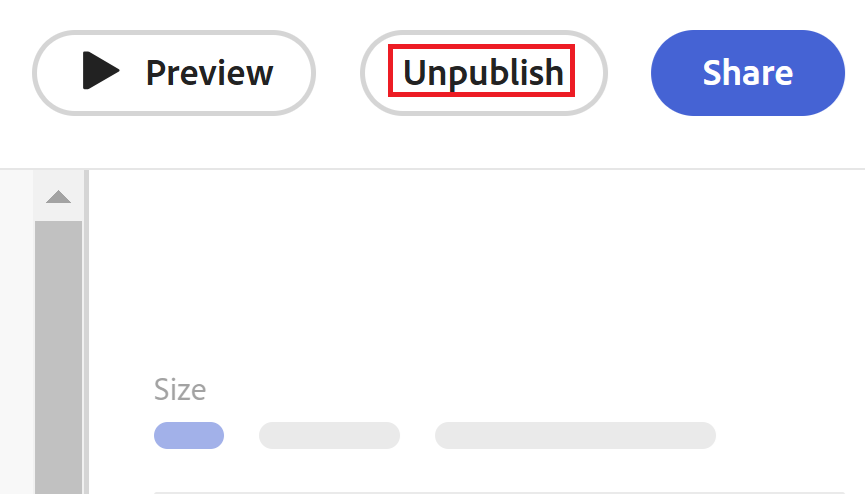

# Unpublish a request form in Adobe Workfront Planning

<!--take Preview and Production references at Production time-->

<!--The highlighted information on this page refers to functionality not yet generally available. It is available only in the Preview environment for all customers. After the monthly releases to Production, the same features are also available in the Production environment for customers who enabled fast releases.    

For information about fast releases, see [Enable or disable fast releases for your organization](/help/quicksilver/administration-and-setup/set-up-workfront/configure-system-defaults/enable-fast-release-process.md). -->

{{planning-important-intro}}

You can unpublish a request form if it is no longer needed or relevant. By unpublishing, you remove everyone's permissions to access the form. 

You can also change the entities you share a request form with, if you want to keep it available to a smaller group of people. 

## Access requirements

+++ Expand to view access requirements for the functionality in this article. 

You must have the following access to perform the steps in this article: 

<table style="table-layout:auto">
 <col>
 </col>
 <col>
 </col>
 <tbody>
    <tr>
<tr>
<td>
   
 Products
 </td>
   <td>
   <ul><li>
 Adobe Workfront
</li>
   <li>
 Adobe Workfront Planning
</li></ul></td>
  </tr>  
 <tr>
   <td role="rowheader">
Adobe Workfront plan*
</td>
   <td>

Any of the following Workfront plans:

<ul><li>Select</li>
<li>Prime</li>
<li>Ultimate</li></ul>

Workfront Planning is not available for legacy Workfront plans

   </td>

<tr>
   <td role="rowheader">
Adobe Workfront Planning package*
</td>
   <td>

Any 
  

For more information about what is included in each Workfront Planning plan, contact your Workfront account manager. </td>

<tr>
   <td role="rowheader">
Adobe Workfront platform
</td>
   <td>

Your organization's instance of Workfront must be onboarded to the Adobe Unified Experience to be able to access all the capabilities of Workfront Planning.

For more information, see <a href="/help/quicksilver/workfront-basics/navigate-workfront/workfront-navigation/adobe-unified-experience.md">Adobe Unified Experience for Workfront</a>. 

   </td>

  </tr>
  </tr>
  <tr>
   <td role="rowheader">
Adobe Workfront license*
</td>
   <td>
   
Standard

   
Workfront Planning is not available for legacy Workfront licenses

  </td>
  </tr>
  <tr>
   <td role="rowheader">
Access level configuration
</td>
   <td> 
There are no access level controls for Adobe Workfront Planning
  
</td>
  </tr>
<tr>
   <td role="rowheader">
Object permissions
</td>
   <td>
   <ul>
   <li>
Manage permissions to a workspace <!--and record type--> 
</li>
    <li>
System Administrators can manage workspaces they did not create. 
</li>
    </ul>
   
For information about sharing permissions for Workfront Planning objects, see  
   <a href="/help/quicksilver/planning/access/sharing-permissions-overview.md">Overview of sharing permissions in Adobe Workfront Planning</a> 
  </td>
  </tr>
<tr>
   <td role="rowheader">
Layout template
</td>
   <td> 
All users, including Workfront administrators,  must be assigned a layout template that includes the Planning area in the Main Menu. 
  
</td>
  </tr>
 </tbody>
</table>

*For more information about Workfront access requirements, see [Access requirements in Workfront documentation](/help/quicksilver/administration-and-setup/add-users/access-levels-and-object-permissions/access-level-requirements-in-documentation.md).  

+++

## Change the sharing of a request form

If you share a request for publicly, with everyone including users from outside your organization, you might consider restricting this access to certain users who either view or manage the workspace the form is associated with. 

To change the sharing of a request form: 

{{step1-to-planning}}
  
1. Click the workspace where you want to add records.

    The workspace opens and the record types display as cards.

1. Click a record type card. For information about creating a record type, see [Create record types](/help/quicksilver/planning/architecture/create-record-types.md). 

    The record type page opens in the view that you last accessed. By default, a record type page opens in the table view. 

1. Click the **More** menu  to the right of the record type name in the page header, then click **Update request form**.
1. Click **Share** in the upper-right corner of the screen, then update the sharing choices. For more information, see [Create and manage a request form in Adobe Workfront Planning](/help/quicksilver/planning/requests/create-request-form.md). 
1. (Optional) Click **Copy link**, if you changed the sharing of the request form and you want to share it to the new group of people with a new link. 

## Unpublish a request form for a record type

When a request form becomes irrelevant and you don't want anyone to access it any longer, you can unpublish it. 

{{step1-to-planning}}
  
1. Click the workspace where you want to add records.

    The workspace opens and the record types display as cards.

1. Click a record type card. For information about creating a record type, see [Create record types](/help/quicksilver/planning/architecture/create-record-types.md). 

    The record type page opens in the view that you last accessed. By default, a record type page opens in the table view. 

1. Click the **More** menu  to the right of the record type name in the page header, then click **Update request form**.
1. Click **Unpublish** in the upper-right corner.

    

    A confirmation displays at the bottom of the screen notifying you that the form was unpublished. 

    The **Unpublish** button changes to **Publish**. 

1. Click **Save**. 

    The form cannot be accessed from a link <!--or from the request queue in the Requests area of Workfront--> any longer. 
    
    Any records previously added using the request form remain on the record type page. 

    Any requests previously added remain in the Requests area of Workfront, on the Planning tab.
