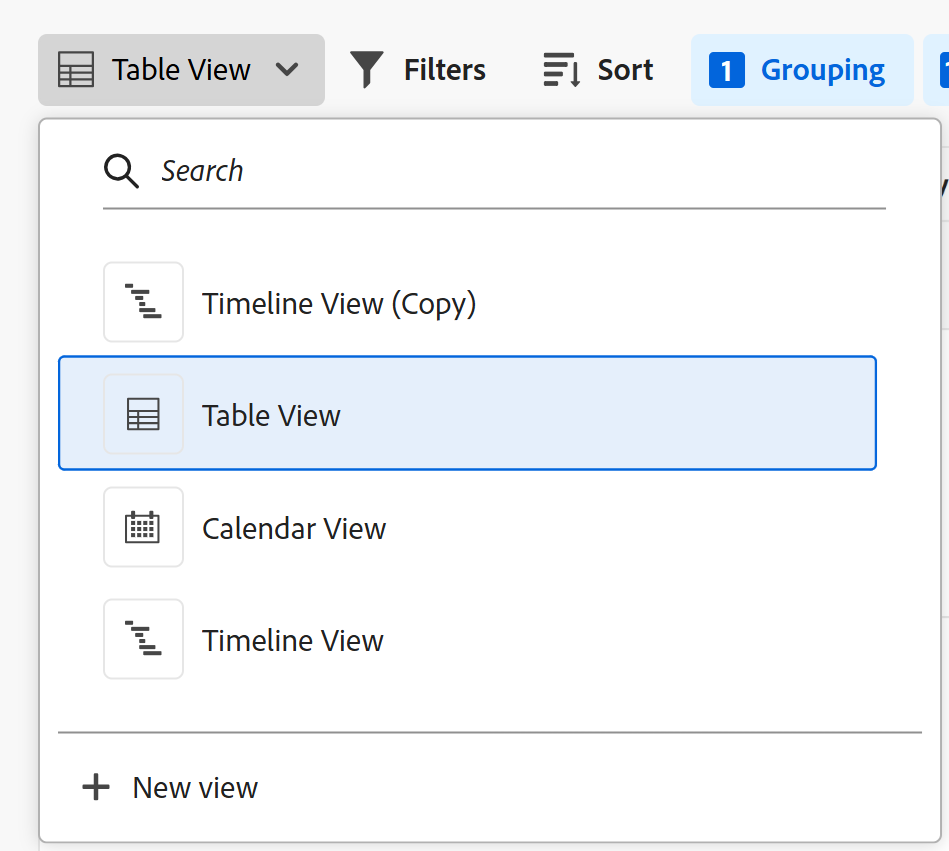
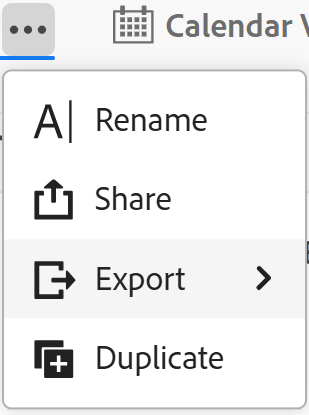
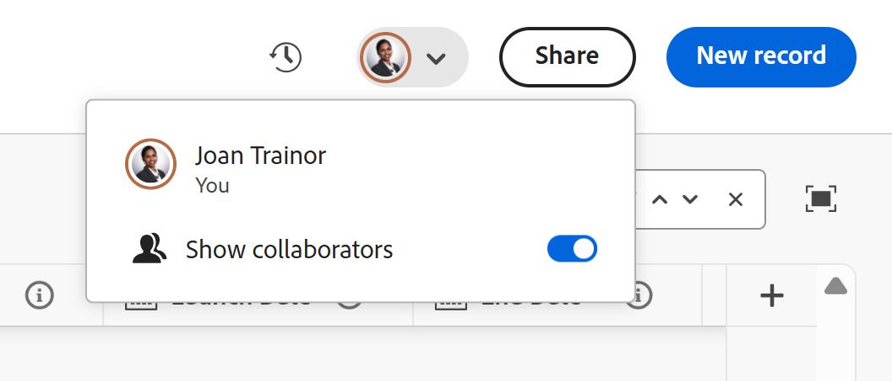
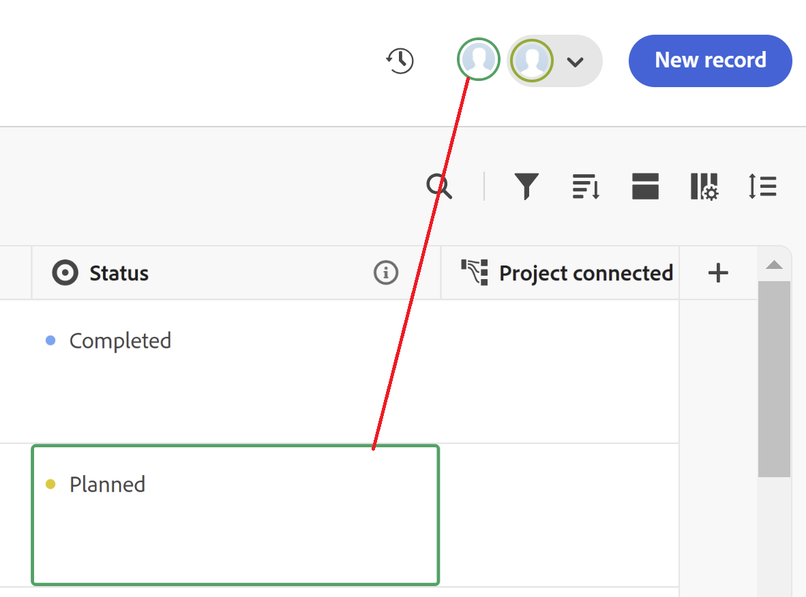

# Manage record views

{{planning-important-intro}}

After selecting a record type in Adobe Workfront Planning area, you can display all the records of that type in the following views: 

* Table
    
    For more information, see [Manage the table view](/help/quicksilver/planning/views/manage-the-table-view.md). 

* Timeline

    For more information, see [Manage the timeline view](/help/quicksilver/planning/views/manage-the-timeline-view.md). 

* Calendar 

    For more information, see [Manage the calendar view](/help/quicksilver/planning/views/manage-the-calendar-view.md).

This article describes the following information about record views:

* [Create and edit a view](#create-or-edit-record-views) 
* [Delete a view](#delete-views)
* [Duplicate a view](#duplicate-views)
* [Enable the real-time presence indicators in a view](#enable-the-real-time-presence-indicator-in-a-view)
<!--* [Add a view as a favorite](#add-a-view-as-a-favorite) - not possible yet-->

## Access requirements

+++ Expand to view access requirements for Workfront Planning. 

You must have the following to be able to access Workfront Planning:  

 <table style="table-layout:auto"> 
<col> 
</col> 
<col> 
</col> 
<tbody> 
    <tr> 
<tr> 
<td> 
   
 Products
 </td> 
   <td> 
   <ul><li>
 Adobe Workfront
</li> 
   <li>
 Adobe Workfront Planning
</li></ul></td> 
  </tr>   
<tr> 
   <td role="rowheader">
Adobe Workfront plan*
</td> 
   <td> 

Any of the following Workfront plans:
 
<ul><li>Select</li> 
<li>Prime</li> 
<li>Ultimate</li></ul> 

Workfront Planning is not available for legacy Workfront plans
 
   </td> 
<tr> 
   <td role="rowheader">
Adobe Workfront Planning plan*
</td> 
   <td> 

Any 
 

For more information about what is included in each Workfront Planning plan, see <a href="https://business.adobe.com/products/workfront/pricing.html">Adobe Workfront pricing and packaging</a>. 
 
   </td> 
 <tr> 
   <td role="rowheader">
Adobe Workfront platform
</td> 
   <td> 

Your organization's instance of Workfront must be onboarded to the Adobe Unified Experience to be able to access all the capabilities of Workfront Planning.
 

For more information, see <a href="/help/quicksilver/workfront-basics/navigate-workfront/workfront-navigation/adobe-unified-experience.md">Adobe Unified Experience for Workfront</a>. 
 
   </td> 
   </tr> 
  </tr> 
  <tr> 
   <td role="rowheader">
Adobe Workfront license*
</td> 
   <td>
 Standard 

   
Workfront Planning is not available for legacy Workfront licenses
 
  </td> 
  </tr> 
  <tr> 
   <td role="rowheader">
Access level configuration
</td> 
   <td> 
There are no access level controls for Adobe Workfront Planning
   
</td> 
  </tr> 
<tr> 
   <td role="rowheader">
Object permissions
</td> 
   <td>   
Manage permissions to a view
  
   
View permissions to a view to temporarily change the view settings
 </td> 
  </tr> 
<tr> 
   <td role="rowheader">
Layout template
</td> 
   <td> 
All users, including Workfront administrators,  must be assigned a layout template that includes the Planning area in the Main Menu. 
 </td> 
  </tr> 
</tbody> 
</table> 

 *For more information about Workfront access requirements, see [Access requirements in Workfront documentation](/help/quicksilver/administration-and-setup/add-users/access-levels-and-object-permissions/access-level-requirements-in-documentation.md).

+++   

<!--old: 

<table style="table-layout:auto">
 <col>
 </col>
 <col>
 </col>
 <tbody>
    <tr>
<tr>
<td>
   
 Product
 </td>
   <td>
   
 Adobe Workfront
 </td>
  </tr>  
 <td role="rowheader">
Adobe Workfront agreement
</td>
   <td>

Your organization must be enrolled in the early access stage for Workfront Planning 

   </td>
  </tr>
  <tr>
   <td role="rowheader">
Adobe Workfront plan
</td>
   <td>

Any

   </td>
  </tr>
  <tr>
   <td role="rowheader">
Adobe Workfront license*
</td>
   <td>
   
New: Standard

   Or
   
Current: Plan 
 
  </td>
  </tr>
  
  <tr>
   <td role="rowheader">
Access level configurations
</td>
   <td> There are no access controls for Adobe Workfront Planning
  
</td>
  </tr>

  <tr>
   <td role="rowheader">
Permissions
</td>
   <td> 
Manage permissions to a view
  
   
View permissions to a view to temporarily change the view settings

</td>
  </tr>

<tr>
   <td role="rowheader">
Layout template
</td>
   <td> 
All users, including Workfront administrators,  must be assigned a layout template that includes the Planning area in the Main Menu. 
 
For information, see <a href="/help/quicksilver/planning/access/access-overview.md">Access overview</a>. 
 
</td>
  </tr>
 </tbody>
</table>

*For information, see [Access requirements in Workfront documentation](/help/quicksilver/administration-and-setup/add-users/access-levels-and-object-permissions/access-level-requirements-in-documentation.md). -->

## Considerations when working with record views

* Views in Workfront Planning are record type-specific. You cannot apply the same view to two different record types. 
* Views that you create are visible only to you and users who you share the views with. 
* When you modify or delete a view, it is modified and deleted for all users who have permissions to the view. 
* Each user can create a maximum of 100 views. You can display more than 100 views for a record type, but one user can create only 100 views. 
* You can share views you create with others. For information, see [Share views](/help/quicksilver/planning/access/share-views.md). 
* The following elements are unique to each record view:

    * Filter
    * Grouping
    * Sort
    * Bar appearance (for the timeline view)
    
    <!-- some of these are not available in all of the views - edit above-->

    For example, when creating a filter in a table view, the filter results are visible only in the view selected and not in all the views associated with the record type. 

    >[!NOTE]
    >
    > Some view elements might not be available to all views.
    

## Similarities and differences between record views

The following table shows the similarities and differences between the table, timeline, and calendar views: 

<!--some of these are NOT available right now; if you make this public, comment out the ones not there-->

| Feature                                                               | Table view | Timeline view | Calendar view|
|-----------------------------------------------------------------------|------------|---------------|--------------|
| Display records in a list or table                                    |    ✓          |              | |
| Display all fields as columns in the table, by default |     ✓       |              |    |
| Hide or show fields (or columns)       | ✓          |               |    |
| Edit field values for each record                           | ✓          |               |             |
| Add records as new rows in the view                                               | ✓          |               |        |
| Add fields as new columns in the view                                               | ✓          |               |         |
| Copy rows from an external list and paste them in a table             | ✓          |               |          |
| Display records in a timeline        |            |      ✓        |             | 
| Filter records            |     ✓     |✓             |    ✓       |
| Display records on a calendar                               |           |              |        ✓|
| Group records                                      |      ✓     | ✓             |
| Sort records                                       | ✓          |              |
| Color-code records                     |           | ✓              |          ✓     |
| Color-code groupings                     |           | ✓              |
| Search for specific records                     |  ✓         | ✓              |
| Share the view with others                     |  ✓         | ✓              |       ✓     |
| Open the record's page from the view                    |  ✓         | ✓              |    |

## Create or edit views {#create-or-edit-views}

{{step1-to-planning}} 
    
    
1. Click the card of a workspace. 

    The workspace opens and the record types display as cards. 
 
1. Click a record type card. 

    The record type page opens. 

    By default, all the records of the selected type display in the table view. 

1. Click **+ View** to add a new view. 
1. Select from the following types of views: 

    * Table
    * Timeline
    * Calendar

    A new tab is created with the selected view. 

    Depending on the width of your screen, additional views might display in the **More** menu .   

>[!TIP]
>
>When you create a record type, the table view is also created by default. 
>
>To create a timeline or a calendar view, the record type you build the view for must have at least two date fields. 
>
>Otherwise, the Timeline and the Calendar options are dimmed.
>

1. (Conditional) Click **Next**, when creating a timeline or calendar view.
    
    By default, Workfront gives the view one of the following names: 
    
    * `Table < number >`    
    * `Timeline < number >`
    * `Calendar < number >`
    
    The number is an automatically generated increment. 

1. (Conditional) Select the **Start** and **End dates** for the records that will display in the timeline or calendar view.
    
    >[!TIP]
    >
    >    You can select from record date fields, or lookup date fields from connected record or object types. You must use aggregators for date fields (MAX or MIN) when you select lookup fields as Start and End dates for the timeline and calendar views. For information, see [Connect record types](/help/quicksilver/planning/architecture/connect-record-types.md). 

1. Click **Create**.

    The view displays as a new tab. Views display in the chronological order from when they were created or shared with you. 
1. (Optional) Click the **More** menu  next to the last view to display all views for the selected record type. 

    Additional views display under the **More** menu after the last view tab. The number next to the **More** menu shows the number of additional views.
1. (Optional) To rename a view after it is created, click the view drop-down menu, then click the **More** menu  > **Rename** to update the view name

    Or

    Double-click the view name and start typing the new name.  <!--ensure there is not another saving step here?!-->

1. (Optional) To manage a specific type of view, see the following articles: 

    * [Manage the table view](/help/quicksilver/planning/views/manage-the-table-view.md)
    * [Manage the timeline view](/help/quicksilver/planning/views/manage-the-timeline-view.md)
    * [Manage the calendar view](/help/quicksilver/planning/views/manage-the-calendar-view.md)

## Delete views

{{step1-to-planning}}

1. Click the card of a workspace. 

    The workspace opens and the record types display as cards. 
 
1. Click a record type card. 

    The record type page opens.  

    By default, all the records of the selected type display in the table view. 

1. Hover over one the of the view's names in the view tab, then click **More**  to the left of the view name, then click **Delete**. 
First, you might need to click **More** to the left of the last tab to find the view you want to delete.

1. Click **Delete** to confirm. <!--ensure there is not another saving step here?!-->
    
    The view is deleted for all users who can access the records area and it cannot be recovered. 

<!--## Add a view as a favorite - this is not possible yet-->

<!--not possible yet - August 30, 2023: -->

## Duplicate a view

If you want to keep multiple versions of a view and make slight changes between the versions, you can duplicate a view. 

Duplicating a view creates identical copies of an existing view. 

The sharing permissions of the original view do not transfer to the duplicated view. 

{{step1-to-planning}} 

1. Click the card of a workspace. 

    The workspace opens and the record types display as cards. 
 
1. Click a record type card. 

    The record type page opens. 
    By default, all the records of the type selected display in the table view. 

1. Hover over the tab of the view you want to duplicate, and click the **More** menu  to the right of the view name, then click **Duplicate**. 

    

    
    The view is duplicated and the new view's name follows the following pattern: `Original view's name (Copy)`. The new view tab displays at the end of all view tabs. 

## Enable the real-time presence indicator in a view

The avatars of other users who are editing record information at the same time as you display in the upper-right corner of all record views, by default.

When you display the table view, you can also view which field another user is editing at the time you are viewing the record. 

1. Go to a record type page and open any view.
1. (Conditional) If there are other users editing the records of the selected type at the same time, their avatars display in the upper-right corner of the view. 
1. Click the drop-down menu next to the avatars, the select the **Show collaborators** toggle. The toggle is selected by default. 

    

1. (Conditional) Open a table view, and the field which another person is editing is outlined in the color corresponding to the outline of their their avatar in the table view. 

    

    >[!TIP]
    >
    >You can select the **Show collaborators** toggle from any view. The edited field is outlined only in the table view. 
