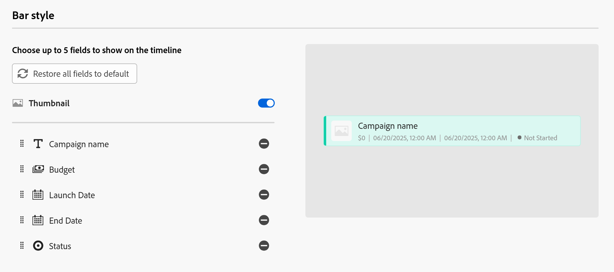
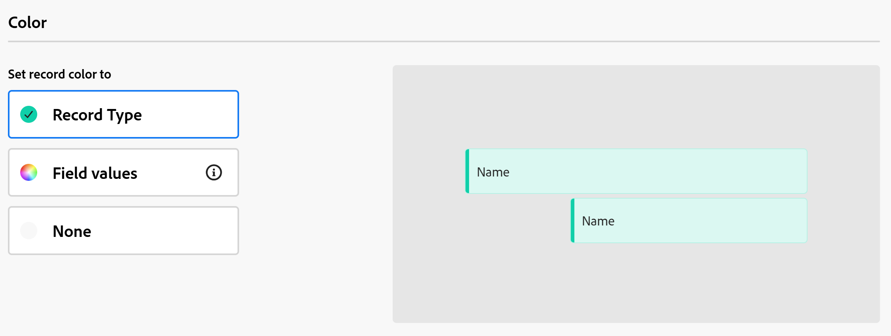
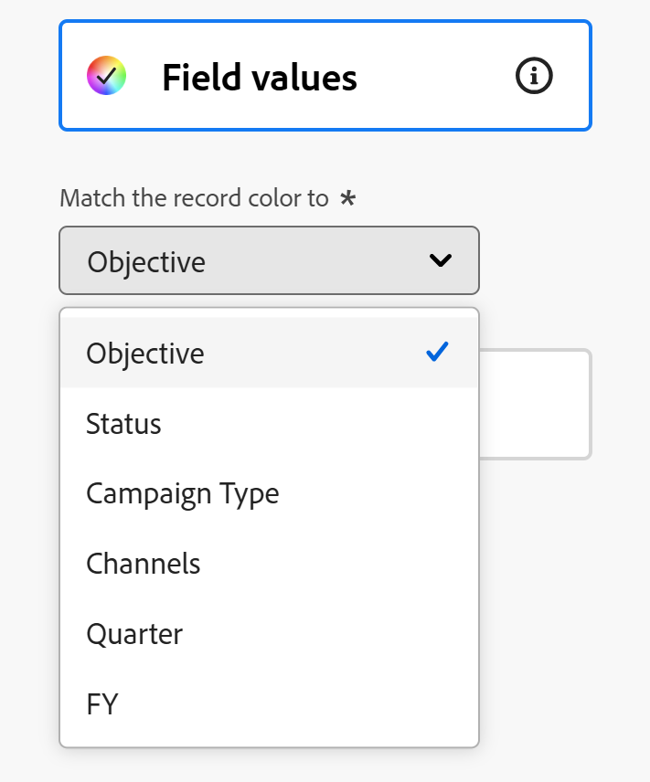

# Manage the calendar view

The highlighted information on this page refers to functionality not yet generally available. It is available only in the Preview environment for all customers. After the monthly releases to Production, the same features are also available in the Production environment for customers who enabled fast releases.    

For information about fast releases, see [Enable or disable fast releases for your organization](/help/quicksilver/administration-and-setup/set-up-workfront/configure-system-defaults/enable-fast-release-process.md). 

{{planning-important-intro}}

You can display records and their fields in a calendar view, from the record type page.

For information about Adobe Workfront Planning views and how to manage them, see [Manage record views](/help/quicksilver/planning/views/manage-record-views.md).

## Access requirements

+++ Expand to view access requirements. 

 <table style="table-layout:auto"> 
<col> 
</col> 
<col> 
</col> 
<tbody> 
    <tr> 
<tr> 
<td> 
   
 Products
 </td> 
   <td> 
   <ul><li>
 Adobe Workfront
</li> 
   <li>
 Adobe Workfront Planning
</li></ul></td> 
  </tr>   
<tr> 
   <td role="rowheader">
Adobe Workfront plan*
</td> 
   <td> 

Any of the following Workfront plans:
 
<ul><li>Select</li> 
<li>Prime</li> 
<li>Ultimate</li></ul> 

Workfront Planning is not available for legacy Workfront plans
 
   </td> 
<tr> 
   <td role="rowheader">
Adobe Workfront Planning package*
</td> 
   <td> 

Any 
 

For more information about what is included in each Workfront Planning plan, contact your Workfront account manager. 
 
   </td> 
 <tr> 
   <td role="rowheader">
Adobe Workfront platform
</td> 
   <td> 

Your organization's instance of Workfront must be onboarded to the Adobe Unified Experience to be able to access Workfront Planning.
 

For more information, see <a href="/help/quicksilver/workfront-basics/navigate-workfront/workfront-navigation/adobe-unified-experience.md">Adobe Unified Experience for Workfront</a>. 
 
   </td> 
   </tr> 
  </tr> 
    <td role="rowheader">
Adobe Workfront license*
</td> 
   <td>
 Standard to create and delete views

   
Contributor or higher to update view elements

   
Workfront Planning is not available for legacy Workfront licenses
 
  </td> 
  </tr> 
  <tr> 
   <td role="rowheader">
Access level configuration
</td> 
   <td> 
There are no access level controls for Adobe Workfront Planning
   
</td> 
  </tr> 
<tr> 
   <td role="rowheader">
Object permissions
</td> 
   <td>   
Manage permissions to a view
  
   
View permissions to a view to temporarily change the view settings or to duplicate it
 </td> 
  </tr> 
<tr>
   <td role="rowheader">
Layout template
</td>
   <td> Users with a Light or Contributor license must be assigned a layout template that includes Planning.
   
Standard users and System Administrators have the Planning areas enabled by default.

</li></ul>
</td>
  </tr>

</tbody> 
</table> 

 *For more information about Workfront access requirements, see [Access requirements in Workfront documentation](/help/quicksilver/administration-and-setup/add-users/access-levels-and-object-permissions/access-level-requirements-in-documentation.md).

+++   

## Manage a calendar view {#manage-a-calendar-view}

<!--insert screen shot of calendar view-->

Consider the following: 

* You can create a Calendar view only when you have at least two date fields associated with a record type. When you have one or no date fields associated with a record type, the Calendar view option is dimmed. 
   
   You can select from record date fields, or lookup date fields from connected record or object types.
* The following scenarios exist:

    * When both the Start and End dates have no values, the records do not display on the calendar
    * When the Start or the End dates have no value, the record displays as a one-day event
    * When the Start date is after the End date, the record does not display on the calendar.

<!--

* You can create and edit records in the calendar view. For information, see [Create records](/help/quicksilver/planning/records/create-records.md).

-->

<!--move this bullet under the same div as above OR add a span or another div tag?? ??

* You can resize the records' bars in the calendar monthly view by clicking, then dragging and dropping their margins in a new position. Resizing the records' bars updates their start and end dates immediately. For information, see [Edit records](/help/quicksilver/planning/records/edit-records.md).

-->

To manage a calendar view: 

1. Go to the record type page for which you want to view the calendar. 
1. Create a calendar view, as described in the article [Manage record views](/help/quicksilver/planning/views/manage-record-views.md). 

    

    The records associated with the record type you selected display as bars in a calendar. The color of the bars matches the color of the record icon, by default. 

1. Do one of the following to navigate through the calendar:

    * Click the left and right icons in the upper-left corner of the calendar or use the horizontal scroll to move backwards and forwards in the calendar. 
    * Click **Today** in the upper-right corner to center the calendar to today's date. 
    * Select one of the following options from the time frame drown-down menu to update the time increments: 

        * **Month**: Records display in a monthly calendar.

        * **Week**: Records display in the following areas:

            * Records that span over multiple days display at the top of the calendar.
            * Records that last a day or less, display in the lower half of the calendar view. If you selected to display the hour of he Start and End Dates, the record displays at the appropriate time within the day that it occurs.
         
1. (Optional) Click the **Full screen** icon  to open the view in full screen, then the **Exit full screen** icon  or Escape on your keyboard to exit the full screen.  
    
1. Update the following view elements as described in the subsections below:
    * [Filters](#add-filters)
    <!--[Row height](#modify-row-height)-->
    * [Settings](#edit-the-calendar-view-settings)
    
    <!--* [Grouping](#add-grouping)-->
    <!--* [Sort](#add-sort) not sure if this is present in calendar views?!; also check the anchor and make sure it's correct-->

### Add filters

You can reduce the amount of information displayed on the screen by using filters.

Consider the following when working with filters in the calendar view: 

<!-- this list is almost identical to the one for the table view - update both-->

* The filters you create for a calendar view work independently from the filters in any other view applied to the same record type. 

* The filters are unique to the view that you select. Two calendar views of the same record type can have different filters applied to them. 

* Two users looking at the same calendar view see the same filter that is currently applied. 

* You cannot name the filters you build for a calendar view.

* Removing filters removes them from anyone accessing the same record type as you and who displays the same view as you do. 

* You can filter by connected record fields or lookup fields. 

* You can filter by lookup fields that display multiple values.

To add a filter to a calendar view: 

1. Create a calendar view for a record type page, as described in the article [Manage record views](/help/quicksilver/planning/views/manage-record-views.md). 
1. Select a calendar view, then click **Filters** in calendar's toolbar.    
1. Click **Add condition** and add the following information: 

    * **Select a field** that you want to filter by <!-- the tip below might change-->

    * **Select an option** (or a filter modifier) to define what kind of condition the field must meet

        The table below displays the available modifiers for each type of field.

        <table>
        <thead>
        <tr>
            <th><b>Field type</b></th>
            <th><b>Modifiers</b></th>
        </tr>
        </thead>
        <tbody>
        <tr>
            <td>Single-line, Paragraph, Formula </td>
            <td>
Contains

            
Does not contain

            
Is

            
Is not

            
Is empty

            
Is not empty
</td>
        </tr>
        <tr><td>Single-select</td>
            <td>
Is

            
Is not

            
Is any of

            
Is none of

            
Is empty

            
Is not empty
</td>
        </tr>
        <tr>
            <td>Multi-select, People</td>
            <td>
Has any of

            
Has all of

            
Is exactly

            
Has none of

            
Is empty

            
Is not empty
</td>
        </tr>
        <tr>
            <td>Number, Percentage, Currency</td>
            <td>
=

            
≠

            
 < 

            
>

            
≤

            
≥

            
Is empty

            
Is not empty
</td>
        </tr>
        <tr>
            <td>Date</td>
            <td>
Is

            
Is not

            
Is after

            
Is before

            
Is between

Is not between

            
Is empty

Is not empty
</td>
        </tr>

        <tr>
            <td>Checkbox</td>
            <td>
Is

        </tr>
        </tbody>
        </table> 

    * Select a value for the field selected. 

     

    There is no limit to how many filtering conditions you can add.

1. (Optional) Click **Add condition** to add another filtering option and repeat the above steps. The number of filters applied displays to the left of the Filters icon. 
1. Click the following operators to indicate how the filter conditions are joined and should be applied:

    * **AND**: All specified conditions must be met. 
    * **OR**: Any of the specified conditions must be met. This is the default option.

    1. (Optional) Add additional **AND** or **OR** operators between multiple condition groupings.

        

    The list of records is filtered automatically.  <!--at this time, you can't name and save the filter - but will this change?!-->
    <!-- asked on the task for the simple filters whether there is a limitation for how many statements a filter can have?!-->

1. (Optional) Click the **x** icon to remove a filter condition.
1. (Optional) Click **Filters** to close the filters box. <!--right now you cannot "clear all" for filters, but this might come later-->

<!--

### Modify row height

You can modify the row height of a calendar cell to increase or decrease the number of record bars you display in each cell. 

The number of records displayed in the calendar varies depending on how many fields you display on the records' bars. 

>[!TIP]
>
>This setting is available only when viewing the calendar by month. 

1. Create a calendar view for a record type page, as described in the article [Manage record views](/help/quicksilver/planning/views/manage-record-views.md). 
1. (Conditional) Display the calendar view by month, then click **Row height** in the calendar's toolbar.    
1. Choose from the following options: 

<table>
<thead>
<tr>
    <th><b>Row height option</b></th>
    <th><b>Number of records</b></th>
</tr>
</thead>
<tbody>
<tr>
    <td>Short</td>
    <td>
Contains:

<ul><li>2 records displaying 1 field</li>
<li>1 record displaying more than 1 field</li></ul>
    </td>
</tr>
<tr><td>Standard</td>
    <td>
Contains:

<ul><li>4 records displaying 1 field</li>
<li>2 record displaying more than 1 field</li></ul>
    </td>
</tr>
<tr>
    <td>Medium</td>
    <td>
Contains:

<ul><li>8 records displaying 1 field</li>
<li>4 record displaying more than 1 field</li></ul>
    </td>
</tr>
<tr>
    <td>Tall</td>
    <td>
Contains:

<ul><li>12 records displaying 1 field</li>
<li>6 record displaying more than 1 field</li></ul>
    </td>
</tr>
<tr>
    <td>Fit to content</td>
    <td>
All records are visible, up to 500 records
</td>
</tr>
</tbody>
</table> 

1. (Optional) Click **Show more** if there are records that are not visible in the calendar. 

    >[!TIP]
    >
    >The **Show more** option displays when you choose Fit to content and there are are more than 500 records in one time frame.

-->

### Edit the calendar view settings

Update the calendar view settings to indicate what and how information displays in the view. 

1. Create a calendar view for a record type, as described in the article [Manage record views](/help/quicksilver/planning/views/manage-record-views.md). 
1. Click **Settings**. 
1. Click **Date and time** in the left panel, then select a **Start date** and an **End date** to display on the calendar. You can choose the default Start and End dates, or you can choose any date field available. 

    The bars representing the records start on the date that you indicate for the Start date and end on the date corresponding with the End date. 

    >[!NOTE]
    >
    >* Records that have no values for the Start or the End dates or have a Start date later than the End date do not display in the calendar view.
    >
    >* If you display additional records using the Breakdown option, the Start and End dates are those of the main record. You cannot choose Start and End dates for the connected records in this area. 

1. Click **Bar style** in the left panel, to indicate what information you want to display on the record bars.

    The primary field (or title) of the record, as defined in the record's table view, is selected by default.
    <!--adjust this when the primary field is released??-->

1. (Optional and conditional) If you added thumbnails to records, select the **Thumbnail** option to display the image associated with records in their record bar. 

    >[!NOTE]
    >
    >    You must first add thumbnails in the table view before you can display them in the calendar view. For more information, see [Add a thumbnail to a record](/help/quicksilver/planning/records/add-thumbnails-to-records.md). 

1. Click **Add field**, then click inside the **Search fields** box, and click the field you want to add. 

    >[!TIP]
    >
    >   * You must create the fields before you can add them to the record bars. 
    > 
    >   * You must have at least one field selected. **Name** is selected by default.
    >
    >   * You can add up to 5 fields. 

    A preview of what the bars will look like on the calendar displays on the right.

    

1. Click **Color** in the left panel, to customize the colors of the records on the calendar. 

    

1. In the **Set record color to** section, select from the following options to set a color for the records: 

    * **Record type**: The color of the record bars in the calendar matches the color of the record type you selected. This is the default option. 
    * **Field values**: The color of the records matches the color of a field that you specify. 
    * **None**: Records displays in a white bar. 

1. (Conditional) If you selected **Field values** for the record colors, select a field from the **Match the record color to** drop-down menu. 

    

    Only fields with color-coded options display in the drop-down menu.
    
    For example, multi-select or single-select fields can have color-coded options.  

    If you do not have a field with color-coded options for the selected record type, this option is dimmed.

1. Click **Save**.

    The records display in the calendar view with the specifications that you selected.