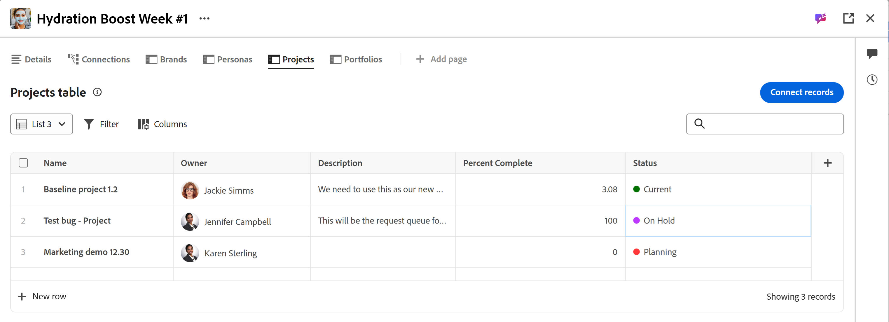
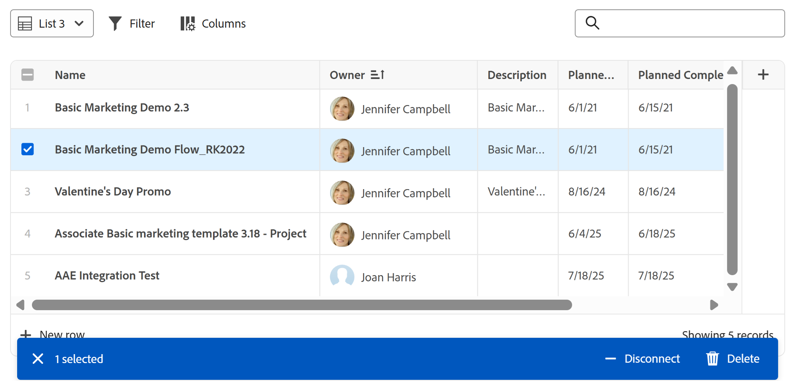

# Manage the list view in Adobe Workfront Planning

<!--The information highlighted on this page refers to functionality not yet generally available. It is available only in the Preview environment for all customers. After the monthly releases to Production, the same features are also available in the Production environment for customers who enabled fast releases.    

For information about fast releases, see [Enable or disable fast releases for your organization](/help/quicksilver/administration-and-setup/set-up-workfront/configure-system-defaults/enable-fast-release-process.md). -->

{{planning-important-intro}}

You can display objects and their fields in a list view, when accessing them in the Connected records page of a record, in Adobe Workfront Planning. 

This article describes how you can create or edit a list view in the Connected records page of a record and how you can edit the objects in the view. 

## Access requirements

+++ Expand to view the access requirements for the functionality in this article. 

<table style="table-layout:auto"> 
<col> 
</col> 
<col> 
</col> 
<tbody> 
    <tr> 
<tr> 
</tr>   
<tr> 
   <td role="rowheader">
Adobe Workfront package
</td> 
   <td> 

Any Workfront and any Planning package

Any Workflow and any Planning package

For more information about what is included in each Workfront Planning package, contact your Workfront account representative. 
 
   </td> 
  <tr> 
   <td role="rowheader">
Adobe Workfront license
</td> 
   <td>
 Standard to create and delete views

   
Contributor or higher to update view elements

  </td> 
  </tr> 
  <tr> 
   <td role="rowheader">
Object permissions
</td> 
   <td>   
Manage permissions to a view
  
   
View permissions to a view to temporarily change the view settings or to duplicate it
 </td> 
  </tr> 
<tr>
   <td role="rowheader">
Layout template
</td>
   <td> Users with a Light or Contributor license must be assigned a layout template that includes Planning.
   
Standard users and System Administrators have the Planning areas enabled by default.

</li></ul>
</td>
  </tr> 
</tbody> 
</table> 

For more information about Workfront access requirements, see [Access requirements in Workfront documentation](/help/quicksilver/administration-and-setup/add-users/access-levels-and-object-permissions/access-level-requirements-in-documentation.md).

+++ 

## Considerations about list views

* You cannot view records in the record type pages in a list view. You can only display the following objects in a list view when you view them in the Connected records page of a record:

    * Workfront projects
    
    For information about creating a connected records page, see [Add a Connected records page to a record](/help/quicksilver/planning/records/add-a-connected-records-page-to-a-record.md).
* Before you can view a list view in a connected records page of a record you must connect Workfront projects with Planning record types. For information, see [Connect record types](/help/quicksilver/planning/architecture/connect-record-types.md). 
* List views are similar to Enhanced lists. For more information, see [Use enhanced lists](/help/quicksilver/workfront-basics/navigate-workfront/use-lists/enhanced-lists.md). 

## Manage a list view {#manage-a-list-view}

For more information about managing list views in Workfront, see [Use enhanced lists](/help/quicksilver/workfront-basics/navigate-workfront/use-lists/enhanced-lists.md). 

{{step1-to-planning}}

1. Click a workspace card, then click a record type card. 
1. From any view, click the name of a record to open the record's preview or details page. 
1. Add a **Connected records page** for connected projects as described in the article [Add a Connected records page to a record](/help/quicksilver/planning/records/add-a-connected-records-page-to-a-record.md).

    The Connected records page displays projects connected to the record in the list view. 

    <!--add new screen shot when they release Row colors/ special formatting for rows-->

    

1. (Optional) Do one of the following to modify the list view: 

    1. Expand the dropdown views menu in the upper-right corner of the list to select another view, or click **New view** and create another one.

        Views are shared throughout the system. If you create a Projects view for one record type, you can view it on other record types that display connected projects. 

    1. Hover over the name of an existing view and click the **More** menu , then click one of the following:
        * **Rename**, to give the view a new name
        * **Share**, to share the view with others
        * **Delete**, to delete the view. 
            
        >[!NOTE]
        >
        >* You must have Manage permissions to a view to be able to edit, share, or delete it.
        >
        >* You cannot modify System Views. 
        >
        <!--* You can reset a view that was shared with you after you modified it to restore its original preferences, or you can copy it with your changes and share the copy. For more information, see [Use enhanced lists](/help/quicksilver/workfront-basics/navigate-workfront/use-lists/enhanced-lists.md). 
        -->
    1. Click the **Filter** icon  to add a filter to the view. Results are filtered immediately in the list. You cannot save and name filters. Filters are remembered when you access the page in future and they are part of shared views.
    1. Click the **Columns** icon  to select which columns to display or to hide in the view. 
    1. Hover over the name of a column, then click the down-pointing arrow to the left of the column name, then click one of the following:
        * **Rename**, to add a **Custom label** for the column. The name of the original field in Workfront does not change. 
        * **Sort**, to sort the list by the selected field. A sorting icon indicating the direction of the sorting is added to the column header. 
    1. Click the **+** icon in the upper-right corner of the list to add or remove columns to the list, then click **Save**. 

        The **Column manager** opens. 
    
        You can add only existing fields to the list view. 
        You cannot remove the primary field in the list view which displays in the first column. 

    
    <!--
    1. Click **Row colors** <!-insert icon and edit the name of the icon if they changed it->. The **Format** box opens. <!-change the name of the box when they update it->
        Do the following: 
        

        1. Define the formatting conditions in the **If** area by clicking **Add condition**, then select a field you want to format by and choose a field value. 
            >[!TIP]
            >
            >Only field visible in the list view are available for conditional formatting.
        1. (Optional) Click **Add condition** in the If area to add more conditions. 
        1. Click the **Or** connector between conditions to change to **And**. **Or** is the default connector.  
        1. In the **Format** area, select a field to indicate which column will be formatted. <!-edit this area, if it changes names???->
        1. Click on the color circle to expand and choose another color.
        1. Turn on the **Apply to row** setting to apply the formatting to the entire row that meets the conditions. 
        1. (Optional) Click **Clear all** to remove all formatting.
            The formatting is applies immediately.
        1. Click outside the **Format** box to close it. 
            This returns you to the list view. There is a blue dot next to the **Row colors** icon to indicate that the view has special formatting applied. <!-might need to edit the icon name and get a screen shot of the icon with the dot and insert it here->
        

    -->

1. (Optional) Add a keyword in the search box in the upper-right corner of the list to search for an item. 

    Items that match your search term are highlighted in the list. 
1. (Optional) To add more items to the list and automatically connect them to the selected record, do one of the following:

    * Click **Connect records** in the upper-right corner of the list to add existing items.
    * Click **New row** at the bottom of the list to add new items. 
1. Click the name of a connected item in the list to open it in another browser tab. 
1. Double-click inside of a cell in the list to edit the information of a field, then press Enter to save your changes. 

    Some fields are read-only. For example, the percent complete of a project is a field calculated by the system and you cannot manually edit it. 

1. Hover over an item's name in the list and click the **More** menu [More menu](assets/more-menu.png) and click **View** to open the project in another tab
     
      Or

      Select one or more items, and notice the actions bar at the bottom of the list, then click one of the following:
      
    * **Delete** to delete the project. Deleting a project disconnects it from the record and moves it to the Workfront's Recycle Bin. Workfront administrators can recover deleted projects up to 30 days after they were deleted.
    * **Disconnect** to disconnect the project from the record. Disconnecting a project removes it and all the values of its lookup fields from the current record.

    

