# Manage the table view

<!--The information highlighted on this page refers to functionality not yet generally available. It is available only in the Preview environment for all customers. After the monthly releases to Production, the same features are also available in the Production environment for customers who enabled fast releases.    

For information about fast releases, see [Enable or disable fast releases for your organization](/help/quicksilver/administration-and-setup/set-up-workfront/configure-system-defaults/enable-fast-release-process.md). -->

{{planning-important-intro}}

You can display records and their fields in a table view, when accessing the record type page in Adobe Workfront Planning. 

For information about record views and how to manage them, see [Manage record views](/help/quicksilver/planning/views/manage-record-views.md).

This article describes the following information:

* [Create or edit columns and rows in a table view](#manage-a-table-view)
* [Enable real-time presence indicators for the table view](#enable-the-real-time-presence-indicator)

For information about exporting the table view to an Excel or CSV file, see [Export records from the table view](/help/quicksilver/planning/records/export-records-from-the-table-view.md).

## Access requirements

+++ Expand to view access requirements. 

 <table style="table-layout:auto"> 
<col> 
</col> 
<col> 
</col> 
<tbody> 
    <tr> 
<tr> 
<td> 
   
 Products
 </td> 
   <td> 
   <ul><li>
 Adobe Workfront
</li> 
   <li>
 Adobe Workfront Planning
</li></ul></td> 
  </tr>   
<tr> 
   <td role="rowheader">
Adobe Workfront plan*
</td> 
   <td> 

Any of the following Workfront plans:
 
<ul><li>Select</li> 
<li>Prime</li> 
<li>Ultimate</li></ul> 

Workfront Planning is not available for legacy Workfront plans
 
   </td> 
<tr> 
   <td role="rowheader">
Adobe Workfront Planning package*
</td> 
   <td> 

Any 
 

For more information about what is included in each Workfront Planning plan, contact your Workfront account manager. 
 
   </td> 
 <tr> 
   <td role="rowheader">
Adobe Workfront platform
</td> 
   <td> 

Your organization's instance of Workfront must be onboarded to the Adobe Unified Experience to be able to access Workfront Planning.
 

For more information, see <a href="/help/quicksilver/workfront-basics/navigate-workfront/workfront-navigation/adobe-unified-experience.md">Adobe Unified Experience for Workfront</a>. 
 
   </td> 
   </tr> 
  </tr> 
    <td role="rowheader">
Adobe Workfront license*
</td> 
   <td>
 Standard to create and delete views

   
Contributor or higher to update view elements

   
Workfront Planning is not available for legacy Workfront licenses
 
  </td> 
  </tr> 
  <tr> 
   <td role="rowheader">
Access level configuration
</td> 
   <td> 
There are no access level controls for Adobe Workfront Planning
   
</td> 
  </tr> 
<tr> 
   <td role="rowheader">
Object permissions
</td> 
   <td>   
Manage permissions to a view
  
   
View permissions to a view to temporarily change the view settings or to duplicate it
 </td> 
  </tr> 
<tr>
   <td role="rowheader">
Layout template
</td>
   <td> Users with a Light or Contributor license must be assigned a layout template that includes Planning.
   
Standard users and System Administrators have the Planning areas enabled by default.

</li></ul>
</td>
  </tr>
</tbody> 
</table> 

 *For more information about Workfront access requirements, see [Access requirements in Workfront documentation](/help/quicksilver/administration-and-setup/add-users/access-levels-and-object-permissions/access-level-requirements-in-documentation.md).

+++   

## Edit records using the table view

You can edit record information only in the table view. 

For more information about editing records in the table view, see [Edit records](/help/quicksilver/planning/records/edit-records.md).

## Manage a table view {#manage-a-table-view}

When creating a table view, all records of the selected type display in a table. Each row is a unique record and each column is a record field. All fields and all records display by default. 

To manage a table view: 

1. Create a table view, as described in the article [Manage record views](/help/quicksilver/planning/views/manage-record-views.md). 

    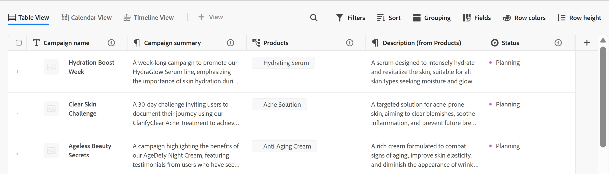

1. (Optional) Click **Row height**, then select from the following options to modify the height of the table rows: 
    * Short
    * Medium
    * Tall 

1. Update the following view elements as described in the subsections below:
    * [Columns (or fields)](#add-columns-or-fields)
    * [Rows (or records)](#add-rows-or-records)
    * [Filters](#add-filters) 
    * [Sort](#add-a-sort) 
    * [Grouping](#add-groupings)
    * [Row colors](#add-row-colors)
    * [Real-time presence indicator](#enable-the-real-time-presence-indicator)

### Add columns (or fields) {#add-columns}

The column headers of a table view display fields associated with the records in the view. Fields displayed in the table view also display in the Details section of a record. 

For more information, see [Edit records](/help/quicksilver/planning/records/edit-records.md). 

<!--this is not available yet:You can display record fields (or columns) in both a table and a timeline view. However, the number of columns displayed in the table of the timeline view is limited and you cannot add columns in addition to those selected by default.-->

Adding columns to a view is identical to adding fields to a record type.  

You can add up to 500 fields (or columns) in a table view. 

1. Go to a record type page and click a table view tab, or click **+ View** to add a new view, then choose **Table**. 

1. Start adding fields (or columns), as described in the article [Create fields](/help/quicksilver/planning/fields/create-fields.md). 

    The columns you add are visible to all users who access the record type and are added as new fields on the record's page.
   
1. Do one of the following to reorder columns in the table:

    * Grab the column header and drag and drop it in the desired position. The column you moved briefly displays with a blue background until you make other adjustments to the table. 

    * Click **Fields** in the table's toolbar, then drag and drop the fields in the desired order, then click outside the **Fields visibility and order** box to close it.

        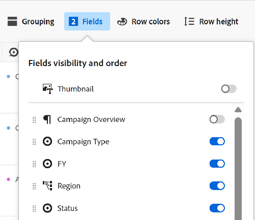

        >[!TIP]
        >
        >* The Name field is always the first field in the table view, by default. This is considered a primary field. 
        >
        >* You cannot move the Name field to another position, unless you designate another field as the primary field. For more information, continue with Step 4. <!--accurate?-->
        >
        >
 
    * Replace the field in the first column with another field by changing the primary field. For more information, continue to step 4. <!--accurate?-->

1. (Optional) Hover over a field name in the column header of any field that does not display in the first column of the table, click the downward-pointing arrow to the right of the field name, then click **Set as primary field**. 
    
    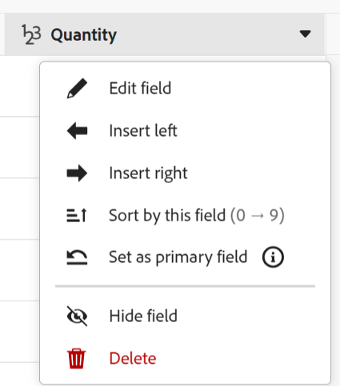

1. Click **Set field** to confirm. 

    The field becomes a primary field which means it displays as the first column of the table view. The previous primary field moves to the second column.

    Primary fields become the record's title and display in the header area of the record's page, and everywhere where the records display. For example, the record title displays in connected fields and all views. For more information about primary fields, see [Primary field overview](/help/quicksilver/planning/fields/primary-field-overview.md). 

1. Click and drag the column separation lines and drop them in the desired spot to increase the width of the columns. 

    >[!TIP]
    >
    >The changes you make to the column width and order are permanent and visible to all users who access the record type. 

1. Hover over the column header, then click the downward-pointing arrow, then click **Hide field**

    Or

    Click **Fields** in the table toolbar and disable the toggle associated with the fields (or columns) you want to hide. The **Fields visibility and order** box displays.

    >[!TIP]
    >
    >The number of hidden fields displays to the left of the Fields icon in the toolbar.

1. Click the **Fields** icon and enable the toggle associated with the fields you want to display in the columns of the table. All fields display by default.

1. Do the following to quickly find records that match a keyword:

    1. Click the **Search** icon  and start typing a keyword associated with any field of a record that displays on the screen. The number of correct matches displays next to the search item and the field with the correct match is highlighted. 

        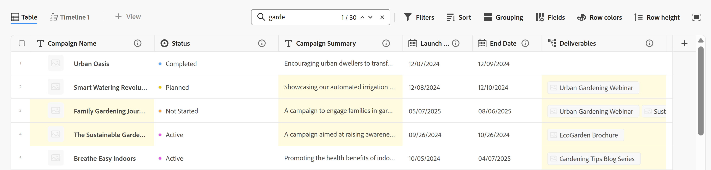

        You can use any word or special character that is visible on the screen. 
    
        You cannot use keywords that are associated with fields that are hidden in the table view. 

    1. Press **Enter** on your keyboard to go to the next found field. 

    1. (Optional) If there is more than one match, click the up and down arrows to the right of the search keyword to find all the matches in the table. 

    1. Click the **x** icon in the search box to clear the search keyword. 
   

### Add rows (or records) {#add-rows}

The rows of a table view display individual records of the selected record type. 

You can have up to 50,000 records (or rows) for a record typeS. 

1. Go to a record type page and click a table view tab, or click **+ View** to add a new view, then choose **Table**. 

1. Start adding records (or rows), as described in the article [Create records](/help/quicksilver/planning/records/create-records.md). 

    The records you add in the table view are saved immediately and are visible to all users who have View or higher permissions to the workspace. 

1. (Optional) Add a thumbnail to each record, and click **Fields** in the upper-right corner of the table, then select the toggle for the **Thumbnail** field to display it to the left of the primary field. It is deselected by default. 
    
    For information, see [Add a thumbnail to a record](/help/quicksilver/planning/records/add-thumbnails-to-records.md).

1. (Optional) Select one or multiple records in a row, then drag and drop the **handle** icon  to the left of the record to reorder the rows. 

    >[!NOTE]
    >
    >You cannot reorder rows if you apply at least one sort to the table view. 
    >
    >The changes you make to the row order are visible to all users who access the record type

<!-- this section below links from the timeline view; consider splitting them if they become different-->

### Add filters {#add-filters}

Filters help you reduce the amount of information displayed on the screen.

Consider the following when working with filters in the table view: 

<!-- this list is almost identical to the one for the table view - update both-->

* The filters you create for the table view work independently from the filters in the timeline view when applied to the same record type. 

* The filters are unique to the view that you select. Two table views of the same record type can have different filters applied to them. Two users looking at the same table view see the same filter that is currently applied. 

* You cannot name the filters you build and apply to a table view.

* Removing filters removes them from anyone accessing the same record type as you and uses the same view as you use.

* You can filter by connected record fields or lookup fields. 

* You can filter by lookup fields that display multiple values. 

* You can reference a field that is up to 4 levels away from the current record type. For example, if you are creating a filter for an Activity record type, and the Activity is connected to the Product record type which is connected to the Campaign record type which is connected to a Workfront Project, you can reference the project's Budget in the filter you are creating for the Activity record type. 

To add a filter to a table view: 

1. Create a table view for a record type page, as described in the article [Manage record views](/help/quicksilver/planning/views/manage-record-views.md). 
1. Select a table view, then click **Filters** in the upper-right corner of the table.    
1. Click **Add condition** and add the following information: 

    * **Select a field** that you want to filter by <!-- the tip below might change-->

    * **Select an option** (or a filter modifier) to define what kind of condition the field must meet

        The table below displays the available modifiers for each type of field.

        <table>
        <thead>
        <tr>
            <th><b>Field type</b></th>
            <th><b>Modifiers</b></th>
        </tr>
        </thead>
        <tbody>
        <tr>
            <td>Single-line, Paragraph, Formula </td>
            <td>
Contains

            
Does not contain

            
Is

            
Is not

            
Is empty

            
Is not empty
</td>
        </tr>
        <tr><td>Single-select</td>
            <td>
Is

            
Is not

            
Is any of

            
Is none of

            
Is empty

            
Is not empty
</td>
        </tr>
        <tr>
            <td>Multi-select, People</td>
            <td>
Has any of

            
Has all of

            
Is exactly

            
Has none of

            
Is empty

            
Is not empty
</td>
        </tr>
        <tr>
            <td>Number, Percentage, Currency</td>
            <td>
=

            
≠

            
 < 

            
>

            
≤

            
≥

            
Is empty

            
Is not empty
</td>
        </tr>
        <tr>
            <td>Date</td>
            <td>
Is

            
Is not

            
Is after

            
Is before

            
Is between

Is not between

            
Is empty

Is not empty
</td>
        </tr>

        <tr>
            <td>Checkbox</td>
            <td>
Is

        </tr>
        </tbody>
        </table> 

    * Select a value for the field selected. 

     

    There is no limit to how many filtering conditions you can add.

1. (Optional) Click **Add condition** to add another filtering option and repeat the above steps. The number of filters applied displays to the left of the Filters icon. 
1. Click the following operators to indicate how the filter conditions are joined and should be applied:

    * **AND**: All specified conditions must be met. 
    * **OR**: Any of the specified conditions must be met. This is the default option.

    1. (Optional) Add additional **AND** or **OR** operators between multiple condition groupings.

        

    The list of records is filtered automatically.  <!--at this time, you can't name and save the filter - but will this change?!-->
    <!-- asked on the task for the simple filters whether there is a limitation for how many statements a filter can have?!-->

1. (Optional) Click the **x** icon to remove a filter condition.
1. (Optional) Click **Filters** to close the filters box. <!--right now you cannot "clear all" for filters, but this might come later-->

### Add a sort {#sort-information} 

By applying a sort, you can organize information in a given order. 

You can sort the following information:

* All records in a table view. <!--or timeline view. ***********verify this is the case for the timeline view*********************-->
<!--* All groupings. - this is not available yet-->

Consider the following when sorting records in the table view: 

<!-- if this is available for the timeline view, update both when you update one-->

* Sorting is unique to the view that you select. Two table views of the same record type can have different sorting criteria applied to them. Two users looking at the same table view see the same sorting that is currently applied. 

* You cannot name the sortings you build and apply to a table view.

* The sorting you create is preserved when you navigate away.

* You can sort by as many fields as you see displayed in the table view of a record type.

* You cannot sort by connected record fields, but you can sort by lookup fields from connected record types. 

* When you sort by lookup fields with multiple values (that have not been summarized by an aggregator), the first value is used for sorting. 

* Removing sorting criteria removes them from anyone accessing the same record type as you and uses the same view as you use.

* You can reference a field that is up to 4 levels away from the current record type. For example, if you are creating a sort for an Activity record type, and the Activity is connected to the Product record type which is connected to the Campaign record type which is connected to a Workfront Project, you can reference the project's Status in the sort you are creating for the Activity record type. 

To sort <!--ungrouped (add this when sorting for groupings will be available--> records, do the following:

1. Create a table view, as described in the article [Manage record views](/help/quicksilver/planning/views/manage-record-views.md).
1. Click the **Sort** icon 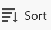 in the upper-right corner of the table
    
    Or

    Hover over the name of a column in the table view, click the downward-pointing arrow to the right of the column header name, then click **Sort by this field**. The field is added as a sorting selection in the Sort icon in the upper-right corner of the table view.

1. (Conditional) In the **Sort records by** box, click one of the suggested fields, or click **Choose a different field** and search for a different field, then click it when it displays in the list. 

    The sorting is applied automatically to the table view and records display sorted by your selected criteria. 

    <!-- add a step that you can rearrange the sorting fields here, when this will be possible-->
    
1. (Optional) Click **Add condition**, and repeat the above steps to sort by additional fields.  

    The number of fields that you are sorting by displays to the left of the Sort icon in the upper-right corner of the toolbar. You can choose only fields that display in the columns of the table view.

1. (Optional) In the **Sort records by** box, click the **x** icon to the right of a sorting field to remove the sort

    Or

    Click **Clear all** to remove all fields from the sort. 

1. Click outside the **Sort records by** box to close it. 

    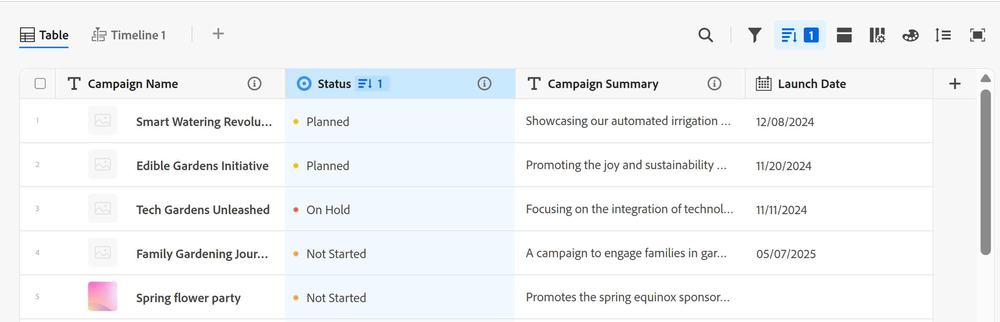

    The information displayed in the table is sorted according to your selected criteria. 
    
    The fields selected for the sort display a sorting icon followed by a number that indicates the order in which the sorting is applied. 

### Add groupings {#add-groupings}

<!--this section exists in the timeline view too, but the display is slightly different, so I kept both steps; consider updating both sections if any updates to groupings are introduced-->

You can group records by similar information when applying  a grouping to a view.

Consider the following:

* You can apply groupings both in the table and timeline views. The groupings of the table view are independent from those in the timeline view of the same record type.
* You can apply 3 levels of grouping in a view. The records are grouped in the order of groupings that you select. 
<!--* You can apply up to 4 levels of grouping when using the API. --checking on this one for now-->
* The groupings are unique to the view that you select. Two table views of the same record type can have different groupings applied to them. Two users looking at the same table view see the same grouping that is currently applied. 
* You cannot name the groupings you build for a table view.
* Removing groupings removes them from anyone accessing the same record type as you and who displays the same view as you do. 
* You can edit records listed under a grouping. 
* You can group by connected record fields or lookup fields. 
* When you group by lookup fields with multiple values (that have not been summarized by an aggregator), records are grouped by each unique combination of field values.  
* You can reference a field that is up to 4 levels away from the current record type. For example, if you are creating a grouping for an Activity record type, and the Activity is connected to the Product record type which is connected to the Campaign record type which is connected to a Workfront Project, you can reference the project's Status in the grouping you are creating for the Activity record type. 
<!--checking into this: * You can apply up to 4 levels of grouping when using the API. -->
<!-- checking also into this: * You cannot group by a Paragraph-type field.-->

To add a grouping:

1. Create a timeline view for a record type, as described in the article [Manage record views](/help/quicksilver/planning/views/manage-record-views.md). 
1. Click **Grouping** in the upper-right corner of the table view.

    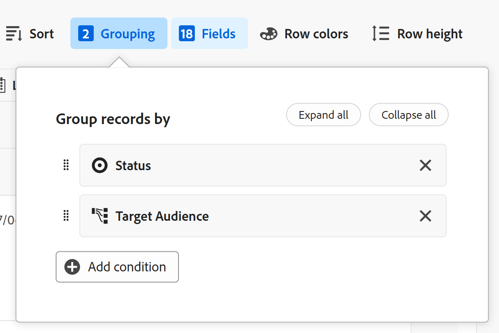

1. Click one of the suggested fields, or click **Choose a different field**, search for a different field, then click it when it displays in the list.

    The grouping is applied automatically to the table and records display under the grouping separation line.
    
1. (Optional) Click **Add condition** and repeat the above steps to add up to 3 groupings. 

    The number of fields selected for the grouping displays next to the Grouping icon. 

    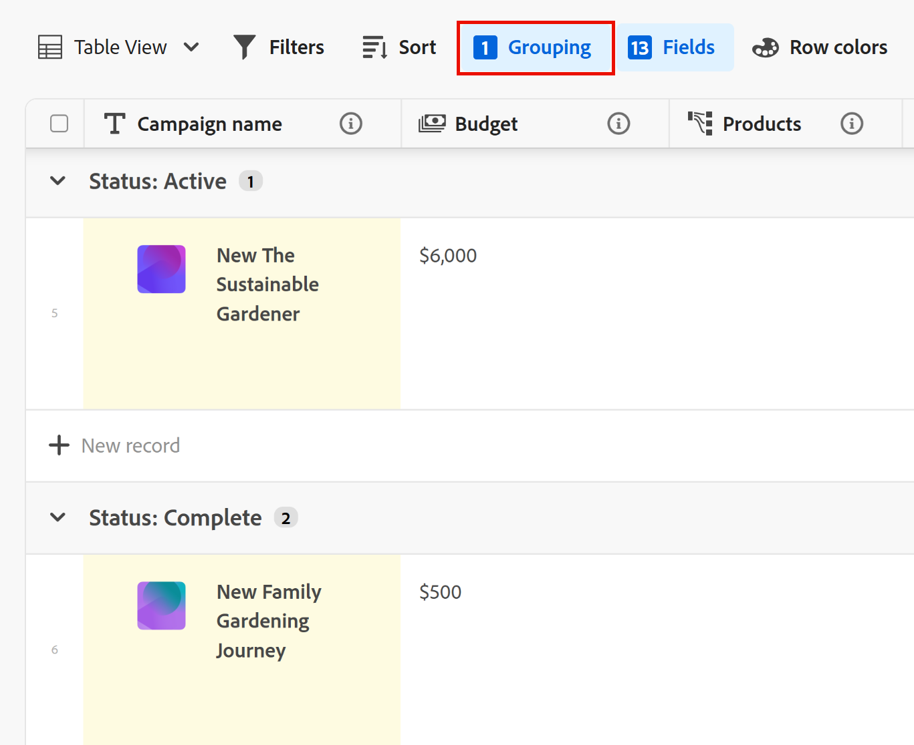

1. (Optional) Inside the **Group records by** box, click the **x** icon to the right of a field selected for the grouping to remove the grouping

    Or

    Click **Clear all** to remove all fields.  

1. Click outside the **Group records by** box to close it. 
1. (Optional) Click **+ New record** at the end of any grouping to add new records, then refresh your page to add the new record to the appropriate grouping. <!--this might need to be changed when they add the Refresh button on the toolbar of the table view-->

1. To expand or collapse groupings, do one of the following:

    1. Click the **Grouping** icon, then **Expand all**, or **Collapse all**. This expands all the groupings and subgroupings in the table view. 

        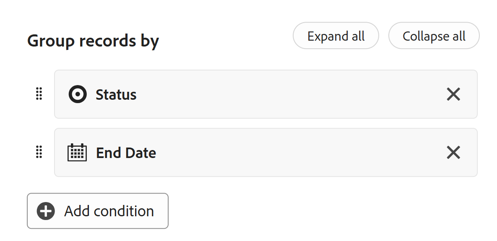

    1. Right-click any of the grouping headers in the table view, then click one of the following options:
        * **Expand group**
        * **Collapse group**
        * **Expand all**
        * **Collapse all**
        * **Expand subgroups**
        * **Collapse subgroups**

        Depending on the number of groupings you apply to the view, some options might not be available.
   
<!-- this is not available yet: 

To sort grouped records: 

1. Create a view, as described in [Create or edit record views](#create-or-edit-record-views). 
1. ************************* add steps here for sorting grouped records****************

-->

### Add row colors

1. (Optional) Click **Row colors** to define conditions and choose configure diferent colors for table rows.

1. Click **Add color**, then **Select a field** whose value you want to determine the color of a row. 

    For example, to display campaigns with a status of Active in green, select **Status**, then choose a modifier and a value for the field. 

    

1. Click the drop-down menu for the color picker in the upper-left corner of the condition you selected, to pick the color for the condition, then click outside the color picker box to close it. 

    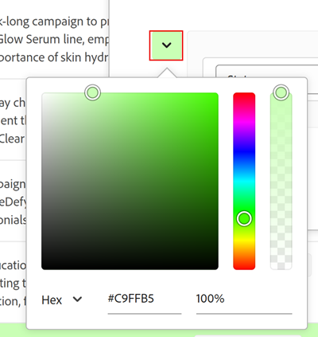

1. (Optional) Click **Add condition** to add more fields and values to the first set of conditions 

    Or

    Click **Add color** to add a new set of conditions and identify a new color. 
    
    For example, you can display campaigns in a Planning status in yellow by defining a new set of conditions. 

    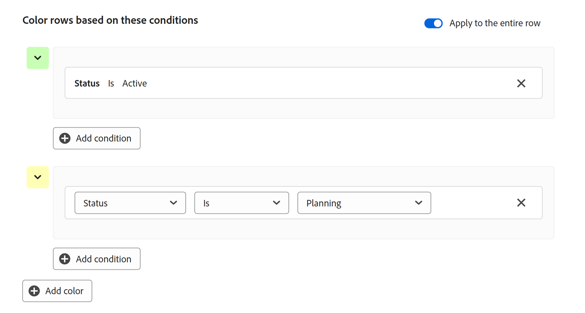

1. (Optional) Turn on the **Apply to the entire row** setting in the upper-right corner of the Row colors box. The entire row where the condition is met automatically displays in the selected color. 

    >[!NOTE]
    >
    >* If the Apply to the entire row setting is turned off, only the left side of the Primary field displays a narrow color indicator with the selected color. The setting is turned off by default.
    >
    >* You cannot apply row colors to an entire row when you have at least one grouping selected in the table view. 

1. Click outside the **Row colors** box to close it. The colors are applied automatically.

### Enable the real-time presence indicator

The avatars of other users who are editing record information at the same time as you display in the upper-right corner of all record views, by default.

When you display the table view, you can also view which field another user is editing at the time you are viewing the record. 

1. Go to a record type page and open any view.
1. (Conditional) If there are other users editing the records of the selected type at the same time, their avatars display in the upper-right corner of the view. 
1. Click the drop-down menu next to the avatars, the select the **Show collaborators** toggle. The toggle is selected by default. 

    

1. (Conditional) Open a table view, and the field which another person is actively editing is highlighted in the color corresponding to the outline of their avatar in the table view. 

    If the highlight color of the avatar is gray, the user stopped actively editing the record more than 30 seconds ago. 

    

    >[!TIP]
    >
    >You can select the **Show collaborators** toggle from any view. The field currently edited by others is outlined only in the table view. 

