# Manage the timeline view

<!--
The highlighted information on this page refers to functionality not yet generally available. It is available only in the Preview environment for all customers. After the monthly releases to Production, the same features are also available in the Production environment for customers who enabled fast releases.    

For information about fast releases, see [Enable or disable fast releases for your organization](/help/quicksilver/administration-and-setup/set-up-workfront/configure-system-defaults/enable-fast-release-process.md). 

-->

{{planning-important-intro}}

You can display records in a timeline view, when accessing the record type page in Adobe Workfront Planning. 

For information about record views, see [Manage record views](/help/quicksilver/planning/views/manage-record-views.md).

## Access requirements

+++ Expand to view the access requirements for the functionality in this article. 

<table style="table-layout:auto"> 
<col> 
</col> 
<col> 
</col> 
<tbody> 
    <tr> 
<tr> 
</tr>   
<tr> 
   <td role="rowheader">
Adobe Workfront package
</td> 
   <td> 

Any Workfront and any Planning package

Any Workflow and any Planning package

For more information about what is included in each Workfront Planning package, contact your Workfront account representative. 
 
   </td> 
  <tr> 
   <td role="rowheader">
Adobe Workfront license
</td> 
   <td>
 Standard to create and delete views

   
Contributor or higher to update view elements

  </td> 
  </tr> 
  <tr> 
   <td role="rowheader">
Object permissions
</td> 
   <td>   
Manage permissions to a view
  
   
View permissions to a view to temporarily change the view settings or to duplicate it
 </td> 
  </tr> 
<tr>
   <td role="rowheader">
Layout template
</td>
   <td> Users with a Light or Contributor license must be assigned a layout template that includes Planning.
   
Standard users and System Administrators have the Planning areas enabled by default.

</li></ul>
</td>
  </tr> 
</tbody> 
</table> 

For more information about Workfront access requirements, see [Access requirements in Workfront documentation](/help/quicksilver/administration-and-setup/add-users/access-levels-and-object-permissions/access-level-requirements-in-documentation.md).

+++ 

<!--Old:
<table style="table-layout:auto"> 
<col> 
</col> 
<col> 
</col> 
<tbody> 
    <tr> 
<tr> 
<td> 
   
 Products
 </td> 
   <td> 
   <ul><li>
 Adobe Workfront
</li> 
   <li>
 Adobe Workfront Planning
</li></ul></td> 
  </tr>   
<tr> 
   <td role="rowheader">
Adobe Workfront plan*
</td> 
   <td> 

Any of the following Workfront plans:
 
<ul><li>Select</li> 
<li>Prime</li> 
<li>Ultimate</li></ul> 

Workfront Planning is not available for legacy Workfront plans
 
   </td> 
<tr> 
   <td role="rowheader">
Adobe Workfront Planning package*
</td> 
   <td> 

Any 
 

For more information about what is included in each Workfront Planning plan, contact your Workfront account manager. 
 
   </td> 
 <tr> 
   <td role="rowheader">
Adobe Workfront platform
</td> 
   <td> 

Your organization's instance of Workfront must be onboarded to the Adobe Unified Experience to be able to access Workfront Planning.
 

For more information, see <a href="/help/quicksilver/workfront-basics/navigate-workfront/workfront-navigation/adobe-unified-experience.md">Adobe Unified Experience for Workfront</a>. 
 
   </td> 
   </tr> 
  </tr> 
    <td role="rowheader">
Adobe Workfront license*
</td> 
   <td>
 Standard to create and delete views

   
Contributor or higher to update view elements

   
Workfront Planning is not available for legacy Workfront licenses
 
  </td> 
  </tr> 
  <tr> 
   <td role="rowheader">
Access level configuration
</td> 
   <td> 
There are no access level controls for Adobe Workfront Planning
   
</td> 
  </tr> 
<tr> 
   <td role="rowheader">
Object permissions
</td> 
   <td>   
Manage permissions to a view
  
   
View permissions to a view to temporarily change the view settings or to duplicate it
 </td> 
  </tr> 
<tr>
   <td role="rowheader">
Layout template
</td>
   <td> Users with a Light or Contributor license must be assigned a layout template that includes Planning.
   
Standard users and System Administrators have the Planning areas enabled by default.

</li></ul>
</td>
  </tr>
</tbody> 
</table> -->

## Manage a timeline view {#manage-a-timeline-view}

When creating a timeline view, all records of the selected record type display in a chronological timeline.

Consider the following: 

* You can create a Timeline view only when you have at least two date fields associated with a record type. When you have one or no date fields associated with a record type, the Timeline view option is dimmed. 

    You can select from the following date fields when building a timeline view:
    
    * Record dates
    * Record system-generated fields: Created date, Last modified date
    * Lookup dates from connected record or object types (only when you added an aggregator for them when you connected the record or object types)
* Depending on the dates associates with the records, some records might not display in the timeline view in the following scenarios:

    * When the Start and End dates have no values
    * When the Start or the End dates have no value
    * When the Start date is after the End date 

To manage a timeline view: 

1. Go to the record type page for which you want to view the timeline. 
1. Create a timeline view, as described in the article [Manage record views](/help/quicksilver/planning/views/manage-record-views.md). 

    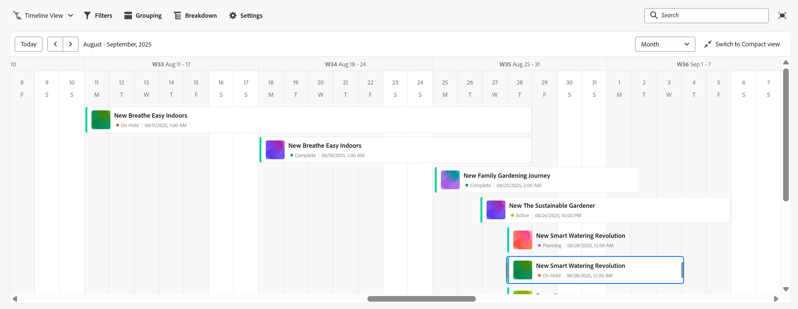

    The records associated with the record type you selected display as bars in a timeline and are sorted in chronological order of their Start Date, by default. 

    >[!TIP]
    >
    >    The sorting of the records in the timeline is not visible in the Compact view.

1. (Conditional) If your administrator has enabled custom quarters, and Workfront detects problems with the way the custom quarters are configured, you might receive a warning when opening the timeline view. 

    The following scenarios exist: 

    * If gaps or overlaps have been detected between the dates of the quarters, you might receive a notification that custom quarters can now be setup and they might need editing.

        

        >[!TIP]
        >
        >This message should display only immediately after your organization purchases Planning and custom quarters were already enabled before the purchase. Overlaps and gaps between the quarters are not allowed after enabling Workfront Planning for your organization. 
    
    * If quarters have been partially set up, with some months within the same year missing, you might receive a notification when you scroll to display the missing quarters that the rest of the year needs to be setup with the missing quarters. 

    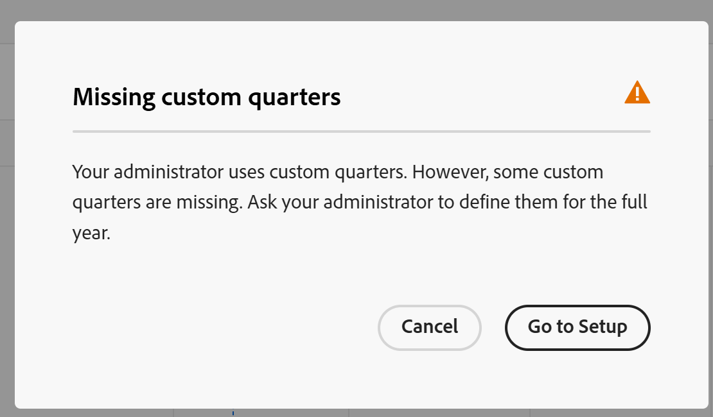

    The warning messages about the custom quarters display once per each user. 

    >[!NOTE]
    >
    >Without custom quarter properly saved, the timeline view displays the classic quarters.
    >After setting up custom quarters in the Setup area, the timeline view displays the custom quarters instead of the classic quarters.
    >For information, see [Enable custom quarters](/help/quicksilver/administration-and-setup/set-up-workfront/configure-system-defaults/enable-custom-quarters-projects.md).

1. (Conditional) If you are a Workfront administrator, click **Go to Setup** to set up your quarters. If not, click **OK** and ask your Workfront administrator to set up the custom quarters.

    >[!TIP]
    >
    >The Go to Setup button displays only for the Workfront administrator.
    
1. (Optional and conditional) When the record name is truncated, hover over a record bar to display the full name of the record and additional information. For information about setting up record bar truncation in the timeline, see the section [Edit the timeline view settings](#edit-the-timeline-view-settings) in this article.

1. Do one of the following to navigate through the timeline:

    * Click the left and right icons in the upper-left corner or use the horizontal scroll to move backwards and forwards in the timeline. Refreshing the page preserves the selected time frame. 
    * Click **Today** in the upper-right corner to center the timeline to today's date. 
    * Select one of the following options from the time frame drop-down menu to update the time increments and update the view: 

        * **Year**: Displays quarters and months with year indication. 
        * **Quarter**: Displays months and weeks with quarter indication. 
        * **Month**: Displays weeks and days. 
1. (Optional) Click **Switch to Compact view** to display the records whose dates don't intersect on the same line. <!--check to see if they updated the name of the setting here--> 
1. (Conditional) If you changed your mode to **Compact**, click **Switch to Standard** view to display records in separate lines. The **Standard** option is the default.  <!--check to see if they updated the name of the setting here--> 

1. Do the following to quickly find records that match a keyword:

    1. Click the **Search** icon  and start typing a keyword associated with any field of a record that displays on the screen. The number of correct matches displays next to the search item and the record with the correct match is highlighted. 

        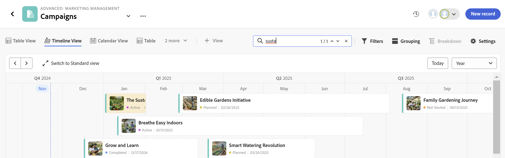

        You can use any word or special character that is visible on the screen.

        You cannot use keywords that are associated with fields that do not display in the timeline view.

    1. Press Enter on your keyboard to go to the next found field.
    1. (Optional) If there is more than one match, click the up and down arrows to the right of the search keyword to find all the matches in the table.
    1. Click the **x** icon in the search box to clear the search keyword.

    1. (Optional) Click the **Full screen** icon  to open the view in full screen, then the **Exit full screen** icon  or Escape on your keyboard to exit the full screen.

1. (Optional) Click **Breakdown** to display connected records on the timeline. 

    For information, see the section [Use the Breakdown feature to display connected records in the timeline view](#break-down-connected-records-in-the-timeline-view) in this article. 
1. To create records in the timeline view or edit their dates do one of the following:

    * Double-click anywhere on the timeline to create a record. 
    
        For information, see [Create records](/help/quicksilver/planning/records/create-records.md).

    >[!TIP]
    >
    >Double-clicking to create records in the timeline is not possible inside of a grouping.
    
    * Click on the left or right margin of a record bar, then drag and drop it in a new position. Resizing the records' bars updates their start or end dates immediately. 
    
    * Drag and drop records to update their position and dates in the timeline. Moving the records' bars updates their start and end dates immediately.
        
        For information, see [Edit records](/help/quicksilver/planning/records/edit-records.md).

    >[!TIP]
    >
    >Resizing and dragging and dropping records is not possible in the timeline for Workfront and AEM Assets object types displayed in breakdowns.

1. Update the following view elements as described in the subsections below:
    * [Filters](#add-filters)
    * [Grouping](#add-grouping)
    * [Settings](#edit-the-timeline-view-settings)
    <!--* [Sort](#add-sort) not yet in timeline; also check the anchor and make sure it's correct-->

### Add filters

You can reduce the amount of information displayed on the screen by using filters.

Consider the following when working with filters in the timeline view: 

<!-- this list is almost identical to the one for the table view - update both-->

* The filters you create for a timeline view work independently from the filters in any other view applied to the same record type. 

* The filters are unique to the view that you select. Two timeline views of the same record type can have different filters applied to them. 

* Two users looking at the same timeline view see the same filter that is currently applied. 

* You cannot name the filters you build for a timeline view.

* Removing filters removes them from anyone accessing the same record type as you and who displays the same view as you do. 

* You can filter by connected record fields or lookup fields. 
* You can filter by lookup fields that display multiple values. 

To add a filter to a timeline view: 

1. Create a timeline view for a record type page, as described in the article [Manage record views](/help/quicksilver/planning/views/manage-record-views.md). 
1. Select a timeline view, then click **Filters** in the upper-right corner of the table.    
1. Click **Add condition** and add the following information: 

    * **Select a field** that you want to filter by <!-- the tip below might change-->

        <!--replace the bullet above with this at preview release: Search for a field or  click the drop-down menu to display a list of fields and select it from the list-->

    * **Select an option** (or a filter modifier) to define what kind of condition the field must meet

        The table below displays the available modifiers for each type of field.

        <table>
        <thead>
        <tr>
            <th><b>Field type</b></th>
            <th><b>Modifiers</b></th>
        </tr>
        </thead>
        <tbody>
        <tr>
            <td>Single-line, Paragraph, Formula </td>
            <td>
Contains

            
Does not contain

            
Is

            
Is not

            
Is empty

            
Is not empty
</td>
        </tr>
        <tr><td>Single-select</td>
            <td>
Is

            
Is not

            
Is any of

            
Is none of

            
Is empty

            
Is not empty
</td>
        </tr>
        <tr>
            <td>Multi-select, People</td>
            <td>
Has any of

            
Has all of

            
Is exactly

            
Has none of

            
Is empty

            
Is not empty
</td>
        </tr>
        <tr>
            <td>Number, Percentage, Currency</td>
            <td>
=

            
≠

            
 < 

            
>

            
≤

            
≥

            
Is empty

            
Is not empty
</td>
        </tr>
        <tr>
            <td>Date</td>
            <td>
Is

            
Is not

            
Is after

            
Is before

            
Is between

Is not between

            
Is empty

Is not empty
</td>
        </tr>

        <tr>
            <td>Checkbox</td>
            <td>
Is

        </tr>
        </tbody>
        </table> 

    * Select a value for the field selected. 

     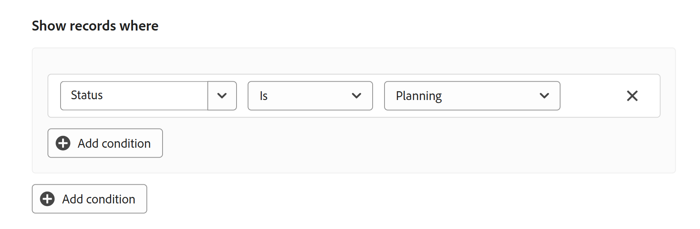

    There is no limit to how many filtering conditions you can add.

1. (Optional) Click **Add condition** to add another filtering option and repeat the above steps. The number of filters applied displays to the left of the **Filters** icon. 
1. Click the following operators to the left to indicate how the filter conditions are joined and should be applied:

    * **AND**: All specified conditions must be met. 
    * **OR**: Any of the specified conditions must be met. 
        This is the default option. 

    1. (Optional) Add additional filter groupings and join them by **AND** or **OR** operators. 

        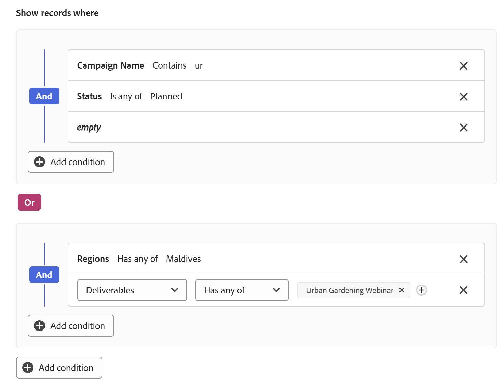

    The list of records is filtered automatically based on your filter criteria.  <!--at this time, you can't name and save the filter - but will this change?!-->
    <!-- asked on the task for the simple filters whether there is a limitation for how many statements a filter can have?!-->

1. (Optional) Click the **x** icon to remove a filter condition.
1. (Optional) Click **Filters** or anywhere else on the page to close the filters box. <!--right now you cannot "clear all" for filters, but this might come later-->

### Add grouping

<!-- groupings are almost identical between this view and table  but they display a little differently, so I kept the steps for both; update in both places if they make changes to groupings-->

You can group records by similar information when applying  a grouping to a view.

Consider the following when working with groupings in the timeline view:

* You can apply groupings both in the table and timeline views. The groupings of the table view are independent from those in the timeline view of the same record type.
* You can apply 3 levels of grouping in a view. The records are grouped in the order of groupings that you select. 
<!--* You can apply up to 4 levels of grouping when using the API. --checking on this one for now-->
* The groupings are unique to the view that you select. Two table views of the same record type can have different groupings applied to them. Two users looking at the same table view see the same grouping that is currently applied. 
* You cannot name the groupings you build for a table view.
* Removing groupings removes them from anyone accessing the same record type as you and who displays the same view as you do. 
* You can edit records listed under a grouping.
* You can group by connected record fields or lookup fields.  
* When you group by lookup fields with multiple values (that have not been summarized by an aggregator), records are grouped by each unique combination of field values.  
* You can reference a field that is up to 4 levels away from the current record type. For example, if you are creating a grouping for an Activity record type, and the Activity is connected to the Product record type which is connected to the Campaign record type which is connected to a Workfront Project, you can reference the project's Status in the grouping you are creating for the Activity record type. 
* Groupings are listed in the alphabetical order of their values. 
<!--checking into this: * You can apply up to 4 levels of grouping when using the API. -->
<!-- checking also into this: * You cannot group by a Paragraph-type field.-->

To add a grouping in the timeline view:

1. Create a timeline view for a record type, as described in the article [Manage record views](/help/quicksilver/planning/views/manage-record-views.md). 
1. Click **Grouping** in the upper-right corner of the timeline view.

    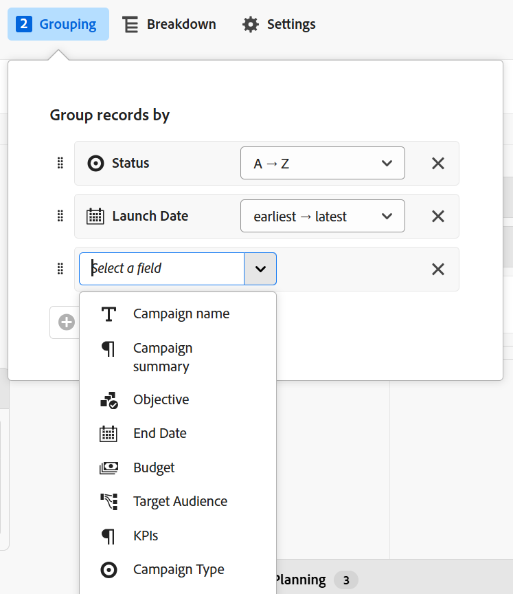

1. Click one of the suggested fields, or click **Choose a different field**, search for a different field, then click it when it displays in the list. 

    The grouping is applied automatically to the timeline and records display inside the grouping box. 
    
1. (Optional) Repeat the above steps to add up to 3 groupings.

    The number of fields selected for the grouping displays next to the Grouping icon.

    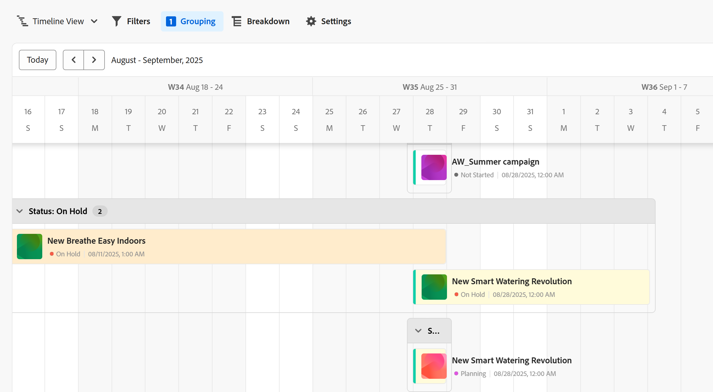

1. In the **Group records by** box, drag and drop the groupings in the correct order.

1. (Optional) Inside the **Group records by** box, click the **x** icon to the right of a field selected for the grouping to remove the grouping

    Or

    Click **Clear all** to remove all fields.  

1. Click outside the **Group records by** box to close it. 
1. (Optional) Click **Settings**, then **Color** to color-code groupings. For more information, see the [Edit the timeline view settings](#edit-the-timeline-view-settings) section in this article. 

<!-- 

### Add sort

this is not possible right now; if this is the same functionality as the table view, document it there and link from here. 

-->

### Edit the timeline view settings {#edit-the-timeline-view-settings}

Update the timeline view settings to indicate what and how information displays in the timeline section of the view. 

1. Create a timeline view for a record type, as described in the article [Manage record views](/help/quicksilver/planning/views/manage-record-views.md). 
1. Click **Settings**. 
1. Click **Date and time** in the left panel, then select a **Start date** and an **End date** to display on the timeline. You can choose the default Start and End dates, or you can choose any date field available. 

    The bars representing the records start on the date that you indicate for the Start date and end on the date corresponding with the End date. 

    >[!NOTE]
    >
    >* Records that have no values for the Start or the End dates or have a Start date later than the End date do not display in the timeline view.
    >
    >* If you display additional records using the Breakdown option, the Start and End dates are those of the main record. You cannot choose Start and End dates for the connected records in this area. 

1. (Conditional and optional) If your are a Workfront administrator, click **Go to Setup** in the **Use custom quarters** box to go to the Setup area and set up custom quarters. After setting up custom quarters, you can display them in the timeline view instead of the classic quarters. If you are not a Workfront administrator, you can request that the custom quarters are enabled for your organization from an administrator. 

    For information, see [Enable custom quarters](/help/quicksilver/administration-and-setup/set-up-workfront/configure-system-defaults/enable-custom-quarters-projects.md). 

    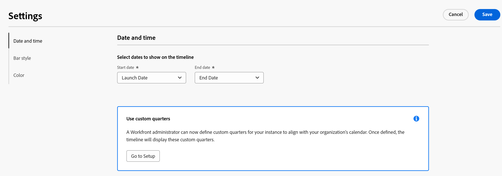

    >[!TIP]
    >
    >The Go to Setup button displays only for the Workfront administrator.

1. Click **Bar style** in the left panel, to indicate what information you want to display on the record bars.

    You can define the bar style of  the main record as well as for the connected records, when using the Breakdown option in the Standard view. 

    The primary field (or title) of the record, as defined in the record's table view, is selected by default.
    <!--adjust this when the primary field is released??-->

1. (Optional and conditional) If you added thumbnails to records, select the **Thumbnail** option to display the image associated with records in their record bar. 

    >[!NOTE]
    >
    >    You must first add thumbnails in the table view before you can display them in the timeline view. For more information, see [Add a thumbnail to a record](/help/quicksilver/planning/records/add-thumbnails-to-records.md). 

1. Click **Add field**, then click inside the **Search fields** box, and click the field you want to add. 

    >[!TIP]
    >
    >   * You must create the fields before you can add them to the record bars. 
    > 
    >   * You must have at least one field selected. **Name** is selected by default.
    >
    >   * You can add up to 5 fields. 

    A preview of what the bars will look like on the timeline displays on the right.

    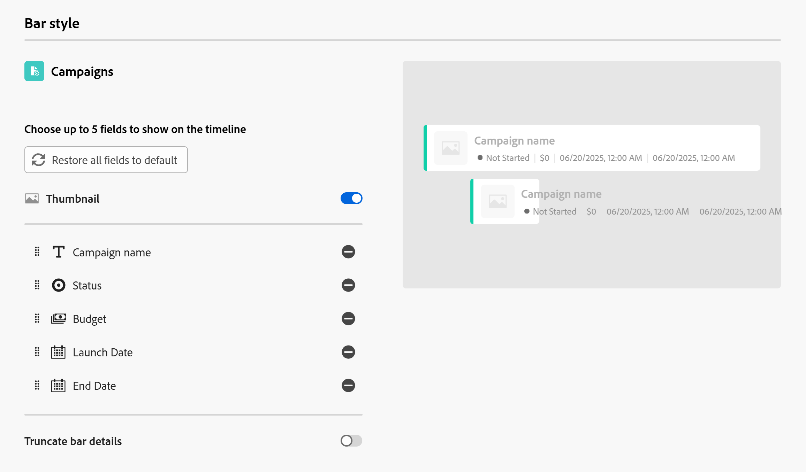

1. (Optional and conditional) If you display the timeline in the Standard mode, select the **Truncate bar details** setting. When selected, the information on the record bars is truncated, and it only displays fully when you hover over the bars. This setting is deselected by default, and the  record information is fully displayed on the bars. 

    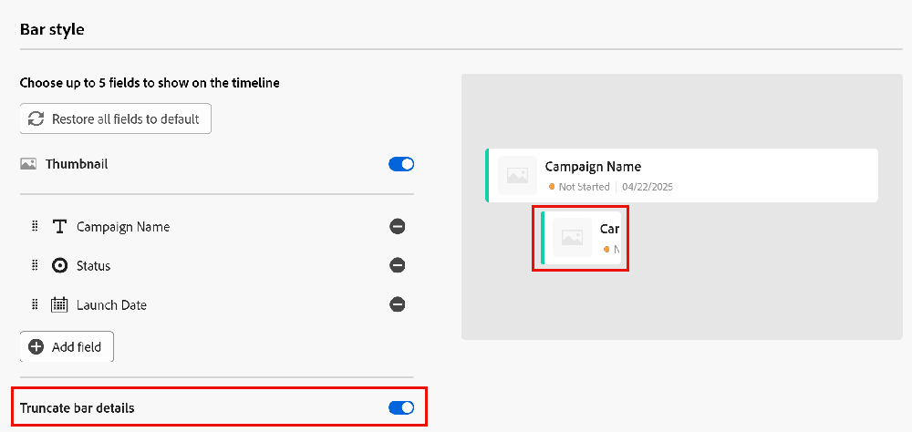

    >[!TIP]
    >
    >The Truncate bar details setting is not available when displaying the timeline view in Compact mode.
    >

1. Click **Color** in the left panel, to customize the colors of the records and groupings in the timeline. 

    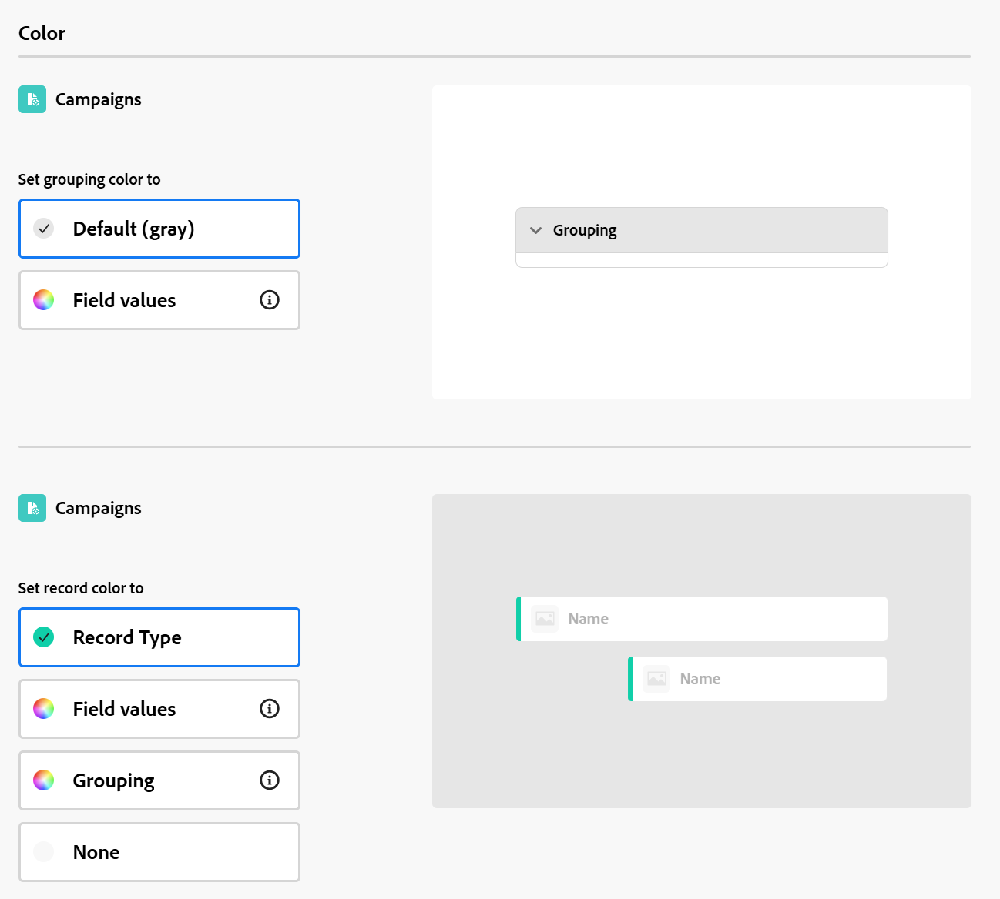

    You can define the color of  the main record as well as for the connected records, when using the Breakdown option in the Standard view. 

1. (Conditional and optional) If you added a grouping to the timeline view, select from the following options to set a color for the grouping in the **Set grouping color** section:

    * **Default (gray)**: The color of the groupings is set to gray. This is the default. 
    * **Field values**: The color of the groupings matches the color of the field you group by. 
    
        >[!NOTE]
        >
        >    * You can match the color only to fields with color-coded options. For example, you can match the color to Status fields, or fields with options associated with colors.
        >    
        >    * You cannot match the color to lookup fields from linked record or object types. 

    For example, multi-select or single-select fields can have color-coded options. 

    If you group by fields without color-coded options, the grouping color remains gray.

    >[!TIP]
    >
    >If you did not add groupings to the timeline view, this section does not display.

1. In the **Set record color** section, select from the following options to set a color for the records: 

    * **Record type**: The color of the records match the color of the record type you selected. This is the default option. 
    * **Field values**: The color of the records matches the color of a field that you specify. Continue with step 10. <!--ensure this stays accurate-->
    * **Grouping**: The color of the records matches the color that you indicated for the groupings. This option is dimmed when you have no groupings applied to the timeline view. 
    * **None**: Records displays in a white bar. 

1. (Conditional) If you selected **Field values** for the record colors, select a field from the **Match the record color to** drop-down menu. 

    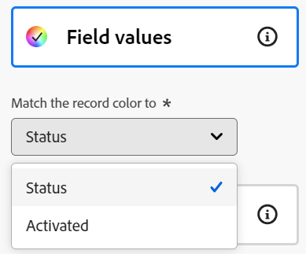

    Only fields with color-coded options display in the drop-down menu.
    
    For example, multi-select or single-select fields can have color-coded options.  

    If you do not have a field with color-coded options for the selected record type, this option is dimmed.

1. (Optional) If you are using the **Breakdown** option, repeat the steps starting with step 4 for each connected record displayed in the timeline. 

1. Click **Save**.

    The records display in the timeline view with the specifications that you selected.

### Break down connected records in the timeline view

You can display connected records in a record's timeline view by using the Breakdown feature. Breaking down records by their connections allows you to view the timelines of other connected records and understand how they might affect the performance and deadlines of your records. 

#### Considerations when using the Breakdown feature

* You can display connected records or objects under the records of the selected record type in the timeline view.
* You can display connected records in the timeline view only when viewing the records in Standard mode. You cannot use the Breakdown option in the Compact mode of the timeline view.  
* You can display the following in the timeline view, using the Breakdown feature:
    * Workfront Planning records connected to the selected record type. 
    * Workfront object types or Experience Manager assets connected to the selected record type.
    * Workfront Planning records or objects from other application that are connected to records connected to the selected record type. 
    
        For example, you might connect campaigns to portfolios. In addition, you might connect  another record type, products, with projects, as well as with campaigns. When you build the campaign timeline view, you can break down the campaigns by portfolios, products, and projects. 

* You cannot display object types that are connected only to Workfront objects in Workfront, but are not connected to a Workfront Planning record type. You can only display object or record types that are connected in Workfront Planning. 

    For example, tasks, are connected to projects in Workfront. Using the Breakdown feature, you can display projects that are connected to campaigns in Planning, but not tasks connected to projects in Workfront. 

    If you want to display both portfolios and projects in the timeline view of a Workfront Planning record type, both the portfolios and the projects must be connected to the Planning record or to a record connected to the Planning record whose timeline view you are managing.
* You can only display record types that are associated with at least two date fields. 
* The date fields for the record types you want to display in the timeline view must be visible in the table view of the selected record type, as lookup fields. 
* The Start and End dates of the record types you want to display in the timeline view must by in chronological order. For example, if a record has a Start date of January 31 and an End date of January 1, it does not display in the timeline view. For more information, see the section [Manage a timeline view](#manage-a-timeline-view) in this article. 
* There is a limit of 5 record types that you can include in a record's breakdown. 

#### Break down connected records

1. Create a timeline view for a record type, as described in the article [Manage record views](/help/quicksilver/planning/views/manage-record-views.md). 
1. From the **Standard** or **Compact** modes, click **Breakdown** in the upper-right corner of the timeline view.
1. Expand the **Select a linked record type** box and select a connected record type. <!--add a new screen shot - submitted a bug to remove the "the"-->

    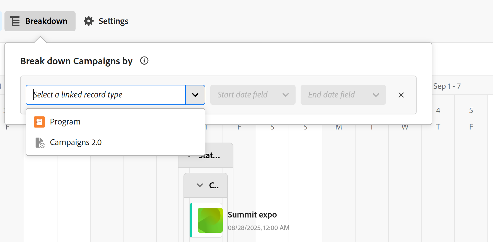

    >[!TIP]
    >
    >    If you do not have any connected records, or if the connected records do not have at least two date fields, the **Select a linked record type** box is not available.

1. Choose a **Start date** and an **End date field**.

    >[!TIP]
    >
    >    The Start and End dates must be sequential. If the End date is before the Start date, no records will display in the timeline. 

    A right-pointing arrow displays on the selected record's bar in the timeline, if they they are connected with other records. 
1. Click the right-pointing arrow to expand a record type and display its connections. <!--update screen shot at production-->

    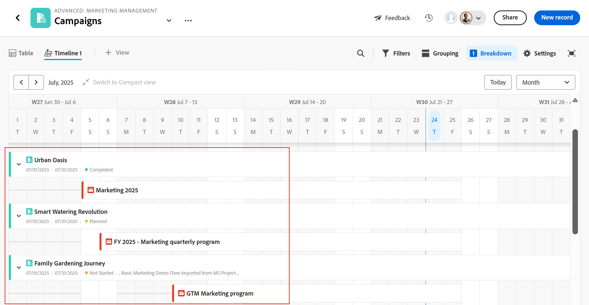    

    >[!IMPORTANT]
    >
    >    When you display multiple connected records in the breakdown, they are not in hierarchical order. 
    >
    >For example, if you are viewing the campaigns' timeline and you add Products and then Programs to the breakdown, Programs are not necessarily connected to the Products first. 
    >
    >Both Products and Programs must be connected to the campaigns to display as choices for the breakdown option, and you can add them to the breakdown in any order.

1. (Conditional) If you are viewing the timeline in the Compact mode, click **Switch view**. The breakdown is not visible in **Compact** mode. 

    >[!TIP]
    >
    >Select **Don't show this again** in the **Switch to the Standard view?** box, before switching the view. 
    >
    >This preference is remembered only for the current browser. If you change browsers or computers, you will have to select this preference again.
    >
    >You cannot revert to the Compact mode after you switched the view to Standard and you display connected records in the view. 
1. (Optional) Repeat the steps above to add more connected records. 

    

