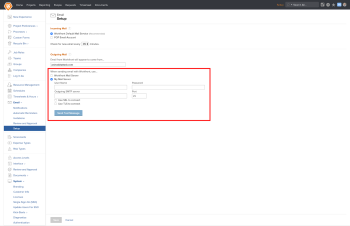

# Remove custom SMTP as an outgoing email option

>[!NOTE]
>
>Functionality described in this article is no longer available, and the article will be removed in the near future.

With the 20.3 release (targeted for August 2020), Adobe Workfront is moving to a new email system that will greatly enhance the reliability of your email delivery for Workfront updates and notifications. As a result of this, customers will no longer be able to use their own SMTP email server to relay their email from the Workfront platform to the intended recipient. All email will be sent directly from the Workfront Mail Server.

This feature is accessed by logging in as a System Administrator and navigating to Setup > Email > Setup. Here is a screenshot highlighting the feature:

The setting highlighted in this screenshot will automatically transition to use the Workfront Mail Server option with the 20.3 release.

If you have configured a custom SMTP mail server, **we highly recommend that you reach out to your IT team** to ensure that email from notifications@my.workfront.com is not going to be blocked for incoming email to your system. You can also reference Configuring your firewall for details about which IP addresses our traffic and email come from.

If you have any other questions or concerns please contact the [Workfront Support Team](https://experienceleague.adobe.com/?support-tab=home#support).
