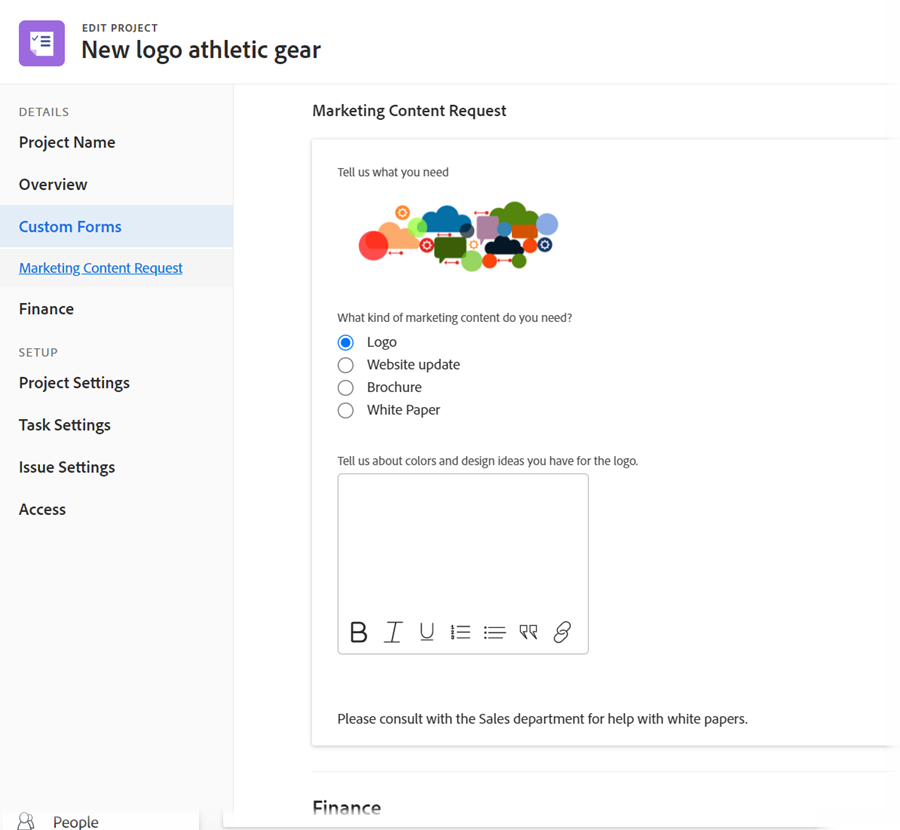

# Custom form enhancements

The following significant enhancements were made for managing custom forms in the 22.2 release.

## Add asset widgets

You can embed image in your custom forms. This allows you to communicate with custom form users in a more interactive and visual way. Additional widget types are coming soon.


When a custom form containing a widget is attached to an object, users who work with the object can see it in the following areas:

* The object's Details area (for example, for a project, the Project Details area)​

  

* The Edit box for the object, if it has the new Adobe Workfront experience look and feel (for example, the Edit Project and Edit Task boxes)​

  

Currently, users cannot see the widget in the following areas:​

* Lists and reports
* Home and Summary
* The Edit box for the object, if it doesn't have the new Adobe Workfront experience look and feel (for example, the Edit Expense box)
* ​The Workfront Mobile app

For more information about adding widgets to custom forms, see [Add or edit an image or other asset widget in a custom form](/help/quicksilver/administration-and-setup/customize-workfront/create-manage-custom-forms/add-widget-or-edit-its-properties-in-a-custom-form.md).

## Associate a custom form with multiple object types

You can associate multiple object types with any new custom form:


Or any existing custom form:


This allows you to create a single custom form for use on projects, tasks, issues, and any other types of objects that are supported for custom forms.

This is especially helpful when you convert an issue or task because you can carry over a custom form and its data to the converted object. You no longer need to create and maintain exact copies of the same custom form for various object types, add the custom form to the project manually.

>[!INFO]
>
>**Example:**
>
>Someone submits an internal IT request (issue) and supplies details about what is needed in an attached custom form.
>
>You convert the issue to a project for the users who will work on it.
>
>Because the custom form containing the submitter's details is associated with both the Issue and the Project object types, the custom form and all of those details are carried over to the project during the conversion.

>[!NOTE]
>
>When the conversion takes place, the custom form must already be associated with the object type you are converting to.

For instructions on adding an asset widget to a custom form, see [Add or edit an image or other asset widget in a custom form](/help/quicksilver/administration-and-setup/customize-workfront/create-manage-custom-forms/add-widget-or-edit-its-properties-in-a-custom-form.md).

Consider the following when you create or edit a multi-object custom form:

* [Permission options for section breaks](#permission-options-for-section-breaks)
* [Calculated custom field compatibility](#calculated-custom-field-compatibility)
* [Caution about deleting an object type from a custom form](#caution-about-deleting-an-object-type-from-a-custom-form)

### Permission options for section breaks

The set of section break permission options available for the Issue, Task, Project, and User object types has one more permission option than the set of permission options for all of the other object types: Limited Edit.


The set of section break permissions available for all of the other object types (Portfolio, Document, Program, Expense, Company, Iteration, Billing Record, and Group) do not include Limited Edit:


In a custom form associated with object types from both of these groups, the system uses a common set of section break permissions that work for all object types. In particular, instead of using the Limited Edit permission option, this common set substitutes the Edit permission option for the Limited Edit permission option. The Edit option is compatible with all object types.

When you associate an object type that uses different permission options than the other object types already on a custom form, a message displays and allows you to switch to the common set of permission options will be used for the form. This change will apply to all fields, even if they are not under a section break.

For more information, see [Add a section break to a custom form](/help/quicksilver/administration-and-setup/customize-workfront/create-manage-custom-forms/add-a-section-break-to-a-custom-form.md).

### Calculated custom field compatibility

In a multi-object custom form, if a calculated field references fields that are available for use with all of the form's associated object types (such as {name}, {description}, and {entryDate}, which are available for multiple object types), the data calculates correctly, no matter which object you attach it to.

For example, if you have a multi-object form for projects and issues, and you add a calculated field containing the {name} expression, the field displays the project name when you add the form to a project, and the task name of you add the form to a task.

However, if a calculated field in the form references a field that is not compatible with all of the form's object types, a message alerts you to make adjustments.

>[!INFO]
>
>**Example:** In a custom form associated with the Task object type, you create a calculated custom field that references the built-in field Assigned To: Name so that it can show the name of the primary assignee in charge whenever the form is attached to a task:
>
>```
>Assigned To: Name{assignedTo}.{name}
>```
>
>Later, you add the Project object type to the custom form. A warning message tells you that the Project object type is incompatible with the calculated custom field. This is because the Assigned To field is not available for projects.

When this occurs, you can do one of the following:

* Remove one of the two incompatible items from the custom form—either the object type or the referenced field.
* Keep both items and use the wildcard filter variable `$$OBJCODE` as a condition in an IF expression to create two different versions of the In Charge field. This allows the field to function successfully, no matter which type of object the form is attached to.

  Using the example above, though there is no built-in Assigned To: Name field for projects, there is a built-in Owner field (which fills in automatically with the name of the person who created the project, unless someone manually changes this). So, in your custom In Charge field, you could use `$$OBJCODE` as shown below to reference the Owner field when the custom form is attached to a project, and the Assigned To: Name field when the form is attached to a task:

  ```
  IF($$OBJCODE="PROJ",{owner}.{name},{assignedTo}.{name})
  ```

>[!NOTE]
>
>  If you add an object type in front of a field name, it references to the object's parent object, so you cannot use `{project}.{name}` with a project, but you can use it with a task.

For instructions on adding a calculated custom field to a custom form, see [Add calculated data to a custom form](/help/quicksilver/administration-and-setup/customize-workfront/create-manage-custom-forms/add-calculated-data-to-custom-form.md).

For more information about variables like `$$OBJCODE`, see [Wildcard filter variables overview](/help/quicksilver/reports-and-dashboards/reports/reporting-elements/understand-wildcard-filter-variables.md).

### Caution about deleting an object type from a custom form

You can delete an object type on a custom form at any time, but this should be done with caution. If users have already attached the custom form to objects of the type you want to delete, and added data to it, that data is permanently deleted when you delete that object type on the form.

Also, there is no notification system to alert people who use the custom form that it was deleted.

For more information, see [Delete a custom field or widget from the system](/help/quicksilver/administration-and-setup/customize-workfront/create-manage-custom-forms/delete-a-custom-field.md).
