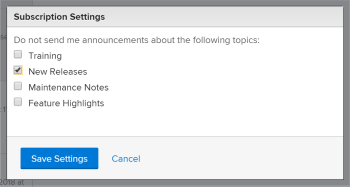

# Unsubscribe from Announcement Center Messages

Announcement Center messages are messages that are sent from Adobe Workfront to the Workfront customer base. You can unsubscribe from the following types of Announcement Center messages:

* Announcements regarding functionality that is released on a feature-by-feature basis outside of these major releases.

  Most new functionality introduced in the Workfront platform is released in conjunction with one of the 4 major releases each year. However, some functionality is released on a feature-by-feature basis outside of these major releases. Each time a feature is released outside of a major release, you receive a message via the Announcement Center. (For more information about the Announcement Center, see [Send announcements](../../administration-and-setup/get-started-wf-administration/view-send-announcements.md).)

* Announcements regarding upcoming Training offerings and events.

To unsubscribe from receiving Announcement Center messages:

1. Click the numbered icon  in the upper-right corner of Workfront to open your list of notifications.
1. Click **All Announcements** at the bottom of the list.

   The **Announcements** page appears, listing all of your announcements.

   

1. Click **Settings** in the upper-right corner of the Announcements page, then select **New Releases** or **Training**, depending on the type of announcements you no longer want to receive.

   

1. Click **Save Settings**.

   You will no longer receive Announcement Center messages for this type of announcement.
