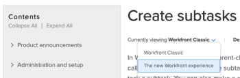
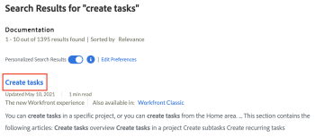

# View documentation resources for the new Adobe Workfront experience

The Adobe Workfront product documentation is available for both the new Adobe Workfront experience and Adobe Workfront Classic.

You can choose to view the new Adobe Workfront experience documentation by doing any of the following:

## Change an article to the new Adobe Workfront experience version while viewing it

1. When viewing any documentation article on Workfront One, click the `Currently viewing` drop-down menu, then click The new Adobe Workfront experience if it is not already selected.

   

   The new Adobe Workfront experience version of the article displays.

   This drop-down menu appears only if there are article versions for both Adobe Workfront Classic and the new Adobe Workfront experience.

## Choose the new Adobe Workfront experience version of an article in the search results

1. After performing a search on Workfront One, click the link that says, `Also available in: The new Workfront experience` to see the new Workfront experience version of the article.

   

   This link appears only if there are article versions for both Adobe Workfront Classic and the new Adobe Workfront experience.

## Make the new Adobe Workfront experience the default documentation version for all articles

Adjust your Workfront&nbsp;One profile to make the new Adobe Workfront experience documentation the default documentation version. This means that any documentation articles that have a version for the new Adobe Workfront experience are displayed by default instead of Adobe Workfront Classic documentation.

>[!NOTE]
>
>You must be logged in to Workfront One to access this feature.

1. Enter a search string in the search field on Workfront One, then press Enter.
1. On the search results page, make sure that the `Personalized Search Results` toggle is enabled, then click `Edit Preferences`.

   

1. On the `Search Preferences` tab, enable the option for The new Adobe Workfront experience.

   Your changes are saved automatically.

   Now when you perform a search, the new Adobe Workfront experience version of articles are displayed by default.

## View the documentation home page for the new Adobe Workfront experience

The documentation home page for the new Adobe Workfront experience is available [here](https://one.workfront.com/s/documentation-new-workfront-experience).
