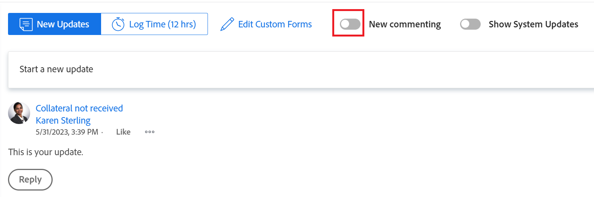

# New commenting experience

The highlighted information on this page refers to functionality not yet generally available. It is available only in the Preview environment for all customers.    

For information about the current release schedule, see [First Quarter 2024 release overview](../../product-releases/24-q1-release-activity/24-q1-release-overview.md).

<!--

After the monthly releases to Production, the same features are also available in the Production environment for customers who enabled fast releases.

For information about fast releases, see [Enable or disable fast releases for your organization](../../../administration-and-setup/set-up-workfront/configure-system-defaults/enable-fast-release-process.md)  -->

>[!IMPORTANT]
>
>The information in this article refers to features that have been released to the new commenting experience. 
>
>The beta program for the new commenting experience started in April 2023 and ended in October 2023. The beta program for the new commenting experience closed with the October 2023 release. 
>
>The features described in this article were released to all customers in October 2023, unless otherwise specified. 

<!--An update to the commenting experience in Adobe Workfront is currently in development. This update includes a new interface, new features, and improved performance in the Updates section of select objects. 

The new commenting experience will slowly become available for all the objects with an Updates section in Workfront, and later it will expand to other Adobe Experience Cloud applications.-->

<!--For additional resources for the new commenting experience, also see the following articles:

* [New commenting experience release activity](../new-commenting-experience-beta/new-commenting-beta-experience-release-activity.md)
* [New commenting experience FAQs](../../betas/new-commenting-experience-beta/new-commenting-faq.md)
-->

## Features

The new commenting experience includes improvements and changes to the Updates section of Adobe Workfront objects. 

Among the improvements included in the new commenting experience are the following:

* Improved performance and user experience
* Separation of user comments from the system activity updates
* Real-time indicator when new comments are added to an object
* Editing comments after submitting them

The following features have been removed from the new experience:

* Comment on a system update
* Ability to edit status, condition, commit date while commenting
* Edit custom form
* The "on behalf of < user name >" information when a Workfront or group administrator logs in as another user and adds a comment on their behalf was originally removed. It has been reinstated on October 19, 2023.
* The "Ask for approval" option when you tag people while adding a comment to a document. 

>[!NOTE]
>
>The objects listed below have only the comments and system updates starting with January 1, 2019 available in the new commenting experience.  
>
>You can view comments and system updates on these objects prior to January 1, 2019 when viewing the Updates section in the current experience:
>
>* Issues
>* Projects
>* Tasks
>* Documents

For more information, see the [New commenting experience FAQs](../../betas/new-commenting-experience-beta/new-commenting-faq.md). 

The following table illustrates the features that will be available in the new commenting experience as well as their availability in areas where they are supported: 

<table>
  <tr>
   <td><strong>Feature </strong>
   </td>
   <td><strong>Exists in old commenting experience </strong>
   </td>
   <td><strong>Exists in the new commenting experience </strong>
   </td>
   <td><strong>Will be introduced in the new commenting experience </strong>
   </td>
   <td><strong>When will be introduced in the new commenting experience </strong>
   </td>
   <td><strong>In research </strong>
   </td>
  </tr>
  <tr>
   <td>Create/read/reply/delete comments 
   </td>
   <td>✓ 
  </td>
   <td>✓ 
   </td>
   <td> 
   </td>
   <td> 
   </td>
   <td> 
   </td>
  </tr>
  <tr>
   <td>Rich text (excludes quoting and emojis)
   </td>
   <td>✓ 
   </td>
   <td>✓
   </td>
   <td> 
   </td>
   <td> 
   </td>
   <td> 
   </td>
  </tr>

<tr>
   <td>Rich text (emojis)
   </td>
   <td>✓ 
   </td>
   <td>✓
   </td>
   <td> 
   </td>
   <td> 
   </td>
   <td> 
   </td>
  </tr>

 <tr>
   <td>Rich text (block quotes)
   </td>
   <td>✓ 
   </td>
   <td> ✓
   </td>
   <td> 
   </td>
   <td> Q2, 2023
   </td>
   <td> 
   </td>
  </tr>
  <tr>
<tr>
   <td> Quote comments
   </td>
   <td>✓ 
   </td>
   <td> ✓
   </td>
   <td> 
   </td>
   <td> Q2, 2023
   </td>
   <td> 
   </td>
  </tr>
  <tr>
   <td>React to comments (Like) 
   </td>
   <td>✓ 
   </td>
   <td>✓ 
   </td>
   <td> 
   </td>
   <td> 
   </td>
   <td> 
   </td>
  </tr>
  <tr>
   <td>Attach images to comments 
   </td>
   <td>✓ 
   </td>
   <td>✓ 
   </td>
   <td> 
   </td>
   <td> 
   </td>
   <td> 
   </td>
  </tr>
  <tr>
   <td>Tag people in comments 
   </td>
   <td>✓ 
   </td>
   <td>✓ 
   </td>
   <td> 
   </td>
   <td> 
   </td>
   <td> 
   </td>
  </tr>
  <tr>
   <td>Remove thread participants
   </td>
   <td> 
   </td>
   <td>✓
   </td>
   <td> 
   </td>
   <td> 
   </td>
   <td> 
   </td>
  </tr>

  <tr>
   <td>Automatically tag all thread participants
   </td>
   <td> 
   </td>
   <td>✓
   </td>
   <td> 
   </td>
   <td> 
   </td>
   <td> 
   </td>
  </tr>

  <tr>
   <td>Comments that are private to a company 
   </td>
   <td>✓ 
   </td>
   <td>✓ 
   </td>
   <td> 
   </td>
   <td> 
   </td>
   <td> 
   </td>
  </tr>
  <tr>
   <td>Undo posting of a comment 
   </td>
   <td>✓ 
   </td>
   <td>Replaced with edit comment 
   </td>
   <td> 
   </td>
   <td> 
   </td>
   <td> 
   </td>
  </tr>
  <tr>
   <td>Turn off system updates 
   </td>
   <td>✓ 
   </td>
   <td>Replaced with the Activity tab 
   </td>
   <td> 
   </td>
   <td> 
   </td>
   <td> 
   </td>
  </tr>
  <tr>
   <td>Edit comments 
   </td>
   <td> 
   </td>
   <td> ✓
   </td>
   <td> 
   </td>
   <td> 
   </td>
   <td> 
   </td>
  </tr>
  <tr>
   <td>Saving comment drafts when navigating away from the page 
   </td>
   <td>✓ 
   </td>
   <td>✓ 
   </td>
   <td> 
   </td>
   <td> 
   </td>
   <td> 
   </td>
  </tr>
  <tr>
   <td>See new comments in real time (includes seeing when a comment is deleted)
   </td>
   <td> 
   </td>
   <td>✓
   </td>
   <td> 
   </td>
   <td> 
   </td>
   <td> 
   </td>
  </tr>
  <tr>
   <td>Log time 
   </td>
   <td>✓ 
   </td>
   <td>✓
   </td>
   <td> 
   </td>
   <td> 
   </td>
   <td> 
   </td>
  </tr>
    <tr>
   <td>Copy thread link 
   </td>
   <td>✓ 
   </td>
   <td> Replaced with Copy link
   </td>
   <td> 
   </td>
   <td>Q2, 2023 
   </td>
   <td> 
   </td>
  </tr>
  <tr>
   <td>Copy comment link 
   </td>
   <td>✓ 
   </td>
   <td> Replaced with Copy link
   </td>
   <td> 
   </td>
   <td> 
   </td>
   <td> 
   </td>
  </tr>
  <tr>
   <td>Quote comment text 
   </td>
   <td>✓ 
   </td>
   <td>✓
   </td>
   <td> 
   </td>
   <td>Q2, 2023 
   </td>
   <td> 
   </td>
  </tr>
  <tr>
   <td>Copy body text 
   </td>
   <td>✓ 
   </td>
   <td> ✓
   </td>
   <td> 
   </td>
   <td>
   </td>
   <td> 
   </td>
  </tr>
    <tr>
   <td>Search in comments 
   </td>
   <td> 
   </td>
   <td> ✓
   </td>
   <td> 
   </td>
   <td>Q1, 2024 
   </td>
   <td> 
   </td>
  </tr>

<tr>
   <td>Copy and paste images in a comment
   </td>
   <td> 
   </td>
   <td> ✓
   </td>
   <td> 
   </td>
   <td>Q1, 2024 
   </td>
   <td> 
   </td>
  </tr>

<tr>
   <td>Drag and drop images in a comment
   </td>
   <td> 
   </td>
   <td> 
   </td>
   <td> 
   </td>
   <td>Q1, 2024 
   </td>
   <td>✓ 
   </td>
  </tr>

<tr>
   <td>Edit custom form 
   </td>
   <td>✓ 
   </td>
   <td> 
   </td>
   <td> 
   </td>
   <td> 
   </td>
   <td> 
   </td>
  </tr>
  <tr>
   <td>Ability to edit status, condition, commit date while commenting 
   </td>
   <td>✓ 
   </td>
   <td> 
   </td>
   <td> 
   </td>
   <td> 
   </td>
   <td>
   </td>
  </tr>
<tr>
   <td>Reply to system updates 
   </td>
   <td> ✓
   </td>
   <td> 
   </td>
   <td> 
   </td>
   <td>
   </td>
   <td> 
   </td>
  </tr>
<tr>
   <td>Display "on behalf of" when adding comments logged in as another user
   </td>
   <td> ✓
   </td>
   <td> ✓
   </td>
   <td> 
   </td>
   <td>
   </td>
   <td> 
   </td>
  </tr>
</table>

## Release timeline 

For information about the features recently released to the new commenting experience, as well as a release timeline, see [New commenting beta experience release activity](../../betas/new-commenting-experience-beta/new-commenting-beta-experience-release-activity.md).  

For more information about managing updates for Workfront objects, see [Update work](../../../workfront-basics/updating-work-items-and-viewing-updates/update-work.md). 

## Locate the new commenting experience

<!--IMPORTANT: when we get rid of the legacy experience, move a version of this to the Update work article or the Update section overview -- to say that the experience is different for all except for iterations-->

The new commenting experience is currently available for all customers and for all environments.

Depending on what objects you access the commenting experience for, you might see the following functionality for the Updates section:

* Both the new and legacy commenting experience for the following objects: 

    * Project
    * Task (this includes Stories)
    * Issue
    * Document

    >[!TIP]
    >
    >Use the New commenting option to display the new commenting experience (when you enable it) or the legacy commenting experience (when you disable it), as described in this section. The new commenting experience is the default. 

  * Only the new commenting experience for the objects listed below. There is no option to enable the legacy commenting experience for these objects:   

     * Goal

      >[!NOTE]
      >
      >You must have an additional license to Adobe Workfront Goals to be able to access this area of Workfront. For more information, see [Requirements to use Workfront Goals](../../../workfront-goals/goal-management/access-needed-for-wf-goals.md).
    * Card on a board
    * Team
    * Template
    * Template Task
    * Timesheet
    * Program
    * Portfolio
    * User

* Only the legacy commenting experience for the following objects:

  * Iterations
    
    There is no option to enable the new commenting experience for iterations. Only the legacy commenting experience is available for iterations. 

<!--before August 17: 

The new commenting experience is currently supported for the following objects:

* When enabling the Beta experience in the Updates section for 

    * Issues, projects, tasks, and documents

    For more information about managing updates for Workfront objects, see [Update work](../../../workfront-basics/updating-work-items-and-viewing-updates/update-work.md). 

* By default, as the only commenting experience for

    * Goals, cards on a board

    >[!NOTE]
    >
    >You must have an additional license to Adobe Workfront Goals to be able to access this area of Workfront. For more information, see [Requirements to use Workfront Goals](../../../workfront-goals/goal-management/access-needed-for-wf-goals.md).

-->

<!--Depending on the environment you access the commenting experience you can do one of the following: 

* Enable the commenting experience Beta in the Production environment
* Enable the legacy commenting experience in the Preview  environment 
-->

To enable the commenting experience option for projects, tasks, issues, and documents: 

1. Go to an object that you want to activate the new commenting experience for, then click **Updates** in the left panel.
1. (Conditional) If it is disabled, enable the **New commenting** option in the upper-right corner of the Updates area to enable it. This should be enabled by default. 

    

1. Start typing an update in the **Comments** tab. The Comments tab is the default tab when the new experience opens

    Or

    Click the  **System Activity** tab to view the activity updates generated by Workfront. 

1. (Optional) To disable the new commenting experience and return to legacy commenting, deselect the **New commenting** option. 

