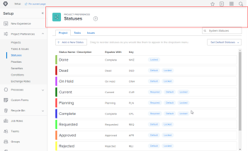

# 21.2 Administrator enhancements

This page describes all administrator enhancements made with the 21.2 release to the Preview environment. These enhancements will be made available in the Production environment the week of May 10, 2021. For a list of all changes available with the 21.2 release, see [21.2 Release overview](../../../product-announcements/product-releases/21.2-release-activity/21-2-release-overview.md).

## For administrators: View Audit Log information about many more areas in Workfront

In the Audit Logs area, you can now track and troubleshoot changes in more areas throughout Workfront. Now the system generates Audit Log entries when a user does any the following:

* Creates, changes, deletes, or shares a custom form
* Creates, changes, deletes, or shares a custom field
* Creates, changes, or deletes a custom section
* Creates, changes, or deletes an exchange rate
* Creates, changes, or deletes a job role
* Creates, changes, or deletes a priority
* Creates, changes, or deletes a severity
* Creates, changes, or deletes a condition
* Changes a project preference or creates or deletes a custom quarter
* Changes a task and issue preference

For more information, see [Audit logs](../../../administration-and-setup/add-users/create-and-manage-users/audit-logs.md).

This feature is now included in the [Admin Fundamentals for the new Workfront experience, Part 2: Project Setup](https://one.workfront.com/s/learningpath3/administrator-fundamentals-in-the-new-workfront-experience-part-1-project-workfl-MCTBVZ3Q3J5RHNLIPPZPFSQRLKUY) learning path on Workfront One.

## For group administrators: Improved controls for moving subgroups and an updated toolbar

>[!NOTE]
>
>Available only in the new Adobe Workfront experience.

We have made the following improvements in the Subgroups area in Setup.

* To give you a quick way to reorganize the groups you manage, we have added an "Add subgroups" toolbar button that allows you to create new subgroups and move existing ones.

  For more information, see [Manage a subgroup](../../../administration-and-setup/manage-groups/create-and-manage-subgroups/manage-subgroups.md).

* The toolbar in the Subgroups area now makes lists consistent with other modernized lists in the new Workfront experience. When you select groups, icons represent available functions in the toolbar.

## New for administrators: Updated look and feel on Timesheets & Hours Preferences page

To improve the experience on the Timesheets & Hours Preferences page, we have updated the user interface to match the more modern look and feel found elsewhere throughout Workfront.

Sections and individual options are easier to read because they are separated by more vertical space.

The labels for the 2 radio button options are broken up so they are not so long—the second part of each label is now an info message on a separate line.

For information about Timesheets & Hours Preference, see [Configure timesheet and hour preferences](../../../administration-and-setup/set-up-workfront/configure-timesheets-schedules/timesheet-and-hour-preferences.md).

## For group administrators: List improvements in the Groups area

>[!NOTE]
>
>Available only in the new Adobe Workfront experience.

Two improvements in the Groups area in Setup make lists consistent with other modernized lists in the new Workfront experience:

* When you select groups, icons represent available functions in the toolbar.
* In the list of groups, columns, sorting, and hierarchy have the newer look and feel you are used to in other lists. Also, by default, lists display up to 2,000 items on a single page instead of 100.

For information about the modernized lists throughout Workfront, see [Modify how a list displays](../../../workfront-basics/navigate-workfront/use-lists/modify-list-display.md).

For information about the Groups area, see [Manage groups](../../../administration-and-setup/manage-groups/manage-groups.md).

## For group administrators: Create and edit programs from the Groups area in Setup

>[!NOTE]
>
>Available only in the new Adobe Workfront experience.

We are continuing to make it easier to manage your groups and their associated objects in one place. Now you can view and work with a group's programs from the Groups area in Setup. This saves you from having to go to the Programs area to manage your group's programs. And it keeps the list of group programs you're working with separate from the other programs in the system.

For more information, see [Create, modify, and view a group's programs](../../../administration-and-setup/manage-groups/work-with-group-objects/create-and-modify-a-groups-programs.md).

## For administrators: Refreshed headers in the Setup area

>[!NOTE]
>
>Available only in the new Adobe Workfront experience.

To better orient administrators in the Setup area and to maintain consistency Adobe Workfront, we have updated the Setup headers with the following:

* A large colorful badge marking each Setup page and subpage
* Hierarchy information above the name of each subpage (on the page for a single group, for example)
* Modernized font styles and sizes

  

For more information about the Setup area, see [Administration and setup](../../../administration-and-setup/administration-and-setup.md).

## For group administrators: View and manage more group objects from the Groups page

>[!NOTE]
>
>This feature is available only in the new Adobe Workfront experience

We are continuing to make it easier to manage your groups and their associated objects in one place. Now you can view and work with your group's companies, teams, and portfolios from the Groups area in Setup. This saves you from having to go to the various Setup pages for these objects to manage them for your group. And it keeps the list of group objects you're looking at separate from those of the other groups in the system.

For more information, see the following articles:

* [Create and modify a group's companies](../../../administration-and-setup/manage-groups/work-with-group-objects/create-and-modify-a-groups-companies.md) 
* [Create and modify a group's projects](../../../administration-and-setup/manage-groups/work-with-group-objects/create-and-modify-a-groups-portfolios.md) 
* [Create and modify a group's teams](../../../administration-and-setup/manage-groups/work-with-group-objects/create-and-modify-a-groups-teams.md)

## New for group administrators: Assign group timesheet profiles

Now it's easier to manage timesheet profiles for a group you administer. Not only can you create timesheet profiles, you can assign them to your groups or to individual members of your groups. This is true even when the Timesheets & hours option is not enabled in your access level.

Up until now, enabling Timesheets & hours option was required in order to assign timesheet profiles. But this might not be ideal for every group administrator because it grants view and edit access to all timesheet and hours information in the system. If you don't need this level of access, now you can manage timesheet profiles for your groups.

For more information, see [Create, edit, and assign timesheet profiles](../../../timesheets/create-and-manage-timesheets/create-timesheet-profiles.md).

For information about the Timesheets & hours option in an access level, see [Grant users administrative access to certain areas](../../../administration-and-setup/add-users/configure-and-grant-access/grant-users-admin-access-certain-areas.md).

## For administrators: Set the Filter, View, and Grouping that users see in object lists

Using a layout template in the new Workfront experience, you can now set the default Filter, View, and Grouping that users see in object lists throughout Workfront.

For example, instead of leaving the Filter list control set to All, you can change it to My Home Team. This way, whenever a user views a list of objects, it includes only the objects associated with the user's team.

Previously, these defaults couldn't be customized, so they were always set as All for Filters, Standard for Views, and Nothing for Groupings. One added bonus of the new functionality is that you can hide these three settings from your users if they don't need them.

For more information, see [Customize Filters, Views, and Groupings using a layout template](../../../administration-and-setup/customize-workfront/use-layout-templates/customize-fvg-list-controls-layout-template.md).

This feature is now included in the [Administrator Fundamentals in the new Workfront Experience, Part 3: Control and Interface Experience](https://one.workfront.com/s/learningpath3/administrator-fundamentals-control-and-interface-experience-MCNCSSMXLPDFEERGVEM4EWL2I4LI) learning path on Workfront One.

## New for administrators: Easily list the reports that are currently using a custom field

>[!NOTE]
>
>This feature was released to the Production environment on March 4, 2021.

When you need to edit or delete a custom field that might already be implemented in some Adobe Workfront reports, it's important to assess whether those reports will need adjustments in order to keep working properly after you make the change.

You can add a custom view in the Custom Forms area with a new Reports column that shows which reports are using a particular custom field.

Previously, without this column, you had to manually create a report using text mode or use another workaround to find out which custom fields were being used in reports. This was difficult and tedious if your organization uses many custom fields.

For more information, [View all reports that use a particular custom field or widget](../../../administration-and-setup/customize-workfront/create-manage-custom-forms/view-all-reports-that-use-a-particular-custom-field.md).

## For group administrators: View and manage a group and its objects in one place

>[!NOTE]
>
>This feature is available only in the new Adobe Workfront experience

Now it's easier to manage a group when you are viewing a group in the Groups area in Setup. The new More menu lets you quickly edit, copy, or delete the group without going back out to the Groups page. For more information, see [Manage a group](../../../administration-and-setup/manage-groups/create-and-manage-groups/manage-a-group.md).

Also, you can view and work with your group's layout templates, schedules, timesheet profiles, and subgroup members from the group's page. This saves you from having to go to the various Setup pages for these objects to manage them for your group. And it keeps the list of your group's objects separate from those of the other groups in the system.

For more information, see the following articles:

* [Create and modify a group's layout templates](../../../administration-and-setup/manage-groups/work-with-group-objects/create-and-modify-a-groups-layout-templates.md) 
* [Create and modify a group's schedules](../../../administration-and-setup/manage-groups/work-with-group-objects/create-and-modify-a-groups-schedules.md) 
* [Create and manage a group's timesheet profiles](../../../administration-and-setup/manage-groups/work-with-group-objects/create-and-modify-a-groups-timesheet-profiles.md) 
* [View and manage subgroup members](../../../administration-and-setup/manage-groups/create-and-manage-subgroups/view-and-manage-subgroup-members.md)

## New for administrators: More text formatting options available in Custom Form fields

When users type in Custom Form fields that allow formatting, they can now organize the text using bullets, numbering, hyperlinks, and block quotes, in addition to bold, italics, and underline.

