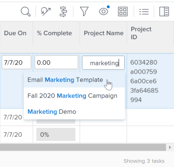

# 21.4 Reporting enhancements

This page describes all Reporting enhancements made with the 21.4 release to the Preview environment. These enhancements will be made available in the Production environment the week of October 4, 2021.

For a list of all changes available with the 21.4 release, see [21.4 Release overview](../../../product-announcements/product-releases/21.4-release-activity/21.4-release-overview.md).

## New look and feel for the Assignments field in updated lists and reports

>[!NOTE]
>
>Previously available in the Production environment with the 21.2 release, then temporarily removed from the Production environment on May 20, 2021.

>[!NOTE]
>
>This feature is available only in the new Adobe Workfront experience.

To match the modern look of other areas in the new Workfront experience, the styling has changed for the Assignments field in updated lists and reports. This redesign includes:

* A rounded avatar for the user profile pictures, job roles, and teams
* Initials display for users without profile pictures
* A new Job role icon
* A new People icon for advanced assignments
* A new Restricted Access icon
* Other minor design changes

For more information on assignments in lists, see [Assign tasks](../../../manage-work/tasks/assign-tasks/assign-tasks.md) or [Assign issues](../../../manage-work/issues/manage-issues/assign-issues.md).

## New look and feel for typeahead fields in updated lists and reports

>[!NOTE]
>
>Previously available in the Production environment with the 21.2 release, then temporarily removed from the Production environment on May 20, 2021.

>[!NOTE]
>
>This feature is available only in the new Adobe Workfront experience.

To match the modern look of other areas in the new Workfront experience, the styling has changed for typeahead fields in updated lists and reports. These changes include:

* The Typeahead icon has been removed from the field.
* When you click a typeahead field, the suggestions menu now displays before you enter text. 
* The suggestions menu is more responsive to the length of values and these values are now truncated at the end when the character limit is met instead of in the middle of the value.

For information on updated lists, see the [The difference between the updated and the legacy lists](../../../workfront-basics/navigate-workfront/use-lists/view-items-in-a-list.md#updated) section in the article [Get started with lists in Adobe Workfront](../../../workfront-basics/navigate-workfront/use-lists/view-items-in-a-list.md).

