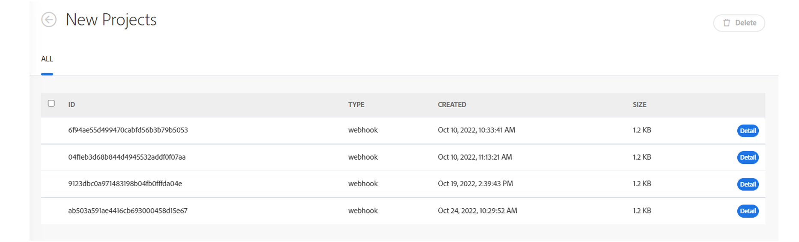

# Workfront Fusion release activity: Week of November 7, 2022

**Webhook queue optimization**

Fusion's webhook queue has been optimized with this release. The service that accepts webhooks is now separate from queuing and other processes. This change makes it possible for Fusion to process webhook queues at a faster and more consistent rate.  

During the implementation of this change, we were able to understand expected log processing time better for queued webhook events. Fusion's webhook viewer page is expected to be no older than 1 minute. 

To see currently queued webhook events, navigate to Webhooks, in left navigation. Truck icons with a number in the numerator indicate queue events for that webhook. Click on the truck icon to see the queued events.

**Unused webhooks will now be deactivated or deleted**

We've made some changes to the way Workfront Fusion handles unused webhooks. Now, wWebhooks are deactivated automatically if either of the following applies:

* The webhook has not been connected to any scenario for more than 5 days.
* The webhook is used only in inactive scenarios, which have been inactive for more than 30 days.

Deactivated webhooks are deleted and unregistered automatically if they are not connected to any scenarios and have been in deactivated status for over 30 days.
