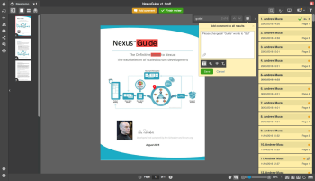
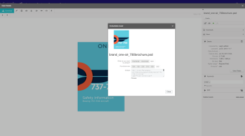

# The Workfront R1 release

## KEEP EVERYONE ENGAGED AND EFFICIENT

Workfront releases new product functionality to all product lines three times a year (Release 1, Release 2, and Release 3.) In the first release of the 2017 year (R1,) several enhancements to core functionality in Workfront, ProofHQ and Workfront DAM allow knowledge workers to be more productive, engaged and spend less time managing work, and more getting things done.

## WHAT'S NEW IN THE LATEST RELEASE?

* [WORKFRONT ENHANCEMENTS](#workfront-enhancements) 
* [PROOFHQ ENHANCEMENTS](#proofhq-enhancements) 
* [WORKFRONT DAM ENHANCEMENTS](#workfront-dam-enhancements)

## WORKFRONT ENHANCEMENTS {#workfront-enhancements}

   
**Manage work right from your email** 
Direct integration into Outlook 365 will allow you to eliminate duplicate work as you update Workfront directly from Outlook 365. Convert emails to tasks, send email conversations and attachments as updates, and respond to comments - without ever leaving Outlook.

For more information see:&nbsp; [Functionality made available in Preview in 2016](../../../../product-announcements/product-releases/quarterly-release-archive/r1-release-activity/available-in-preview-in-2016.md)

   
**Keep projects on track and budget** 
Manage your resources and their utilization, keeping projects on track and on budget using the new Utilization Report. View planned vs. actual hours per project and role, and compare resources and departments on a regular basis.

For more information see:&nbsp; [R1 Preview 3](../../../../product-announcements/product-releases/quarterly-release-archive/r1-release-activity/r1-preview-3.md)

   
**Terminology and Notification Customization** 
Make Workfront more relevant to your team by leveraging the custom terminology feature to change terms like “Portfolio” or “Project” to fit your preferred lingo regardless of industry. Additionally, each user can now customize the types of notifications they receive by regulating their digest frequency.

For more information see:&nbsp; [R1 Preview 3](../../../../product-announcements/product-releases/quarterly-release-archive/r1-release-activity/r1-preview-3.md)

**Milestone View** 
New progress status icons let you get more out of your milestone reports. Also, you may now edit percent complete directly from the milestone view.

For more information see:&nbsp; [R1 Preview 5](../../../../product-announcements/product-releases/quarterly-release-archive/r1-release-activity/r1-preview-5.md)

**Workfront Recycle Bin** 
The new Workfront Recycle Bin helps you restore projects, tasks, issues, and all related documents, forms, and updates within 30 days of deletion.

For more information see:&nbsp; [R1 Preview 1 and 2](../../../../product-announcements/product-releases/quarterly-release-archive/r1-release-activity/r1-peview-1-and-2.md)

### PROOFHQ ENHANCEMENTS {#proofhq-enhancements}

   
**Proof Search and Find** 
New search functionality in ProofHQ allows you to quickly and easily search and find all instances of a word or phrase directly in the proofs as you review. This applies to all text-based documents, including PDFs and Microsoft Word files.

For more information see:&nbsp; [R1 Final](../../../../product-announcements/product-releases/quarterly-release-archive/r1-release-activity/r1-final.md)

   
**Visual Reporting and Enhanced Custom Views** 
New reporting metrics in ProofHQ allow you to track turnaround time, late percentages, number of comments, and time to first activity. New custom views create advanced filter logic so you get the exact data, right when you need it.

For more information see:&nbsp; [R1 Final](../../../../product-announcements/product-releases/quarterly-release-archive/r1-release-activity/r1-final.md)

**ProofHQ Preview** 
ProofHQ now allows you to test new features in a Preview environment before releasing to all your users.

## WORKFRONT DAM ENHANCEMENTS {#workfront-dam-enhancements}

   
**DAM Embedded Links** 
For marketing teams who need a better way to manage, publish, and track the usage of digital assets to external platforms, the embedded links feature provides the control you need to manage the process of sharing the right content at the right time.

**DAM Required Metadata Fields** 
Improve digital asset categorization with required metadata fields which allow for increased control of asset sharing.

**Keep everyone engaged and efficient with Workfront.** 
Workfront is an Enterprise Work Management solution that allows modern knowledge workers and executives to:

* Tailor work to fit individual and organizational preferences and increase adoption
* Work more efficiently from anywhere
* Have better and more meaningful visibility of resources, both budgets and people
* Deliver the right work, faster than before

**FIND OUT MORE**

* Download the R1 Datasheet here:&nbsp; [https://resources.workfront.com/data-sheets/r1-release-datasheet](https://resources.workfront.com/data-sheets/r1-release-datasheet)
* Download the R1 Release FAQ here: [https://resources.workfront.com/data-sheets/r1-faq-for-customers](https://resources.workfront.com/data-sheets/r1-faq-for-customers)
* For a complete list of improvements available in R1: [R1 release activity overview](../../../../product-announcements/product-releases/quarterly-release-archive/r1-release-activity/r1-release-activity-overview.md)

Workfront. Because Work Matters.
