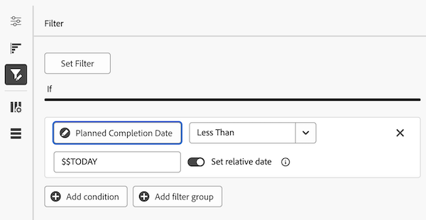

# Build a chart report in a Canvas Dashboard

>[!IMPORTANT]
>
>The Canvas Dashboards feature is currently only available for users participating in the beta stage. For more information, see [Canvas Dashboards beta information](/help/quicksilver/product-announcements/betas/canvas-dashboards-beta/canvas-dashboards-beta-information.md).

You can build and add a chart report to a Canvas Dashboard to visualize your data as a bar, column, line, or pie chart. 

+++ Expand to view access requirements. 

 <table style="table-layout:auto"> 
<col> 
</col> 
<col> 
</col> 
<tbody> 
<tr> 
   <td role="rowheader">
Adobe Workfront plan
</td> 
   <td> 

Any 
 
   </td> 
<tr> 
 <tr> 
   <td role="rowheader">
Adobe Workfront license
</td> 
   <td> 

Current: Plan 
 

New: Standard
 
   </td> 
   </tr> 
  </tr> 
  <tr> 
   <td role="rowheader">
Access level configurations
</td> 
   <td>
Edit access to Reports, Dashboards, and Calendars

  </td> 
  </tr>  
</tbody> 
</table> 

For more detail about the information in this table, see [Access requirements in Workfront documentation](/help/quicksilver/administration-and-setup/add-users/access-levels-and-object-permissions/access-level-requirements-in-documentation.md).
+++

## Prerequisites

You must create a dashboard before you can build a chart report. 

## Build a chart report in a Canvas Dashboard

There are many configuration options available for building a chart report. In this section, we'll walk you through the general process of creating one.

{{step1-to-dashboards}}

1. In the left panel, click **Canvas Dashboards**. 

1. Click **New Dashboard** in the upper-right corner.  

1. In the **Create dashboard** box, enter the dashboard's **Name** and **Description**.  

1. Click **Create**. 

1. In the **Add report** box, select **Create report**.  

1. On the left side, select **Chart**.

1. In the top-right corner, click **Create report**.  

1. (Optional) Follow the steps below to configure the **Details** section: 

    1. Enter a report **Name**. 

    1. Enter a report **Description**. 

    1. If desired, uncheck the **Show extra series as "Other"** box.  

        >[!NOTE]
        >
        >There is a maximum number of series that can be displayed in a chart. When this box is checked, any series above the limit are consolidated into an **Other** grouping in the chart.  

1. Follow the steps below to configure the **Build chart** section: 

    1. In the left panel, click the **Build chart**  icon.  

    1. In the **Chart type** drop-down, select the type of chart you want to create: 

        * **Bar**
        * **Column** 
        * **Line** 
        * **Pie** 

    1. In the **Column type** drop-down, select the column type: 
        * **Simple**
        * **Multi-series**
        * **Stacked**

    1. Select the **Update field** button in the first section, then locate and select the field that contains the data that will be summarized in the chart.
    1. In the **Aggregation type** drop-down, select how the data rolls up to produce the chart output.

    1. Select the **Update field** button under the second section, then locate and select the second field you want to display in the chart. 

1. Follow the steps below to configure the  **Filter** section: 

    1. In the left panel, click the  **Filter** icon.
    1. Select **Edit filter**. 
    1. Click **Add condition** and then specify the field you want to filter by and the modifier that defines what kind of condition the field must meet.  
    1. (Optional) Click **Add filter group** to add another set of filtering criteria. The default operator between the sets is AND. Click the operator to change it to OR. 

1. Follow the steps below to configure the **Drilldown Column Settings** section: 

    1. In the left panel, click the **Drilldown Columns**  icon. The fields from your chart automatically appear as columns in the preview section on the right.  

    1. (Optional) To update any of the existing column configurations, select the column you want to update in the **Current columns** section and then update the desired information (e.g. label, linked status, and conditions). 

    1. Click **Add column** and then select the field you want to display as a column in the table. Repeat this process for each column you want to add.  

1. Follow the steps below to configure the **Drilldown Group Settings** section: 

    1. In the left panel, click the **Group Settings**  icon. 

    1. Click the **Add grouping** button and then select the field you want to create as a grouping.  

1. Click **Save** to create the report and add it to the dashboard. 
 
## Build a chart report example

In this section, we will go over the steps to create a column chart that displays overdue tasks by project owner.

{{step1-to-dashboards}}

1. In the left panel, click **Canvas Dashboards**. 

1. Click **New Dashboard** in the upper-right corner.  

1. In the **Create dashboard** box, enter the dashboard's **Name** and **Description**.  

1. Click **Create**. 

1. In the **Add report** box, select **Create report**.  

1. On the left side, select **Chart**.

1. In the top-right corner, click **Create report**.  

1. Follow the steps below to configure the **Details** section: 

    1. Enter a report **Name** (e.g. *Overdue Tasks by Project Owner*). 

    1. Enter a report **Description**. 

1. Follow the steps below to configure the **Build chart** section: 

    1. In the left panel, click the **Build chart** icon.  

    1. In the **Chart type** drop-down, select **Column**. 

    1. In the **Column type** drop-down, select **Simple**. 

    1. Select the **Update field** button under the **Bottom (X) axis** section, then locate and select the **Task** > **Project** > **Owner** > **Name** field.

        

    1. Click the **Select field** button under the **Left (Y) axis** section, then locate and select the **Task** > **Name** field. 

    1. In the **Aggregation type** drop-down, select **Count**.

        

1. Follow the steps below to configure the **Filter** section: 

    1. In the left panel, click the **Filter** icon. 

    1. Select **Edit filter**. 

    1. Click **Add condition**. 

    1. Click in the empty condition area, then select **Pick Field**. 

    1. Select the **Percent Complete** field. 

    1. In the **Operators** drop-down, select **Less Than**, then enter *100* in the evaluator field.  

    1. Click **Add Condition**, then **Pick Field**. 

    1. Select the **Planned Completion Date** field. 

    1. In the **Operators** drop-down, select **Less Than**. 

    1. Toggle **Set relative date** to **ON**. 

    1. Enter *$$TODAY* in the evaluator field. 

        

1. Follow the steps below to configure the **Drilldown Column Settings** section: 

    1. In the left panel, click the **Drilldown Columns**  icon. The fields from your chart automatically appear as columns in the preview section on the right.  

    1. Click **Add column**, then select the **Assigned To** > **Name** field. 

    1. Click **Add column**, then select the **Planned Start Date** field. 

    1. Click **Add column**, then select the **Planned Completion Date** field. 

    1. Click **Add column**, then select the **Last Update Date** field. 

    1. (Optional) To display the update time, select the **Last Update Date** option in the **Current Columns** field, then select a time value option in the **Date format** drop-down. 

1. Follow the steps below to configure the **Drilldown Group Settings** section: 

    1. In the left panel, click the **Group Settings**   icon. 

    1. Click the **Add grouping** button and then select the **Project** > **Name** field. 

1. Click **Save** to create the report and add it to the dashboard.