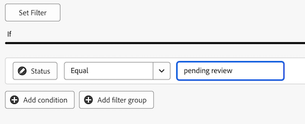
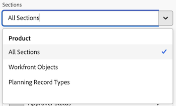
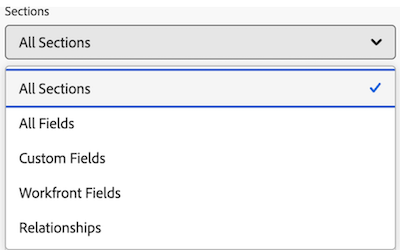

# Build a KPI report in a Canvas Dashboard

>[!IMPORTANT]
>
>The Canvas Dashboards feature is currently only available for users participating in the beta stage. Parts of the feature may not be complete or work as intended during this stage. Please submit any feedback regarding your experience by following the instructions in the [Provide feedback](/help/quicksilver/product-announcements/betas/canvas-dashboards-beta/canvas-dashboards-beta-information.md#provide-feedback) section in the Canvas Dashboards beta overview article. 
>If you have feedback regarding a possible bug or technical issue, please submit a ticket to Workfront Support. For more information, see [Contact Customer Support](/help/quicksilver/workfront-basics/tips-tricks-and-troubleshooting/contact-customer-support.md). 
>Please note that this beta is not available on the following cloud providers:
>
>* Bring Your Own Key for Amazon Web Services
>* Azure
>* Google Cloud Platform 

You can build and add a KPI report to a Canvas Dashboard that visually represents your key performance indicator data as a number, which you can then use to see how your projects and teams are performing.   

## Access Requirements

+++ Expand to view access requirements for the functionality in this article.

 <table style="table-layout:auto"> 
<col> 
</col> 
<col> 
</col> 
<tbody> 
<tr> 
   <td role="rowheader">
Adobe Workfront package
</td> 
   <td> 

Any 
 
   </td> 
<tr> 
 <tr> 
   <td role="rowheader">
Adobe Workfront license
</td> 
   <td> 

Standard
 

Plan
 
   </td> 
   </tr> 
  </tr> 
  <tr> 
   <td role="rowheader">
Access level configurations
</td> 
   <td>
Edit access to Reports, Dashboards, and Calendars

  </td> 
  </tr>  
</tbody> 
</table> 

For more detail about the information in this table, see [Access requirements in Workfront documentation](/help/quicksilver/administration-and-setup/add-users/access-levels-and-object-permissions/access-level-requirements-in-documentation.md).
+++

## Prerequisites

You must create a dashboard before you can build a KPI report. 

## Build a KPI report in a Canvas Dashboard

There are many configuration options available for building a KPI report. In this section, we'll walk you through the general process of creating one. 

{{step1-to-dashboards}}

1. In the left panel, click **Canvas Dashboards**. 

1. Click **New Dashboard** in the upper-right corner.  

1. In the **Create dashboard** box, enter the dashboard's **Name** and **Description**.  

1. Click **Create**. 

1. In the **Add report** box, select **Create report**.  

1. On the left side, select **KPI**.

1. In the upper-right corner, click **Create report**.  

1. Follow the steps below to configure the **Details** section: 

    1. Enter a report **Name**. 
    1. Enter a report **Description**. 
    
        >[!NOTE]
        >
        >The description will be used as a caption below the KPI value. If you don't enter a description, a caption will be generated for you based on the aggregator and aggregation type you select in the following steps.  

1. Follow the steps below to configure the **Build KPI** section: 

    1. In the left panel, click the **Build KPI**  icon.  

    1. Click **Select field** and then specify the field you want to add to the report.  

    1. In the **Aggregation type** drop-down, select how the data rolls up to produce the KPI output. The options in this field will vary depending on the type of field that was selected in the previous step. 

1. Follow the steps below to configure the **Filter** section: 

    1. In the left panel, click the **Filter**  icon. 

    1. Select **Edit filter**. 

    1. Click **Add condition** and then specify the field you want to filter by and the modifier that defines what kind of condition the field must meet.   

    1. (Optional) Click **Add filter group** to add another set of filtering criteria. The default operator between the sets is AND. Click the operator to change it to OR. 

        For more information on filters, see [Edit report filters in a Canvas Dashboard](/help/quicksilver/reports-and-dashboards/canvas-dashboards/manage-reports/edit-report-filters.md).

1. Follow the steps below to configure the **Drilldown Column Settings** section: 

    1. In the left panel, click the **Drilldown Columns**  icon. The fields from your chart automatically appear as columns in the preview section on the right.  

    1. (Optional) To update any of the existing column configurations, select the column you want to update in the **Current columns** section and then update the desired information (e.g. label, linked status, and formatting rules). 

    1. Click **Add column** and then select the field you want to display as a column in the table. Repeat this process for each column you want to add.  

1. Follow the steps below to configure the **Drilldown Group Settings** section: 

    1. In the left panel, click the **Group Settings**  icon. 

    1. Click the **Add grouping** button and then select the field you want to create as a grouping.  

1. Click **Save** to create the report and add it to the dashboard. 

## Build a KPI report example

In this section, we will go over the steps to create a KPI report that displays pending document approvals. 

For more information on KPI report examples, see [Create a report dashboard for review and approvals](/help/quicksilver/review-and-approve-work/document-reviews-and-approvals/create-review-and-approval-dashboard.md).

{{step1-to-dashboards}}

1. In the left panel, click **Canvas Dashboards**. 

1. Click **New Dashboard** in the upper-right corner.  

1. In the **Create dashboard** box, enter the dashboard's **Name** and **Description**.  

1. Click **Create**. 

1. In the **Add report** box, select **Create report**.  

1. On the left side, select **KPI**.

1. In the upper-right corner, click **Create report**.  

1. Follow the steps below to configure the **Details** section: 

    1. Type *Pending* in the **Name** field. 
    1. Type *Pending approvals* in the **Description** field. This displays as a caption below the KPI value. 

1. Follow the steps below to configure the **Build KPI** section: 

    1. In the left panel, click the **Build KPI** .

    1. Click **Select field**.  

    1. Locate and select the **Document approval** folder.

    1. Select **Status**.

    1. In the **Aggregation type** drop-down, select **Count**. 

1. Follow the steps below to configure the **Filter** section: 

    1. In the left panel, click the **Filter**  icon. 

    1. Select **Edit filter**. 

    1. Click **Add condition**. 

    1. Click into the empty condition filter, click **Pick a Field**, then choose **Status**.
    1. Leave the operator as **Equal**, then type _pending review_ in the textbox.
    
1. Click **Save** in the top-right corner of the screen.

## Considerations when building a KPI report

### Utilizing the field selector

The **Sections** drop-down in the **Build KPI** section is designed to narrow down the choices in a field selector to make an object easier to find when building a table report. To start, you would select a base entity object.

* **All Sections**: All object types in Workfront Workflow and Workfront Planning.
* **Workfront Objects**: Native Workfront Workflow objects.
* **Planning Record Types**: Custom record types defined in Workfront Planning.

Once the base entity object has been selected, the **Sections** drop-down then updates with applicable field type options to choose from.

* **All Sections**: Native fields, custom fields, and related objects.
* **All Fields**: Both native and custom fields (excludes relationships).
* **Custom Fields**: Customer-defined fields either on a custom form or Planning record.
* **Workfront Fields**: Native fields only.
* **Relationships**: Connected records.

### Referencing children objects

Available relationships for additional columns, filter options, and grouping attributes are generally limited to objects higher in the Workfront object hierarchy or otherwise have a single selection on the report's base entity object. There are some exceptions to this, which include the following:

* Project > Tasks
* Document Approval > Document Approval Stages
* Document Approval Stages > Document Approval Stage Participants 

When utilizing any of the parent-to-child relationships listed above, you will see a row in the table for each child record connected to the parent object.  

