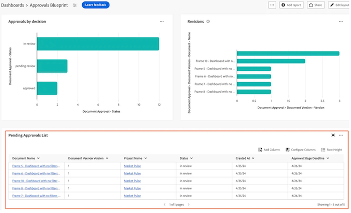
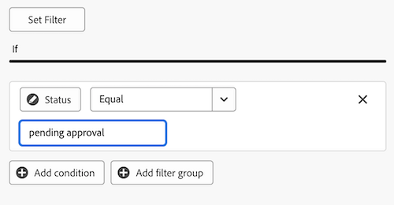

# Build a table report in a Canvas Dashboard

>[!IMPORTANT]
>
>The Canvas Dashboards feature is currently only available for users participating in the beta stage. For more information, see [Canvas Dashboards beta information](/help/quicksilver/product-announcements/betas/canvas-dashboards-beta/canvas-dashboards-beta-information.md).

You can add a table report to a Canvas Dashboard in order to visualize your data in a table format.  

+++ Expand to view access requirements. 

 <table style="table-layout:auto"> 
<col> 
</col> 
<col> 
</col> 
<tbody> 
<tr> 
   <td role="rowheader">
Adobe Workfront plan
</td> 
   <td> 

Any 
 
   </td> 
<tr> 
 <tr> 
   <td role="rowheader">
Adobe Workfront license
</td> 
   <td> 

Current: Plan 
 

New: Standard
 
   </td> 
   </tr> 
  </tr> 
  <tr> 
   <td role="rowheader">
Access level configurations
</td> 
   <td>
Edit access to Reports, Dashboards, and Calendars

  </td> 
  </tr>  
</tbody> 
</table> 

For more detail about the information in this table, see [Access requirements in Workfront documentation](/help/quicksilver/administration-and-setup/add-users/access-levels-and-object-permissions/access-level-requirements-in-documentation.md).
+++

## Prerequisites

You must create a dashboard before you can build a table report. 

## Build a table report in a Canvas Dashboard

There are many configuration options available for building a table report. In this section, we'll walk you through the general process of creating one.

{{step1-to-dashboards}}

1. In the left panel, click **Canvas Dashboards**. 

1. Click **New Dashboard** in the upper-right corner.  

1. In the **Create dashboard** box, enter the dashboard's **Name** and **Description**.  

1. Click **Create**. 

1. In the **Add report** box, select **Create report**.  

1. On the left side, select **Table**. 

1. In the upper-right corner, click **Create report**. 

1. (Optional) Follow the steps below to configure the **Details** section: 
    
    1. Enter a report **Name**.

    1. Enter a report **Description**.

1. Follow the steps below to configure the **Build table** section:

    1. In the left panel, click the **Table columns**  icon. 

    1. Click **Add column** and then select the field you want to display as a column in the table. The column appears in the preview section on the right.  

    1. Repeat the above step for each column you want to add. 

1. Follow the steps below to configure the **Filter** section: 

    1. In the left panel, click the **Filter**  icon.

    1. Select **Edit filter**. 

    1. Click **Add condition** and then specify the field you want to filter by and the modifier that defines what kind of condition the field must meet. The column appears in the preview section on the right.

1. (Optional) Click **Add filter group** to add another set of filtering criteria. The default operator between the sets is AND. Click the operator to change it to OR. 

1. Follow the steps below to configure the **Drilldown Group Settings** section: 

    1. In the left panel, click the **Group Settings**  icon. 

    1. Click the **Add grouping** button and then select the field you want to create as a grouping. The grouping column appears in the preview section on the right. 

1. Click **Save** to create the report and add it to the dashboard. 

## Build a table report example

In this section, we will go over the steps to create a table report that displays pending document approvals. 

For more information on table report examples, see [Create a report dashboard for review and approvals](/help/quicksilver/review-and-approve-work/document-reviews-and-approvals/create-review-and-approval-dashboard.md).

{{step1-to-dashboards}}

1. In the left panel, click **Canvas Dashboards**. 

1. Click **New Dashboard** in the upper-right corner.  

1. In the **Create dashboard** box, enter the dashboard's **Name** and **Description**.  

1. Click **Create**. 

1. In the **Add report** box, select **Create report**.  

1. On the left side, select **Table**. 

1. In the upper-right corner, click **Create report**. 

1. Follow the steps below to configure the **Details** section: 

    1. Type _Pending approvals_ in the **Name** field. 
    1. Type a description in the **Description** field. This text displays as a tooltip next to the chart name. 

1. Follow the steps below to configure the **Build table** section: 

    1. In the left panel, click the **Table columns**  icon.
    1. Click **Add column**.
    1. Scroll down and select **Document Approvals** > **Status**.
    1. Add the following columns:

    <table>
    <tr>
    <td><strong>Project name</strong></td>
    <td>Document Version > Document > Project > Name</td>
    </tr>
    <tr>
    <td><strong>Document name</strong></td>
    <td>Document Version > Document > type <em>Name</em> in the search box.</td>
    </tr>
    <tr>
    <td><strong>Document version</strong></td>
    <td>Document Version > Document > Version</td>
    </tr>
    <tr>
    <td><strong>Deadline</strong></td>
    <td>Document Approval > Approval Stage > Deadline</td>
    </tr>
    <tr>
    <td><strong>Requested by</strong></td>
    <td>Document Approval > Approval Stage > Approval Stage Participants* > Requester > type <em>Name</em> in the search box.</td>
    </tr>
    <tr>
    <td><strong>Requested date</strong></td>
    <td>Document Approval > Approval Stage > Approval Stage Participants* > Created at</td>
    </tr>
    <tr>
    <td><strong>Approver</strong></td>
    <td>Document Approval > Approval Stage > Approval Stage Participants* > Participant User > type <em>Name</em> in the search box.</td>
    </tr>
    </table>

    *Approval Stage Participants is truncated to _Approval Stage Pa.._
    

1. Follow the steps below to configure the **Filter** section: 
    1. In the left panel, click the **Filter**  icon.
    1. Click **Edit Filter**, then **Add condition**.
    1. Click into the empty condition filter, then click **Pick a Field**.
    1. Select **Status**.
    1. Change the operator to **Equal**, then type _pending approval_ in the textbox.
         
    1. (Optional) Add additional filters as described in the **Optional filters** section below.
1. Click **Save** in the top-right corner of the screen.
