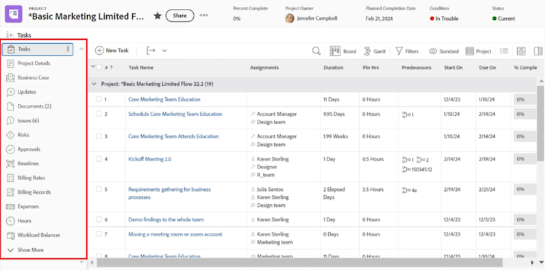

# Add a Canvas Dashboard to a layout template 

>[!IMPORTANT]
>
>The Canvas Dashboards feature is currently only available for users participating in the beta stage. For more information, see [Canvas Dashboards beta information](/help/quicksilver/product-announcements/betas/canvas-dashboards-beta/canvas-dashboards-beta-information.md).

You can add a Canvas Dashboard to a layout template so it replaces the Home landing page, appears in an object's left panel, or is pinned to the top bar throughout Adobe Workfront. 

+++ Expand to view access requirements. 

 <table style="table-layout:auto"> 
<col> 
</col> 
<col> 
</col> 
<tbody> 
<tr> 
   <td role="rowheader">
Adobe Workfront plan
</td> 
   <td> 

Any 
 
   </td> 
<tr> 
 <tr> 
   <td role="rowheader">
Adobe Workfront license
</td> 
   <td> 

Current: Plan 
 

New: Standard
 
   </td> 
   </tr> 
  </tr> 
  <tr> 
   <td role="rowheader">
Access level configurations
</td> 
   <td>
Edit access to Reports, Dashboards, and Calendars

  </td> 
  </tr> 
    </tr>  
        <tr> 
   <td role="rowheader">
Object permissions
</td> 
   <td>
Manage permissions for the dashboard

  </td> 
  </tr> 
</tbody> 
</table> 

For more detail about the information in this table, see [Access requirements in Workfront documentation](/help/quicksilver/administration-and-setup/add-users/access-levels-and-object-permissions/access-level-requirements-in-documentation.md).
+++

## Add a Canvas Dashboard to the left panel 

{{step-1-to-setup}}

1. In the left panel, select **Interface**, then **Layout Templates**.  

1. On the **Layout Templates** page, select a template. 

1. On the template details page, select the object you want to add the dashboard to in the **Customize what users see** drop-down.

    

1. Scroll down to the bottom of the **Left panel** section, then click **Add dashboard**.  

1. In the **Add custom dashboard** box, enter a **Quick link** name.  

1. In the **Choose a dashboard** drop-down, select **Canvas dashboards**.  

1. In the drop-down to the right of **Choose a dashboard**, select the Canvas Dashboard you want to add to the left panel.  

1. Click **Add**. The dashboard appears in the left panel section. 

1. Click **Save**.

    >[!NOTE]
    >
    >When placed on a work object, such as a Project, Task, Issue, Portfolio, or Program, the results displayed in each report will be limited to the records available within that object.

## Add a Canvas Dashboard to the top bar 

{{step-1-to-setup}}

1. In the left panel, select **Interface**, then **Layout Templates**.  

1. On the **Layout Templates** page, select a template. 

1. In the **Top navigation area** section, click **Add new pin**, then select **Add a dashboard** in the drop-down. 

1. In the **Pin a page** box, enter a **Quick link name**.   

1. In the **Choose a dashboard** drop-down, select **Canvas dashboards**.  

1. In the drop-down to the right of **Choose a dashboard**, select the Canvas Dashboard you want to add to the top bar.  

1. Click **Add**. The dashboard appears in the top bar. 

1. Click **Save**.  

## Add a Canvas Dashboard as the Home landing page

{{step-1-to-setup}}

1. In the left panel, select **Interface**, then **Layout Templates**.  

1. On the **Layout Templates** page, select a template. 

1. In the **Top navigation area** section, click **Select landing page**, then select **Add a dashboard** in the drop-down.

1. In the **Add custom dashboard** box, enter a **Quick link name**.   

1. In the **Choose a dashboard** drop-down, select **Canvas dashboards**.  

1. In the drop-down to the right of **Choose a dashboard**, select the Canvas Dashboard you want to add as the Home landing page.  

1. Click **Add**. 

1. Click **Save**.  
