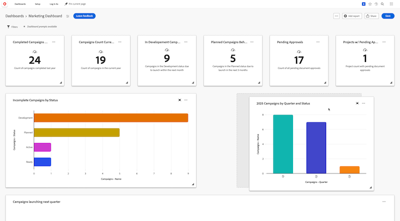

# Arrange reports in a Canvas Dashboard

>[!IMPORTANT]
>
>The Canvas Dashboards feature is currently only available for users participating in the beta stage. Parts of the feature may not be complete or work as intended during this stage. Please submit any feedback regarding your experience by following the instructions in the [Provide feedback](/help/quicksilver/product-announcements/betas/canvas-dashboards-beta/canvas-dashboards-beta-information.md#provide-feedback) section in the Canvas Dashboards beta overview article. 
>If you have feedback regarding a possible bug or technical issue, please submit a ticket to Workfront Support. For more information, see [Contact Customer Support](/help/quicksilver/workfront-basics/tips-tricks-and-troubleshooting/contact-customer-support.md). 
>Please note that this beta is not available on the following cloud providers:
>
>* Bring Your Own Key for Amazon Web Services
>* Azure
>* Google Cloud Platform 

Once a report is added to a Canvas Dashboard, they display as a report widget in the dashboard so you can quickly visualize its data at a glance. Once multiple reports have been added, you can set the size of each widget to best fit the contents of the report within the dashboard and then adjust the position of each widget to display the data more effectively. 

## Access Requirements

+++ Expand to view access requirements for the functionality in this article. 

 <table style="table-layout:auto"> 
<col> 
</col> 
<col> 
</col> 
<tbody> 
<tr> 
   <td role="rowheader">
Adobe Workfront package
</td> 
   <td> 

Any 
 
   </td> 
<tr> 
 <tr> 
   <td role="rowheader">
Adobe Workfront license
</td> 
   <td> 

Standard 
 

Plan
 
   </td> 
   </tr> 
  </tr> 
  <tr> 
   <td role="rowheader">
Access level configurations
</td> 
   <td>
Edit access to Reports, Dashboards, and Calendars

  </td> 
  </tr>  
        <tr> 
   <td role="rowheader">
Object permissions
</td> 
   <td>
Manage permissions for the dashboard

  </td> 
  </tr>
</tbody> 
</table> 

For more detail about the information in this table, see [Access requirements in Workfront documentation](/help/quicksilver/administration-and-setup/add-users/access-levels-and-object-permissions/access-level-requirements-in-documentation.md).
+++

## Prerequisites

You must add reports to a dashboard before they can be rearranged. 

## Arrange reports in a dashboard

{{step1-to-dashboards}}

1. In the left panel, click **Canvas Dashboards**. 

1. On the **Canvas Dashboards** page, select **Edit layout** in the upper-right corner. The report widgets become editable. 

1. Click and drag a report widget to a new position on the page. 

   

1. (Optional) To adjust the length and width of a report widget, click and hold the **Resize**  icon in the lower-right corner of the widget, then adjust the size as needed.

1. Repeat steps 4-5 for each widget you want to rearrange.

1. Click **Save** in the upper-right corner.
