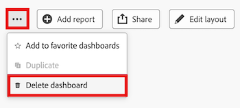

# Delete a Canvas Dashboard

>[!IMPORTANT]
>
>The Canvas Dashboards feature is currently only available for users participating in the beta stage. Parts of the feature may not be complete or work as intended during this stage. Please submit any feedback regarding your experience by following the instructions in the [Provide feedback](/help/quicksilver/product-announcements/betas/canvas-dashboards-beta/canvas-dashboards-beta-information.md#provide-feedback) section in the Canvas Dashboards beta overview article. 
>Please note that this beta is not available on the following cloud providers:
>
>* Bring Your Own Key for Amazon Web Services
>* Azure
>* Google Cloud Platform 

Once you no longer have a need for a Canvas Dashboard, you can remove it from Adobe Workfront.

## Access Requirements

+++ Expand to view access requirements. 

 <table style="table-layout:auto"> 
<col> 
</col> 
<col> 
</col> 
<tbody> 
<tr> 
   <td role="rowheader">
Adobe Workfront plan
</td> 
   <td> 

Any 
 
   </td> 
<tr> 
 <tr> 
   <td role="rowheader">
Adobe Workfront license
</td> 
   <td> 

Current: Plan 
 

New: Standard
 
   </td> 
   </tr> 
  </tr> 
  <tr> 
   <td role="rowheader">
Access level configurations
</td> 
   <td>
Edit access to Reports, Dashboards, and Calendars

  </td> 
  </tr>  
    </tr>  
        <tr> 
   <td role="rowheader">
Object permissions
</td> 
   <td>
Manage permissions for the dashboard

  </td> 
  </tr>
</tbody> 
</table> 

For more detail about the information in this table, see [Access requirements in Workfront documentation](/help/quicksilver/administration-and-setup/add-users/access-levels-and-object-permissions/access-level-requirements-in-documentation.md).
+++

## Prerequisites

You must create a dashboard before it can be deleted. 

For more information, see [Create a Canvas Dashboard](/help/quicksilver/reports-and-dashboards/canvas-dashboards/create-dashboards/create-dashboards.md).

## Delete a dashboard

>[!WARNING]
>
> Once a dashboard is deleted, the dashboard and all of its customized reports and/or visualizations cannot be recovered.  
> If you delete a dashboard that contains a classic report, the classic report will not be deleted. 

{{step1-to-dashboards}}

1. In the left panel, click **Canvas Dashboards**. 

1. On the **Canvas Dashboards** page, select the dashboard you want to delete. 

1. In the upper-right corner, select the **More**  icon, then select **Delete dashboard**.
   

1. In the **Delete dashboard** dialog box, select the **I confirm I want to delete this dashboard** checkbox. 

1. Click **Delete**.
