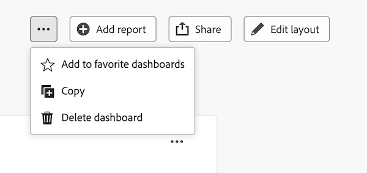
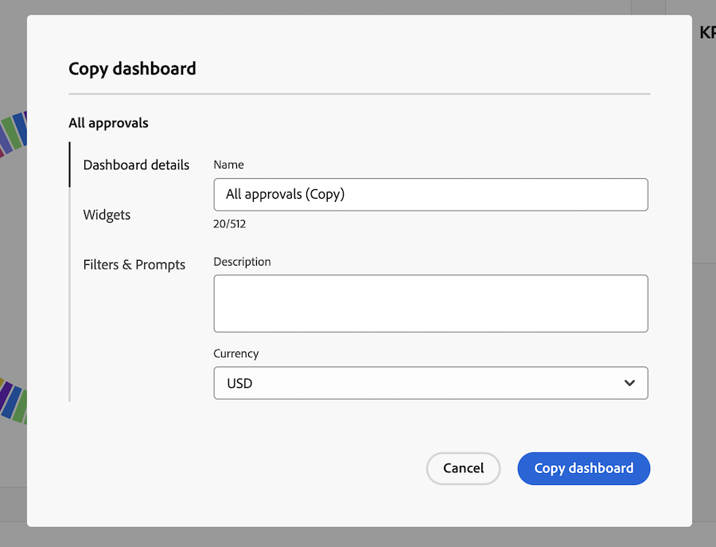
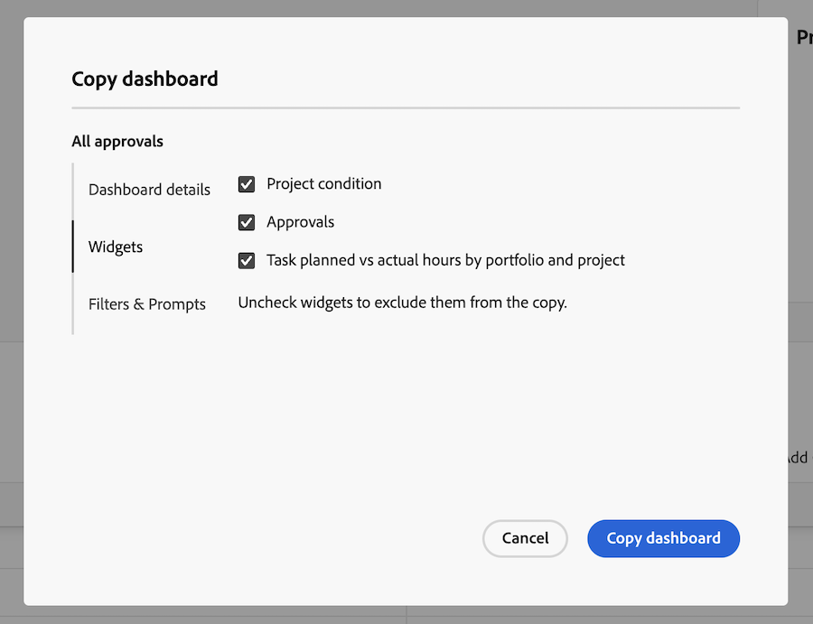
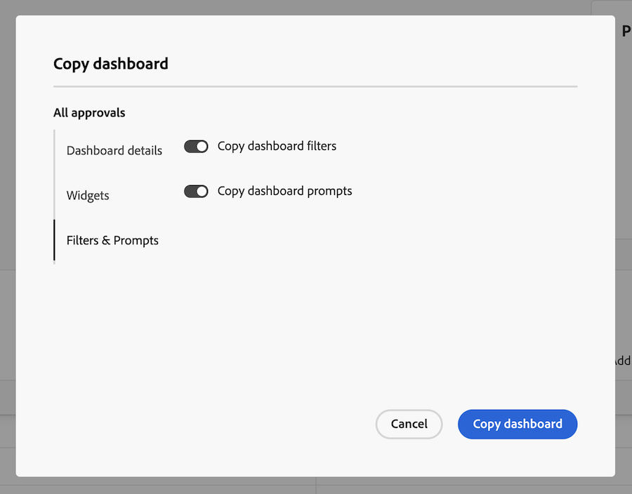

# Copy a Canvas Dashboard

{{highlighted-preview-article-level}}

>[!IMPORTANT]
>
>The Canvas Dashboards feature is currently only available for users participating in the beta stage. Parts of the feature may not be complete or work as intended during this stage. Please submit any feedback regarding your experience by following the instructions in the [Provide feedback](/help/quicksilver/product-announcements/betas/canvas-dashboards-beta/canvas-dashboards-beta-information.md#provide-feedback) section in the Canvas Dashboards beta overview article. 
>If you have feedback regarding a possible bug or technical issue, please submit a ticket to Workfront Support. For more information, see [Contact Customer Support](/help/quicksilver/workfront-basics/tips-tricks-and-troubleshooting/contact-customer-support.md). 
>Please note that this beta is not available on the following cloud providers:
>
>* Bring Your Own Key for Amazon Web Services
>* Azure
>* Google Cloud Platform

You can copy a Canvas Dashboard to create a variation of it for a different audience, such as a director-level copy of an executive dashboard, without rebuilding it from scratch.

## Access Requirements

+++ Expand to view access requirements for the functionality in this article.

 <table style="table-layout:auto"> 
<col> 
</col> 
<col> 
</col> 
<tbody> 
<tr> 
   <td role="rowheader">
Adobe Workfront package
</td> 
   <td> 

Any 
 
   </td> 
<tr> 
 <tr> 
   <td role="rowheader">
Adobe Workfront license
</td> 
   <td> 

Standard 
 

Plan
 
   </td> 
   </tr> 
  </tr> 
  <tr> 
   <td role="rowheader">
Access level configurations
</td> 
   <td>
Edit or Create access to Dashboards

  </td> 
  </tr>  
    </tr>  
        <tr> 
   <td role="rowheader">
Object permissions
</td> 
   <td>
View access to the dashboard

  </td> 
  </tr>
</tbody> 
</table> 

For more detail about the information in this table, see [Access requirements in Workfront documentation](/help/quicksilver/administration-and-setup/add-users/access-levels-and-object-permissions/access-level-requirements-in-documentation.md).
+++

## Prerequisites

You must create a dashboard before it can be duplicated.

For more information, see [Create a Canvas Dashboard](/help/quicksilver/reports-and-dashboards/canvas-dashboards/create-dashboards/create-dashboards.md).

## Copy a dashboard

>[!NOTE]
>
>Sharing preferences are not copied to the new dashboard. If a widget has a **Run as user** configuration, that configuration is preserved on the copy only if you are the designated user or a System Administrator.

To copy a dashboard:

{{step1-to-dashboards}}

1. In the left panel, click **Canvas Dashboards**.

1. On the **Canvas Dashboards** page, open the dashboard you want to copy.

1. In the upper-right corner, select the **More**  icon, then select **Copy**.
   

1. In the **Copy dashboard** dialog box, enter a **Name** for the new dashboard, which defaults to the source dashboard's name followed by "(Copy)."

1. (Optional) On the **Dashboard details** tab, update the **Description** or **Currency** for the new dashboard.
   

1. (Optional) Click the **Widgets** tab, then deselect any widgets you don't want to include in the duplicate dashboard.
   

1. (Optional) Click the **Filters & Prompts** tab, then turn off **Copy dashboard filters** or **Copy dashboard prompts** to exclude them from the duplicate dashboard.
   

1. Click **Copy dashboard**.

A confirmation message displays, with a link to the new dashboard.
