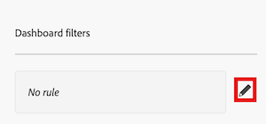
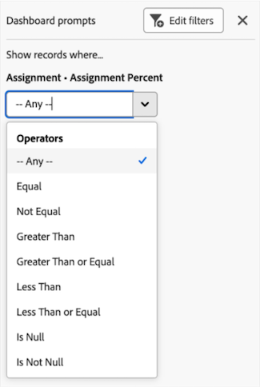

# Filter a Canvas Dashboard

>[!IMPORTANT]
>
>The Canvas Dashboards feature is currently only available for users participating in the beta stage. For more information, see [Canvas Dashboards beta information](/help/quicksilver/product-announcements/betas/canvas-dashboards-beta/canvas-dashboards-beta-information.md).

You can apply a filter to a Canvas Dashboard that contains prompts. A prompt works as a filter modifier that applies additional filtering criteria so you can narrow your results down even further. These prompts can be modified each time you apply the filter, allowing you to adjust the displayed results without needing to edit the main filter criteria of the dashboard or each individual report. 

+++ Expand to view access requirements. 

 <table style="table-layout:auto"> 
<col> 
</col> 
<col> 
</col> 
<tbody> 
<tr> 
   <td role="rowheader">
Adobe Workfront plan
</td> 
   <td> 

Any 
 
   </td> 
<tr> 
 <tr> 
   <td role="rowheader">
Adobe Workfront license
</td> 
   <td> 

Current: Plan 
 

New: Standard
 
   </td> 
   </tr> 
  </tr> 
  <tr> 
   <td role="rowheader">
Access level configurations
</td> 
   <td>
Edit access to Reports, Dashboards, and Calendars

  </td> 
  </tr> 
    </tr>  
        <tr> 
   <td role="rowheader">
Object permissions
</td> 
   <td>
Manage permissions for the dashboard

  </td> 
  </tr> 
</tbody> 
</table> 

For more detail about the information in this table, see [Access requirements in Workfront documentation](/help/quicksilver/administration-and-setup/add-users/access-levels-and-object-permissions/access-level-requirements-in-documentation.md).
+++

## Prerequisites

You must create a dashboard before it can be filtered. 

For more information, see [Create a Canvas Dashboard](/help/quicksilver/reports-and-dashboards/canvas-dashboards/create-dashboards/create-dashboards.md).

## Filter a dashboard

Please perform the following steps in the listed order to filter a dashboard:

* [Part 1: Create a dashboard filter](#part-1-create-a-dashboard-filter)
* [Part 2: Create a dashboard prompt](#part-2-define-a-dashboard-prompt)
* [Part 3: Apply a dashboard prompt](#step-3-apply-a-dashboard-prompt)

>[!NOTE]
>
>The dashboard filter will apply to all reports where dashboard-level filters are not disabled.  You can exclude individual reports from having dashboard-level filters applied by expanding the actions menu for each report and selecting the **Disable Filters** option.

### Part 1: Create a dashboard filter

With a dashboard filter, you can apply a common filter across all reports that are available on a dashboard without having to modify the filters for each individual report.  

>[!NOTE]
>
>These filters can only be configured by a user with Manage access to the dashboard.

{{step1-to-dashboards}}

1. In the left panel, click **Canvas Dashboards**. 

1. On the **Canvas Dashboards** page, select the dashboard you want to apply a filter to. 

1. In the upper-left corner of the dashboard details page, click **Filters**. The filters side panel opens. 

1. Select **Edit filters**. The **Dashboard filters** dialog box opens.

1. (Optional) To add a rule, follow the steps below:

    1. Select the **Edit** icon to the right of the rule box.

        

    1. Click **Add condition** and then add the following information:
        * Select a field that you want to filter by.
        * Select an option (or filter modifier) to define what kind of condition the field must meet. 

    1. (Optional) Click **Add filter group** to add another set of filtering criteria. The default operator between the sets is AND. Click the operator to change it to OR.

1. Proceed to [Part 2: Create a dashboard prompt](#part-2-define-a-dashboard-prompt).

### Part 2: Define a dashboard prompt 

A dashboard prompt gives users the option to apply additional customized filters to reports available on the dashboard. 

>[!NOTE]
>
>The dashboard prompt options can only be configured by a user with Manage access to the dashboard.

1. To add a prompt, follow the steps below:

    1. Select **Add prompt**. New fields appear on the right side of the screen.

    1. Enter a label in the **Customize label** field. 

    1. Select the field that you want the prompt to be based on by typing the name of the field and then selecting it when it appears in the list. 

1. To add a custom prompt, follow the steps below:

    1. Select **Add custom prompt**. New fields appear on the right side of the screen.

    1. (Optional) Enter a new label in the **Customize label** field. By default, the label *New custom prompt* is assigned.

    1. Click **Add new option**.

    1. Enter the prompt name in the **Option Value** field. 

    1. Click **Add condition** and then specify the field you want to filter by and the modifier that defines what kind of condition the field must meet.

        >[!NOTE]
        >
        >The condition of a custom prompt can only be edited using text mode. This allows for multiple conditions to be applied in a single field.

    1. (Optional) Click **Add filter group** to add another set of filtering criteria. The default operator between the sets is AND. Click the operator to change it to OR.

1. Click **Save** to apply the filter to the dashboard.

1. Proceed to [Part 3: Apply a dashboard prompt](#step-3-apply-a-dashboard-prompt). 

### Step 3: Apply a dashboard prompt

All users with access to a dashboard can apply a dashboard prompt to a Canvas Dashboard once the filter and prompts have been created.

{{step1-to-dashboards}}

1. In the left panel, click **Canvas Dashboards**. 

1. On the **Canvas Dashboards** page, select the dashboard you want to apply the prompt to. 

1. In the upper-left corner of the dashboard details page, click **Filters**. The filters side panel opens. 

1. In the **Show records where...** section, choose a condition for one or all the prompts displayed. The prompt is applied and a **Dashboard filters applied** tag appears in the corner of the report widget.

1. Click the **Close** icon  in the upper-right corner to hide the panel. 