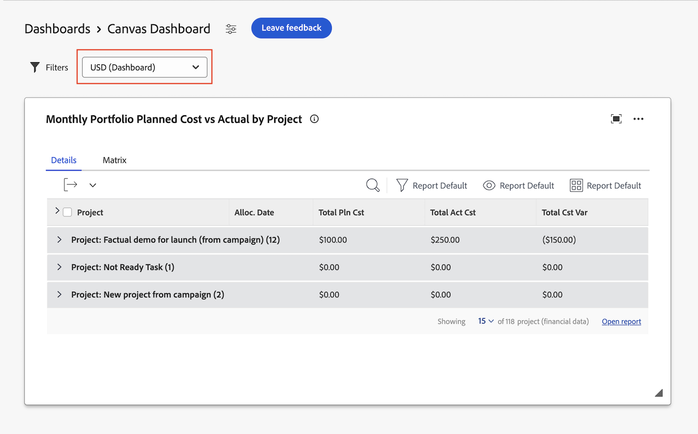

# Use currency fields in Canvas Dashboards

>[!IMPORTANT]
>
>The Canvas Dashboards feature is currently only available for users participating in the beta stage. Parts of the feature may not be complete or work as intended during this stage. Please submit any feedback regarding your experience by following the instructions in the [Provide feedback](/help/quicksilver/product-announcements/betas/canvas-dashboards-beta/canvas-dashboards-beta-information.md#provide-feedback) section in the Canvas Dashboards beta overview article. 
>If you have feedback regarding a possible bug or technical issue, please submit a ticket to Workfront Support. For more information, see [Contact Customer Support](/help/quicksilver/workfront-basics/tips-tricks-and-troubleshooting/contact-customer-support.md). 
>Please note that this beta is not available on the following cloud providers:
>
>* Bring Your Own Key for Amazon Web Services
>* Azure
>* Google Cloud Platform 

## Access Requirements

+++ Expand to view access requirements for the functionality in this article. 

 <table style="table-layout:auto"> 
<col> 
</col> 
<col> 
</col> 
<tbody> 
<tr> 
   <td role="rowheader">
Adobe Workfront package
</td> 
   <td> 

Any 
 
   </td> 
<tr> 
 <tr> 
   <td role="rowheader">
Adobe Workfront license
</td> 
   <td> 

Standard
 

Plan
 
   </td> 
   </tr> 
  </tr> 
  <tr> 
   <td role="rowheader">
Access level configurations
</td> 
   <td>
Edit access to Reports, Dashboards, and Calendars

   
View access to Financial Data

  </td> 
  </tr> 
    </tr>  
        <tr> 
   <td role="rowheader">
Object permissions
</td> 
   <td>
Manage permissions for the dashboard

  </td> 
  </tr> 
</tbody> 
</table> 

For more detail about the information in this table, see [Access requirements in Workfront documentation](/help/quicksilver/administration-and-setup/add-users/access-levels-and-object-permissions/access-level-requirements-in-documentation.md).
+++

## Prerequisites

1. You must have multiple currency types set up in your Workfront instance to use the functionality described in this article. For more information, see [Set up exchange rates](/help/quicksilver/administration-and-setup/manage-workfront/exchange-rates/set-up-exchange-rates.md).

   >[!IMPORTANT]
   >
   >The functionality described in this article applies only to native currency fields. Support for custom currency fields is coming soon.

## Set a default currency for a Canvas Dashboard

When creating a Canvas Dashboard, you can set a default currency for the dashboard. This currency will be used to display all native currency fields in reports on the dashboard, unless the currency field is locked at the report level.

1. In the left panel, click **Canvas Dashboards**. 

1. Click **New Dashboard** in the top-right corner.  

1. In the **Create dashboard** box, 

1. Specify the following: 

   <table style="table-layout:auto">
    <col>
    <col>
    <tbody>
     <tr>
      <td role="rowheader"><strong>Name</strong></td>
      <td>
Enter a name for your dashboard. We recommend using only UTF-8 characters to avoid compatibility issues.
</td>
     </tr>
     <tr>
      <td role="rowheader"><strong>Description (Optional)</strong></td>
      <td>Enter a description of your dashboard.</td>
     </tr>
      <tr>
      <td role="rowheader"><strong>Currency</strong></td>
      <td>Choose the default currency type for the dashboard.  
       Users can toggle between different currency types when filtering the dashboard.</td>
     </tr>
    </tbody>
   </table> 

## Switch between currencies on a Canvas Dashboard

You can switch between different currency types at the dashboard level. Reports that contain currency fields will update to reflect the selected currency type.

Currency fields can be locked at the report level. If a currency field is locked, the currency type for that report will not change when you change the currency type for the dashboard.

To change the currency type for the dashboard,

1. Click the currency drop-down menu in the upper-right corner of the dashboard details page.
1. Select the desired currency type from the list.

    

## Limitations

The following table outines limitations when currencies are defined in the Exchanges Rates area in Setup.

<table> 
<tr>
<td></td>
<td>Users can</td>
<td>Users can't</td>
</tr>
<tr> 
<td>Single currency is defined</td>
<td>
<ul>
<li>Use native currency fields in canvas chart, KPI, and table reports</li>
<li>Use custom currency fields in canvas chart, KPI, and chart reports</li>
</ul>
</td>
<td>
<ul>
<li>Assign a default currency to the dashboard (on creation or when editing the dashboard)</li>
<li>See and use the dashboard-level currency toggle</li>
<li>Lock a specific currency for view in a canvas chart, KPI, or table report</li>
<li>Use Planning currency fields in a canvas chart, KPI, and table reports</li>
</ul>
</td> 
</tr>
</td> 
</tr> 
<tr>
<td>Multiple currencies are defined</td>
<td>
<ul>
  <li>Use native currency fields in canvas chart, KPI, and table reports</li>
  <li>Set a default currency for the dashboard (on creation or when editing the dashboard)</li>
  <li>See and use the dashboard-level currency toggle</li>
  <li>Lock a specific currency for view in a canvas chart, KPI, or table report to ignore the dashboard currency toggle preference</li>
</ul>
</td>
<td><ul>
  <li>Use custom data currency fields in canvas chart, KPI, and table reports</li>
  <li>Use Planning currency fields in a canvas chart, KPI, and table reports</li>
</ul>
</td>
</tr></table>

