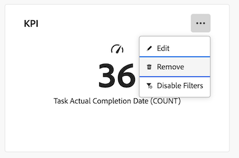

# Delete a report in a Canvas Dashboard

>[!IMPORTANT]
>
>The Canvas Dashboards feature is currently only available for users participating in the beta stage. For more information, see [Canvas Dashboards beta information](/help/quicksilver/product-announcements/betas/canvas-dashboards-beta/canvas-dashboards-beta-information.md).

Once a Canvas Dashboard is created and you've added reports to it, you can delete older reports that are no longer applicable for that specific dashboard. 

Deleting a report is permanent. If you need to re-add a report after it's been deleted, you will need to recreate the report.  
 

+++ Expand to view access requirements. 

 <table style="table-layout:auto"> 
<col> 
</col> 
<col> 
</col> 
<tbody> 
<tr> 
   <td role="rowheader">
Adobe Workfront plan
</td> 
   <td> 

Any 
 
   </td> 
<tr> 
 <tr> 
   <td role="rowheader">
Adobe Workfront license
</td> 
   <td> 

Current: Plan 
 

New: Standard
 
   </td> 
   </tr> 
  </tr> 
  <tr> 
   <td role="rowheader">
Access level configurations
</td> 
   <td>
Edit access to Reports, Dashboards, and Calendars

  </td> 
  </tr>  
      <tr> 
   <td role="rowheader">
Object permissions
</td> 
   <td>
Manage permissions for the dashboard

  </td> 
  </tr>
</tbody> 
</table> 

For more detail about the information in this table, see [Access requirements in Workfront documentation](/help/quicksilver/administration-and-setup/add-users/access-levels-and-object-permissions/access-level-requirements-in-documentation.md).
+++

## Prerequisites

You must apply a report to a dashboard before it can be deleted. 

For more information, see [Create a Canvas dashboard](/help/quicksilver/reports-and-dashboards/canvas-dashboards/create-dashboards/create-dashboards.md).

## Delete a report

>[!WARNING]
>
>Once a report is deleted, it cannot be recovered. 

{{step1-to-dashboards}}

1. In the left panel, click **Canvas Dashboards**. 

1. On the **Canvas Dashboards** page, select the dashboard that contains the report you want to delete. 

1. On the dashboard details page, click the **More**  icon in the upper-right corner of the report widget you want to delete.

1. Select **Remove**. 
   

1. In the **Delete report** dialog box, click **Delete**.