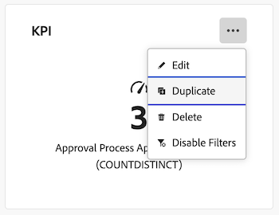

# Duplicate a report in a Canvas Dashboard

>[!IMPORTANT]
>
>The Canvas Dashboards feature is currently only available for users participating in the beta stage. Parts of the feature may not be complete or work as intended during this stage. Please submit any feedback regarding your experience by following the instructions in the [Provide feedback](/help/quicksilver/product-announcements/betas/canvas-dashboards-beta/canvas-dashboards-beta-information.md#provide-feedback) section in the Canvas Dashboards beta overview article. 
>If you have feedback regarding a possible bug or technical issue, please submit a ticket to Workfront Support. For more information, see [Contact Customer Support](/help/quicksilver/workfront-basics/tips-tricks-and-troubleshooting/contact-customer-support.md). 
>Please note that this beta is not available on the following cloud providers:
>
>* Bring Your Own Key for Amazon Web Services
>* Azure
>* Google Cloud Platform 

You can duplicate a KPI, table, or chart report in a Canvas Dashboard after it's been created. Once duplicated, you can edit the report as needed before saving.  
 
 
## Access Requirements

+++ Expand to view access requirements for the functionality in this article. 

 <table style="table-layout:auto"> 
<col> 
</col> 
<col> 
</col> 
<tbody> 
<tr> 
   <td role="rowheader">
Adobe Workfront package
</td> 
   <td> 

Any 
 
   </td> 
<tr> 
 <tr> 
   <td role="rowheader">
Adobe Workfront license
</td> 
   <td> 

Standard 
 

Plan
 
   </td> 
   </tr> 
  </tr> 
  <tr> 
   <td role="rowheader">
Access level configurations
</td> 
   <td>
Edit access to Reports, Dashboards, and Calendars

  </td> 
  </tr>  
      <tr> 
   <td role="rowheader">
Object permissions
</td> 
   <td>
Manage permissions for the dashboard

  </td> 
  </tr>
</tbody> 
</table> 

For more detail about the information in this table, see [Access requirements in Workfront documentation](/help/quicksilver/administration-and-setup/add-users/access-levels-and-object-permissions/access-level-requirements-in-documentation.md).
+++

## Prerequisites

You must add a report to a dashboard before it can be duplicated.  

For more information, see [Create a Canvas dashboard](/help/quicksilver/reports-and-dashboards/canvas-dashboards/create-dashboards/create-dashboards.md).

## Duplicate a report

{{step1-to-dashboards}}

1. In the left panel, click **Canvas Dashboards**. 
1. On the **Canvas Dashboards** page, click the **More**  icon in the upper-right corner of the report you want to duplicate, then select **Duplicate**. 

    

1. (Optional) In the **Configure** box that appears, enter a new report **Name** in the **Details** tab.   

1. (Optional) Make any needed adjustments to the configurations using the tabs on the left side. 
  
    >[!NOTE]
    >
    >These tabs will vary depending on if you duplicated a KPI, table, or chart report.  For more, see [Build a KPI report in a Canvas Dashboard](/help/quicksilver/reports-and-dashboards/canvas-dashboards/add-reports/build-kpi-report.md), [Build a chart report in a Canvas Dashboard](/help/quicksilver/reports-and-dashboards/canvas-dashboards/add-reports/build-chart-report.md), and [Build a table report in a Canvas Dashboard](/help/quicksilver/reports-and-dashboards/canvas-dashboards/add-reports/build-table-report.md). 
 
1. Click **Save**. The duplicated report appears on the dashboard.