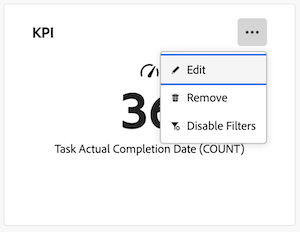
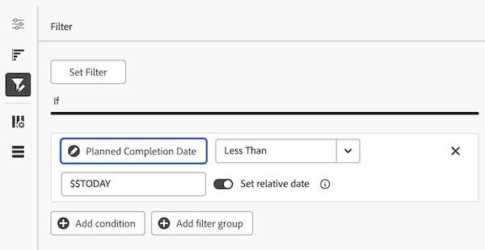
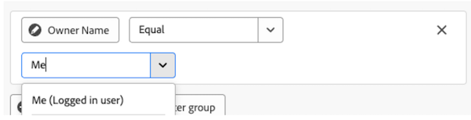
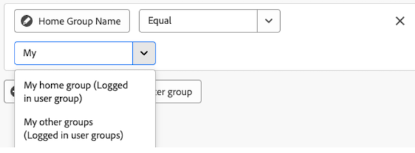
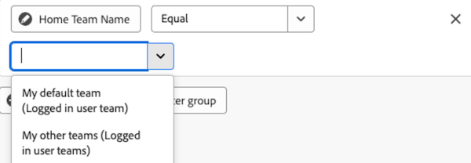

# Edit report filters in a Canvas Dashboard

>[!IMPORTANT]
>
>The Canvas Dashboards feature is currently only available for users participating in the beta stage. Parts of the feature may not be complete or work as intended during this stage. Please submit any feedback regarding your experience by following the instructions in the [Provide feedback](/help/quicksilver/product-announcements/betas/canvas-dashboards-beta/canvas-dashboards-beta-information.md#provide-feedback) section in the Canvas Dashboards beta overview article. 
>If you have feedback regarding a possible bug or technical issue, please submit a ticket to Workfront Support. For more information, see [Contact Customer Support](/help/quicksilver/workfront-basics/tips-tricks-and-troubleshooting/contact-customer-support.md). 
>Please note that this beta is not available on the following cloud providers:
>
>* Bring Your Own Key for Amazon Web Services
>* Azure
>* Google Cloud Platform 

You can edit report filters once you've applied them to a Canvas Dashboard to update the data that displays as a project progresses. 

## Access Requirements

+++ Expand to view access requirements. 

 <table style="table-layout:auto"> 
<col> 
</col> 
<col> 
</col> 
<tbody> 
<tr> 
   <td role="rowheader">
Adobe Workfront plan
</td> 
   <td> 

Any 
 
   </td> 
<tr> 
 <tr> 
   <td role="rowheader">
Adobe Workfront license
</td> 
   <td> 

Current: Plan 
 

New: Standard
 
   </td> 
   </tr> 
  </tr> 
  <tr> 
   <td role="rowheader">
Access level configurations
</td> 
   <td>
Edit access to Reports, Dashboards, and Calendars

  </td> 
  </tr>  
        <tr> 
   <td role="rowheader">
Object permissions
</td> 
   <td>
Manage permissions for the dashboard

  </td> 
  </tr>
</tbody> 
</table> 

For more detail about the information in this table, see [Access requirements in Workfront documentation](/help/quicksilver/administration-and-setup/add-users/access-levels-and-object-permissions/access-level-requirements-in-documentation.md).
+++

## Prerequisites

You must add a filter to a report before it can be edited. 

## Edit a report filter

>[!NOTE]
>
>There are many available configuration tools for building and editing a report filter. For more information on these tools, see the following section in this article: [Considerations when editing a report filter](#considerations-when-editing-a-report-filter).

{{step1-to-dashboards}}

1. In the left panel, click **Canvas Dashboards**. 

1. On the **Canvas Dashboards** page, click the **More**  icon in the upper-right corner of the report that contains the filter you want to edit, then select **Edit**. 

    

1. On the left side of the **Configure** dialog box, select the **Filters** panel.

1. Click **Edit filter**.

1. Select the field or the modifier that you want to edit, then adjust the current selections as needed.  

   

1. (Optional) Click **Add filter group** to add another set of filtering criteria. The default operator between the sets is AND. Click the operator to change it to OR.

1. Click **Save**.

## Considerations when editing a report filter

### Date-based wildcards filter variables

Date-based wildcard options can be used in combination with any date filter attribute. For information about adding a date-based wildcard to a report, see the article [Use date-based wildcards to generalize reports](../../../reports-and-dashboards/reports/reporting-elements/use-date-based-wildcards-generalize-reports.md).

>[!NOTE]
>
>If you create a date and time calculation that doesn't include a time portion, or that uses the date wildcards $$TODAY or $$NOW, the system uses the date according to the Coordinated Universal Time (UTC) zone, not according your local timezone. This can cause an unexpected date result.

You can choose from the following date-based wildcards:

<table style="table-layout:auto"> 
 <col> 
 <col> 
 <tbody> 
  <tr valign="top"> 
   <td width="100" role="rowheader"> 
<strong>$$TODAY</strong> 
 </td> 
   <td> 
We recommend that you build date-sensitive filters using this wildcard so you avoid building the filter again tomorrow, next week, or next month.
 
For example, if you want to display all tasks due before today, you can use the following rule in a task filter: <em>Planned Start Date Less Than $$TODAY</em>.
 
$$TODAY is always equal to midnight for the current day.
 </td> 
  </tr> 
  <tr valign="top"> 
   <td width="100" role="rowheader"> 
<strong>$$NOW</strong> 
 </td> 
   <td> 
This is similar to the $$TODAY wildcard but includes the current date and time. $$NOW is equal to the current date and time.
 
For example, if you want to display all hour entries provided up to the current time, you can do this by using the following rule in an hour filter: <em>Planned Start Date Less Than $$NOW</em>.
 
Note: This wildcard is not supported in the Resource Planner.
 </td> 
  </tr> 
 </tbody> 
</table>

To indicate various periods of time and various points in time (future or past), you can combine the wildcards above with the following:

| Attributes |&nbsp; |
|---|---|
| **q** |calendar quarter |
| **h** |hour |
| **d** |day |
| **w** |week |
| **m** |month |
| **y** |year |

{style="table-layout:auto"}

| **Qualifiers** | |
|---|---|
| **b** |beginning of the period (without a specified attribute, defaults to beginning of the week: Sunday) |
| **e** |ending of the period (without a specified attribute, defaults to end of the week: Saturday)  |

{style="table-layout:auto"}

| **Operators** | |
|---|---|
| **+** |add value to wildcard value |
| **-** |subtract value from wildcard value |

{style="table-layout:auto"}

For example, the wildcard `$$TODAYb+2w` refers to "2 weeks from the beginning of this week." The wildcard *`$$NOW+2h` refers to "2 hours from now."

### Logged-in user wildcard filter variables

* When filtering on the user `name` attribute, you will view the **Me (Logged in user)** option.

    

* When filtering on a group `name` attribute, you will view the **My home group (Logged in user group)** and **My other groups (Logged in user groups)** options to use in a filter condition.

  

* When filtering on a team `name` attribute, you will view the **My default team (Logged in user team)** and **My other teams (Logged in user teams)** options to choose from in the filter condition.

    

### Referencing children objects

Available relationships for additional columns, filter options, and grouping attributes are generally limited to objects higher in the Workfront object hierarchy or otherwise have a single selection on the report's base entity object. There are some exceptions to this, which include the following:

* Project > Tasks
* Document Approval > Document Approval Stages
* Document Approval Stages > Document Approval Stage Participants 

When utilizing any of the parent-to-child relationships listed above, you will see a row in the table for each child record connected to the parent object.  

### Field operators by field type

+++ Expand to view list of field operators by field type. 

   <table>
    <tr>
        <td><b>Field Type</b></td>
        <td><b>Example</b></td>
       <td><b>Operators</b></td>
        <td><b>Wildcards</b></td>
    </tr>
    <tr>
        <td>Object / Reference Name</td>
        <td>Any native name attribute or custom lookup</td>
              <td><ul>
        <li>Equal</li>
        <li>Not Equal</li>
        <li>Contains</li>
          <li>Not Contains</li>
            <li>Is Null</li>
              <li>Is Not Null</li>
        </ul></td>
        <td>User: Name
        <ul>
        <li>Me (Logged in user)</li>
        </ul>
        Group: Name
        <ul>
          <li>My home group (Logged in user group)</li>
            <li>My other groups (Logged in user groups)</li>
          </ul>
          Team: Name
                  <ul>
          <li>My default team (Logged in user team)</li>
            <li>My other teams (Logged in user teams)</li>
          </ul>
        </td>
    </tr>
    <tr>
        <td>String / Text Input </td>
                <td>Project: Description</td>
                      <td><ul>
             <li>Equal</li>
        <li>Not Equal</li>
        <li>Contains</li>
          <li>Not Contains</li>
            <li>Is Null</li>
              <li>Is Not Null</li>
        </ul></td>
        <td></td>
    </tr>
    <tr>
        <td>Integer / Double</td>
             <td>Project: Planned Hours
         Task: Percent Complete</td>
              <td><ul>
        <li>Equal</li>
        <li>Not Equal</li>
        <li>Greater Than</li>
          <li>Greater Than or Equal</li>
          <li>Less Than</li>
          <li>Less Than or Equal</li>
            <li>Is Null</li>
              <li>Is Not Null</li>
        </ul></td>
        <td></td>
    </tr>
       <tr>
        <td> Date / Date Time </td>
                    <td>Project: Planned Start Date
         Hour: Entry Date</td>
              <td><ul>
        <li>Equal</li>
        <li>Not Equal</li>
        </ul></td>
        <td>By toggling on the <b>Set relative date</b> option, you can apply relative date wildcards to make the report more dynamic and self-adjust based on common date periods. 
         <ul><li>$$TODAY</li>
         <li>$$NOW</li>
         </ul>
        </td>
    </tr>
       <tr>
        <td>Boolean </td>
                  <td>Project: Has Documents
         Task: Is Critical
          User: Is Active</td>
        <td><ul>
        <li>Equal</li>
        <li>Not Equal</li>
        </ul></td>
        <td>&nbsp</td>
    </tr>
   </table>

   +++