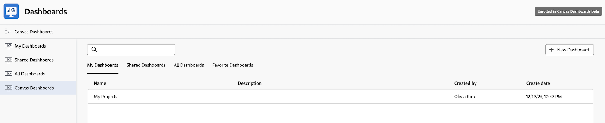

# Use Canvas Dashboards

>[!IMPORTANT]
>
>The Canvas Dashboards feature is currently only available for users participating in the beta stage. Parts of the feature may not be complete or work as intended during this stage. Please submit any feedback regarding your experience by following the instructions in the [Provide feedback](/help/quicksilver/product-announcements/betas/canvas-dashboards-beta/canvas-dashboards-beta-information.md#provide-feedback) section in the Canvas Dashboards beta overview article.
>
>If you have feedback regarding a possible bug or technical issue, please submit a ticket to Workfront Support. For more information, see [Contact Customer Support](/help/quicksilver/workfront-basics/tips-tricks-and-troubleshooting/contact-customer-support.md).
>
>Please note that this beta is not available on the following cloud providers:
>
>* Bring Your Own Key for Amazon Web Services
>* Azure
>* Google Cloud Platform 

Canvas Dashboards allow you to visualize your Adobe Workfront data by adding different report types onto a flexible canvas layout. This article provides an overview of how to use Canvas Dashboards effectively.

## Accessing Canvas Dashboards

To access Canvas Dashboards, navigate to the Dashboards section in Adobe Workfront. From there, you can view existing dashboards or create a new one if you have the necessary permissions.

{{step1-to-dashboards}}

1. In the left panel, click **Canvas Dashboards**.
1. Click the name of an existing dashboard to open it.
    

<!--## Navigating the Dashboard

Once you open a Canvas Dashboard, you can interact with the reports displayed on the dashboard. You can resize, drag, and drop reports to customize the layout according to your preferences.

## Add dashboard to favorites

-->

## Interacting with Reports

You can interact with individual reports on the Dashboard.

### Temporarily customize table reports

You can temporarily customize table reports on dashboards. These changes only apply to your current session and do not affect the original report configuration.

1. In the left panel, click **Canvas Dashboards**.
1. Click the name of an existing dashboard to open it.
    
1. Locate the table report that you want to customize.
1. Choose any of the following options to customize the report:

    | Option | Description |
    |--------|-------------|
    | **Add Column** | Click **Add Column** to add additional columns to the report. |
    | **Configure columns** | Choose to show or hide specific columns in the report. |
    | **Row height** | Adjust the row height for the report. |
    | **Snap scroll** | Enable or disable snap scrolling for easier navigation through the report. |

    >[!IMPORTANT]
    >
    >These changes only apply to your current session and do not affect the original report configuration. To make permanent these changes, you need to edit the report.

<!--### Use drilldowns

You can use drilldowns in Canvas Dashboards to sort and group data within reports.

1. In the left panel, click **Canvas Dashboards**.
1. Click the name of an existing dashboard to open it.
    
1. Locate the report that you want to look at.
1. Click on a data point within the report to drill down into more detailed information.
1. Click the Show build table icon to open the drilldown settings. 
1. Click Add Column to add additional columns to the drilldown table.

 >[!IMPORTANT]
>
>These changes only apply to your current session and do not affect the original report configuration. To make permanent these changes, you need to edit the report.

### Add additional columns to table reports

## View reports with grouped data

Report creators can configure reports to display grouped data. When viewing these reports on a Canvas Dashboard, you can expand or collapse the grouped data to see more or less detail.

Data within groups is sorted alphabetically or chronologically by default, depending on the data type. You can click the column headers to sort the data within each group based on different attributes. When you sort by a different attribute, the order of the groups remains unchanged.

When you sort by the same field that your report is grouped by, the group order can flip. For example, a text-based grouping that normally runs A–Z can switch to Z–A. This only happens when the sort column and the grouping attribute are the same.

## Saving and Sharing Dashboards

After customizing your Canvas Dashboard, you can save your changes. Additionally, you can share the dashboard with other users in your organization, provided you have the appropriate sharing permissions.

For more detailed instructions on creating, managing, and customizing Canvas Dashboards, refer to the related articles in the [Canvas Dashboards overview](/help/quicksilver/reports-and-dashboards/canvas-dashboards/canvas-dashboards-overview.md) section.-->

## View reports with grouped data

Report creators can configure reports to display grouped data. When a report has a grouping, you can expand or collapse the grouped data to see more or less detail.

By default, data within each group is sorted alphabetically or chronologically, depending on the field type. You can click a column header to sort the data within each group. When you sort by a field that is different from the grouping field, the order of the groups does not change.

However, when you sort by the same field that the report is grouped by, the group order can change. For example, a text-based grouping that normally runs A–Z may switch to Z–A.