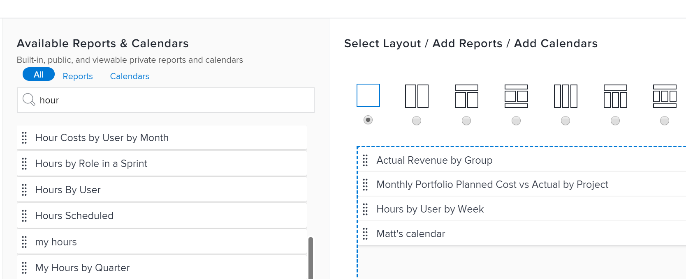

# Create a dashboard

<!--Audited: 01/2024-->

You can create dashboards to quickly access information in Adobe Workfront. Reports, calendars, and external pages can be added to dashboards that you can share with others for optimal collaboration.

To learn more about dashboards, see [Get started with dashboards](../../../reports-and-dashboards/dashboards/understanding-dashboards/get-started-dashboards.md).

## Access requirements

You must have the following:

<table style="table-layout:auto">
 <col> 
 </col> 
 <col> 
 </col> 
 <tbody> 
  <tr> 
   <td> 
<strong>Adobe Workfront plan</strong>
 </td> 
   <td>Any</td> 
  </tr> 
  <tr> 
   <td> 
<strong>Adobe Workfront license*</strong>
 </td> 
   <td> 
Current: Plan 

   Or
   
New: Standard 
 </td> 
  </tr> 
  <tr> 
   <td><strong>Access level configurations</strong> </td> 
   <td> 
Edit access to Reports, Dashboards, and Calendars
 </td> 
  </tr> 
  <tr> 
   <td> 
<strong>Object permissions</strong> 
 </td> 
   <td> 
You will obtain Manage permissions to the dashboards you create
 </td> 
  </tr> 
 </tbody> 
</table>

*To find out what plan, license type, or access you have, contact your Workfront administrator. For information, see [Access requirements in Workfront documentation](/help/quicksilver/administration-and-setup/add-users/access-levels-and-object-permissions/access-level-requirements-in-documentation.md). 

## Prerequisites

You must create any of the following objects before you can add them to a dashboard:

* **Reports**: For information on creating reports, see [Create a custom report](../../../reports-and-dashboards/reports/creating-and-managing-reports/create-custom-report.md).

* **Calendars**: For information on creating calendars, see [Calendar reports overview](../../../reports-and-dashboards/reports/calendars/calendar-reports-overview.md).

You can add existing external pages to a dashboard, or you can create one from the new dashboard. For information on creating external pages, see [Embed an external web page in a dashboard](../../../reports-and-dashboards/dashboards/creating-and-managing-dashboards/embed-external-web-page-dashboard.md).

## Create a dashboard

{{step1-to-dashboards}}

1. Click **New Dashboard**.  
   The New Dashboard dialog box displays.

1. Specify the following: 

   <table style="table-layout:auto">
    <col>
    <col>
    <tbody>
     <tr>
      <td role="rowheader"><strong>Name</strong></td>
      <td>
This is the name of your dashboard.

If you do not specify a name, the name of the first report on the dashboard becomes the name of the dashboard, by default.
</td>
     </tr>
     <tr>
      <td role="rowheader"><strong>Description (Optional)</strong></td>
      <td>This is a description of your dashboard.</td>
     </tr>
    </tbody>
   </table>

1. Select a layout by clicking the radio button corresponding to it at the top of the **Select Layout/ Add Reports/ Add Calendars** section. This is the layout in which the reports, calendars, or external pages will display on the dashboard. 

   The single-column layout is the default. 

   For information about report layout on dashboards, see [Understand how reports display on a dashboard](../../../reports-and-dashboards/dashboards/understanding-dashboards/understand-how-reports-display-dashboard.md).

   <!--
   Consider adding the information from this article above here, at some point, instead of linking to it.)
   -->

1. Search for reports, calendars, or external pages in the **Search by name or type ...** field, then drag them to the layout pane, when they appear in the list.

   >[!NOTE]
   >
   >When searching for an item, the search returns any of the 2,000 most recently created reports. Report names that include unicode characters are not returned in search results. As a best practice, avoid including unicode characters when naming objects in Workfront by typing names rather than copying and pasting names from another source.

   

1. (Optional) Click **Add External Page** to add a new External Page to the dashboard.   

   For more information about creating external pages and embedding them into dashboards, see [Embed an external web page in a dashboard](../../../reports-and-dashboards/dashboards/creating-and-managing-dashboards/embed-external-web-page-dashboard.md).

1. Click **Save + Close**. 

   A timestamp displays in the upper-right corner of the dashboard. The timestamp includes the date, time, and time zone when the dashboard was last refreshed.
