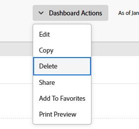
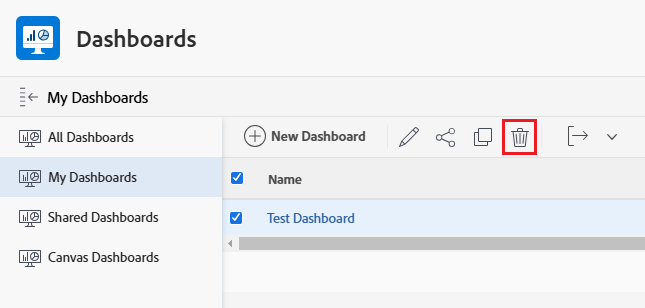

# Delete a dashboard

<!-- Audited: 1/2025 -->

If you no longer have use for a dashboard, you can remove it from Adobe Workfront.

## Access requirements

+++ Expand to view access requirements for the functionality in this article. 

<table style="table-layout:auto"> 
 <col> 
 <col> 
 <tbody> 
  <tr> 
   <td role="rowheader">Adobe Workfront package</td> 
   <td> 
Any
 </td> 
  </tr> 
  <tr> 
   <td role="rowheader">Adobe Workfront license</td> 
   <td> 
      
Standard

      
Plan

   </td> 
  </tr> 
  <tr> 
   <td role="rowheader">Access level configurations</td> 
   <td> 
Edit access to Reports, Dashboards, and Calendars
</td> 
  </tr>  
  <tr> 
   <td role="rowheader">Object permissions</td> 
   <td> 
Manage permissions to the dashboard
</td> 
  </tr> 
 </tbody> 
</table>

For more detail about the information in this table, see [Access requirements in Workfront documentation](/help/quicksilver/administration-and-setup/add-users/access-levels-and-object-permissions/access-level-requirements-in-documentation.md).

+++

## Delete a dashboard from the Actions menu

If you want to delete a dashboard, you can delete it using the Actions menu.

For information on deleting a dashboard with an external page embedded, see [Delete a dashboard from the Dashboards area](#delete-a-dashboard-from-the-dashboards-area).

To delete a dashboard:

1. Go to the dashboard that you want to edit.
1. Click **Dashboard Actions**, then click **Delete**.

   

1. To confirm that you want to delete the dashboard, click **Yes, Delete it.** 
   The dashboard is removed from Workfront.

## Delete a dashboard from the Dashboards area {#delete-a-dashboard-from-the-dashboards-area}

If you are deleting multiple dashboards, you can delete the dashboards from the Dashboards area. This is also the only way to delete a dashboard with an external page.

To delete multiple dashboards:

1. Click the **[!UICONTROL Main Menu]** icon  in the upper-right corner of Adobe Workfront, or (if available), click the **[!UICONTROL Main Menu]** icon  in the upper-left corner, then click **[!UICONTROL Dashboards]**.
1. Select each dashboard in the list that you want to delete, then click **Delete** .

   

1. To confirm that you want to delete the dashboard, click **Yes, Delete it.** 
   The dashboard is removed from Workfront.
