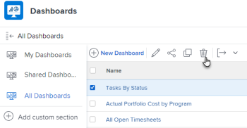

# Delete a dashboard

If you no longer have use for a dashboard, you can remove it from Adobe Workfront.

## Access requirements

You must have the following:

<table style="table-layout:auto"> 
 <col> 
 <col> 
 <tbody> 
  <tr> 
   <td role="rowheader"><strong>Adobe Workfront plan*</strong></td> 
   <td> 
Any
 </td> 
  </tr> 
  <tr> 
   <td role="rowheader"><strong>Adobe Workfront license*</strong></td> 
   <td> 
Plan 
 </td> 
  </tr> 
  <tr> 
   <td role="rowheader"><strong>Access level configurations*</strong></td> 
   <td> 
Edit access to Reports, Dashboards, and Calendars
 
Note: If you still don't have access, ask your Workfront administrator if they set additional restrictions in your access level. For information on how a Workfront administrator can change your access level, see <a href="../../../administration-and-setup/add-users/configure-and-grant-access/create-modify-access-levels.md" class="MCXref xref">Create or modify custom access levels</a>.
 </td> 
  </tr> 
  <tr> 
   <td role="rowheader"><strong>Object permissions</strong></td> 
   <td> 
Manage permissions to the dashboard
 
For information on requesting additional access, see <a href="../../../workfront-basics/grant-and-request-access-to-objects/request-access.md" class="MCXref xref">Request access to objects </a>.
 </td> 
  </tr> 
 </tbody> 
</table>

&#42;To find out what plan, license type, or access you have, contact your Workfront administrator.

## Delete a dashboard from the Actions menu

If you want to delete a dashboard, you can delete it using the Actions menu.

For information on deleting a dashboard with an external page embedded, see [Delete a dashboard from the Dashboards area](#delete-a-dashboard-from-the-dashboards-area).

To delete a dashboard:

1. Go to the dashboard that you want to edit.
1. Click **Dashboard Actions**, then click **Delete**.

   

1. To confirm that you want to delete the dashboard, click **Yes, Delete it.** 
   The dashboard is removed from Workfront.

## Delete a dashboard from the Dashboards area {#delete-a-dashboard-from-the-dashboards-area}

If you are deleting multiple dashboards, you can delete the dashboards from the Dashboards area. This is also the only way to delete a dashboard with an external page.

To delete multiple dashboards:

1. Click the **Main Menu** icon  in the upper-right corner of Workfront, then click **Dashboards**.
1. Select each dashboard in the list that you want to delete, then click **Delete** .

   

1. To confirm that you want to delete the dashboard, click **Yes, Delete it.** 
   The dashboard is removed from Workfront.
