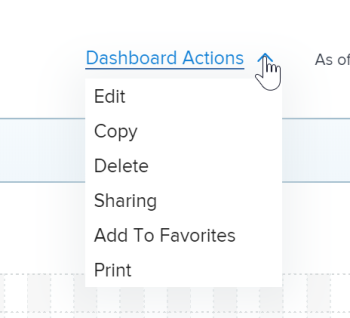

# Edit a dashboard

The purpose of the dashboard is to provide quick access to information. You can populate a dashboard with the following items in Adobe Workfront:

* Reports

  For more information about creating reports, see [Create a custom report](../../../reports-and-dashboards/reports/creating-and-managing-reports/create-custom-report.md).

* Calendars

  For more information about creating calendars, see [Calendars: article index](../../../reports-and-dashboards/reports/calendars/calendars.md).

* External pages

  For more information about creating external pages, see [Embed an external web page in a dashboard](../../../reports-and-dashboards/dashboards/creating-and-managing-dashboards/embed-external-web-page-dashboard.md).

After you create these items and you add them to a dashboard, you can edit the dashboard to add more items to it, remove existing items from it, or edit the dashboard information.

Any changes made to a dashboard will impact all users who have access to that dashboard.

When you share a dashboard with users, all the reports, calendars, and external pages are also shared with the same users.

## Access requirements

You must have the following:

<table style="table-layout:auto"> 
 <col> 
 <col> 
 <tbody> 
  <tr> 
   <td role="rowheader"><strong>Adobe Workfront plan*</strong></td> 
   <td> 
Any
 </td> 
  </tr> 
  <tr> 
   <td role="rowheader"><strong>Adobe Workfront license*</strong></td> 
   <td> 
Plan 
 </td> 
  </tr> 
  <tr> 
   <td role="rowheader"><strong>Access level configurations*</strong></td> 
   <td> 
Edit access to Reports, Dashboards, and Calendars
 
Note: If you still don't have access, ask your Workfront administrator if they set additional restrictions in your access level. For information on how a Workfront administrator can change your access level, see <a href="../../../administration-and-setup/add-users/configure-and-grant-access/create-modify-access-levels.md" class="MCXref xref">Create or modify custom access levels</a>.
 </td> 
  </tr> 
  <tr> 
   <td role="rowheader"><strong>Object permissions</strong></td> 
   <td> 
Manage permissions to the dashboard
 
For information on requesting additional access, see <a href="../../../workfront-basics/grant-and-request-access-to-objects/request-access.md" class="MCXref xref">Request access to objects </a>.
 </td> 
  </tr> 
 </tbody> 
</table>

&#42;To find out what plan, license type, or access you have, contact your Workfront administrator.

## Prerequisites

You must create a dashboard before you can edit it.

For information on creating dashboards, see [Create a dashboard](../../../reports-and-dashboards/dashboards/creating-and-managing-dashboards/create-dashboard.md).

## Edit a dashboard

1. Go to the dashboard that you want to edit.
1. Click **Dashboard Actions**, then click **Edit**.

   

   >[!TIP]
   >
   >To learn how to delete a dashboard, see [Delete a dashboard](../../../reports-and-dashboards/dashboards/creating-and-managing-dashboards/delete-dashboard.md).

1. Consider editing the following fields:

   * **Name**: Edit the name of the dashboard.
   * **Description**: Specify a description for the dashboard.

1. In the **Available Reports & Calendars** section, start typing the name of a report, calendar, or external page in the **Search by name or type ...** field, then drag and drop the report or calendar in the layout pane to the right.

   >[!NOTE]
   >
   >When searching for an item, the search returns any of the 2,000 most recently created reports. Report names that include unicode characters are not returned in search results. As a best practice, avoid including unicode characters when naming objects in Workfront by typing names rather than copying and pasting names from another source.

1. (Optional) Select a new layout for the dashboard by clicking a radio button corresponding to the layout you want.
1. (Optional) Mouse over the name of an existing report and click the trash can icon to remove it from the dashboard.
1. (Optional) Change the order of the reports on the dashboard by clicking the name of a report, dragging it, and dropping it in the desired spot in the layout pane.
1. (Optional) Click **Add External Page** to add an external page to the dashboard.  
   Or  
   Locate an existing external page in the dashboard, then mouse over it and click the **Edit** icon to edit the external page.  
   For more information about adding or editing external pages in a dashboard, see [Embed an external web page in a dashboard](../../../reports-and-dashboards/dashboards/creating-and-managing-dashboards/embed-external-web-page-dashboard.md).

1. Click **Save + Close**.
