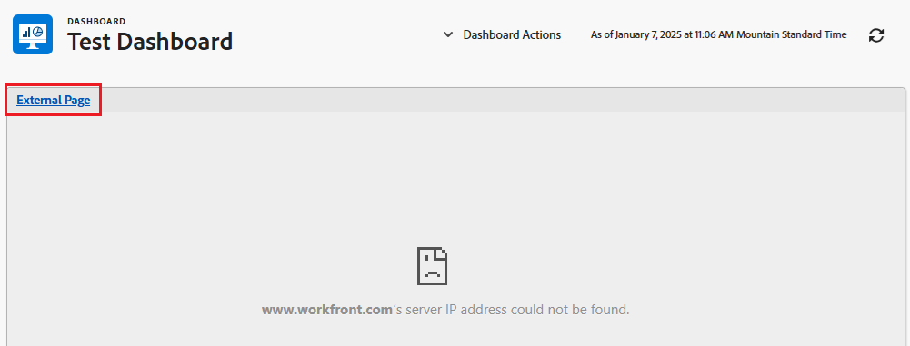
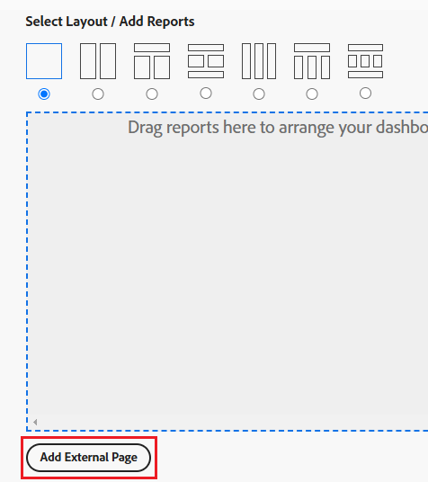
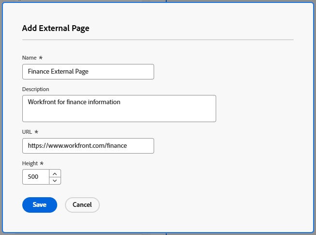
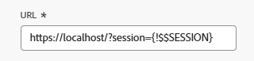
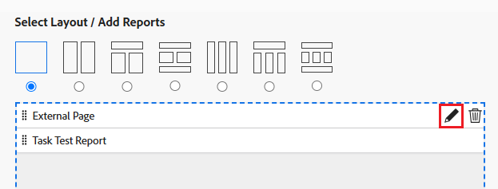
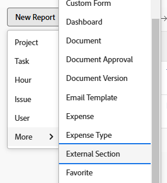

# Embed an external web page in a dashboard

<!--Audited: 01/2024-->

You can embed an external web page in a dashboard to provide access to related information from other systems or from within Adobe Workfront.

For example, if your organization has a web-based document repository, wiki, or other content management system that contains project information that is regularly accessed through a URL, you can display that information into Workfront by creating an external page on a dashboard.

>[!IMPORTANT]
>
>* For security reasons, some websites do not allow you to embed web pages as an iframe. If the web page you want to embed in a dashboard does not allow this, the page does not display in the dashboard. However, you can still access the external page by clicking the name of the dashboard.  
>  
>To allow embedding for a website you own, work with your web administrator to adjust the **X-Frame-Options** setting. For more information, see [X-Frame-Options](https://developer.mozilla.org/en-US/docs/Web/HTTP/Headers/X-Frame-Options).
>
>
>* Dashboard pages are no longer supported as embeded external pages in Dashboards. While existing dashboards will not be automatically modified to remove these external pages, any modification to a dashboard that includes such a reference will not be able to be saved until the reference is removed or changed.
> Specifically, the following Workfront.com subdomains are no longer supported:
>
>     * /dashboards​
>     * /dashboard/:ID​
>     * /portfolio/:ID/content-dashboard__:dashboardID​
>     * /program/:ID/content-dashboard__:dashboardID​
>     * /project/:ID/content-dashboard__:dashboardID​
>     * /task/:ID/content-dashboard__:dashboardID​
>     * /template/:ID/content-dashboard__:dashboardID​
>     * /templatetask/:ID/content-dashboard__:dashboardID​
>     * /resourcemanagement/:ID/
>     * content-dashboard__:dashboardID​
>     * /team/:ID/content-dashboard__:dashboardID​
>     * /iteration/:ID/content-dashboard__:dashboardID​
>     * /requests/:ID/content-dashboard__:dashboardID​
>     * /group/:ID/content-dashboard__:dashboardID​
>     * /billingrecord/:ID/content-dashboard__:dashboardID
>
>As an alternative solution, consider including a list report in your dashboard as explained in [Add a report to a Dashboard](/help/quicksilver/reports-and-dashboards/dashboards/creating-and-managing-dashboards/add-report-dashboard.md)

## Access requirements

+++ Expand to view access requirements for the functionality in this article.

You must have the following:

<table style="table-layout:auto"> 
 <col> 
 <col> 
 <tbody> 
  <tr> 
   <td role="rowheader"><strong>Adobe Workfront plan</strong></td> 
   <td> 
Any
 </td> 
  </tr> 
  <tr> 
   <td role="rowheader"><strong>Adobe Workfront license*</strong></td> 
   <td> 
Current: Plan 

   Or
   
New: Standard 
 </td> 
  </tr> 
  <tr> 
   <td role="rowheader"><strong>Access level configurations</strong></td> 
   <td> 
Edit access to Reports, Dashboards, and Calendars
 </td> 
  </tr> 
  <tr> 
   <td role="rowheader"><strong>Object permissions</strong></td> 
   <td> </td> 
  </tr> 
 </tbody> 
</table>

*To find out what plan, license type, or access you have, contact your Workfront administrator. For more information, see [Access requirements in Workfront documentation](/help/quicksilver/administration-and-setup/add-users/access-levels-and-object-permissions/access-level-requirements-in-documentation.md). 

+++

## Prerequisites

You must create a dashboard before you can embed an external page in it.

For information on creating dashboards, see [Create a dashboard](../../../reports-and-dashboards/dashboards/creating-and-managing-dashboards/create-dashboard.md).

## Embed an external page in a dashboard

>[!IMPORTANT]
>
>You can remove an External Page from a dashboard if it's no longer needed. However, you cannot delete an external page after it is created in Workfront. You can delete an external page only using the API. For more information, see [Remove an External Page from a dashboard](../../../reports-and-dashboards/dashboards/creating-and-managing-dashboards/remove-external-page-from-dashboard.md).

1. Locate the URL of the page to display in Workfront and copy the URL located in the address bar.

   >[!NOTE]
   >
   >If you are sharing URLs to Workfront objects, remember that some URLs expire over time. For example, document URLs expire after they have been opened. This is configured as a security measure, and by design they are considered as non-static URLs and should not be shared.

{{step1-to-dashboards}}

1. To edit an existing dashboard, select the dashboard you want to embed the website page in, then click **Dashboard Actions**, then click **Edit**
   Or  
   To create a new dashboard, click **New Dashboard**.  
   For more information about creating a dashboard, see [Create a dashboard](../../../reports-and-dashboards/dashboards/creating-and-managing-dashboards/create-dashboard.md).

1. Click **Add External Page** under the **Select Layout/ Add Reports/ Add Calendars** area.

   

   The **Add External Page** box displays. 

1. Specify the following information about the external page: 

   * **Name**: Add a name for the dashboard. 
   * **Description**: Add more information about the dashboard to identify the information it contains. The description displays on the dashboard for everyone who has access to view it, after you save it. 
   * **URL**: Paste the URL you copied earlier in this field. 
   
      You can specify the following types of URLs:

      * An https (encrypted) URL to a web page.  
     Only https (encrypted) pages load with the URL.  
     

      * A template URL that contains session information for a specific website.  
     For example: *https://localhost/?session={!$$SESSION}* 
     You must be logged into the specified website to display the External Page.  
     For information about how to obtain a SessionID from Workfront, see [API basics](../../../wf-api/general/api-basics.md).  
     Your Workfront administrator may configure your system preferences in a way that does not allow the use of session information in your external pages, for security reasons. In this case, the external page does not load on the dashboard.  
     For more information about system security preferences, see [Configure system security preferences](../../../administration-and-setup/manage-workfront/security/configure-security-preferences.md).  
     

      >[!WARNING]
      >
      >Using the SessionID is insecure and not recommended.
      >

   * **Height**: Type a number greater than 0 to define the space that the external page occupies on the dashboard. The default height is 500. 

1. Click **Save**.  

   The page is automatically added to the dashboard. 
   
   If you create additional dashboards, you can find this external page and add it to other dashboards. You can find all existing external pages in the list of Available Reports & Calendars when creating or editing a dashboard.

   <!--
    *** This is linked to: Creating Dashboards, and Editing Dashboards.
   -->

## Update an external page in a dashboard

To update the information for an external page used in a dashboard:

{{step1-to-dashboards}}

1. Click the name of the dashboard that you want to update to open it, and click **Dashboard Actions**, then **Edit**.

   The **Dashboard Details** box opens.

1. In the **Select Layout / Add Reports / Add Calendars** area of the **Dashboard Details** box, locate the external page you want to update, hover over it, and click the **Edit** icon.  
   

1. In the **Edit External Page** box, update the fields you want to change, then click **Save**.
1. (Optional) Click the **Delete** icon  to remove the external page from the dashboard. For more information, see [Remove an External Page from a dashboard](../../../reports-and-dashboards/dashboards/creating-and-managing-dashboards/remove-external-page-from-dashboard.md). 
1. Click **Save + Close**.

## View external pages in a report

You can view all external pages in Workfront in an External Page report.

{{step1-to-reports}}

1. Click **New Report** > select **External Page**.

   

1. (Optional) Update the View, Filters, or Groupings tabs of the report.

   For more information, see [Create a custom report](../../../reports-and-dashboards/reports/creating-and-managing-reports/create-custom-report.md). 

1. Click **Save+Close**.

   You can view the name and the URL associated with the external pages in your system in the new report.

   
