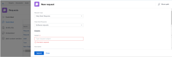
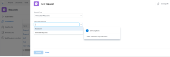
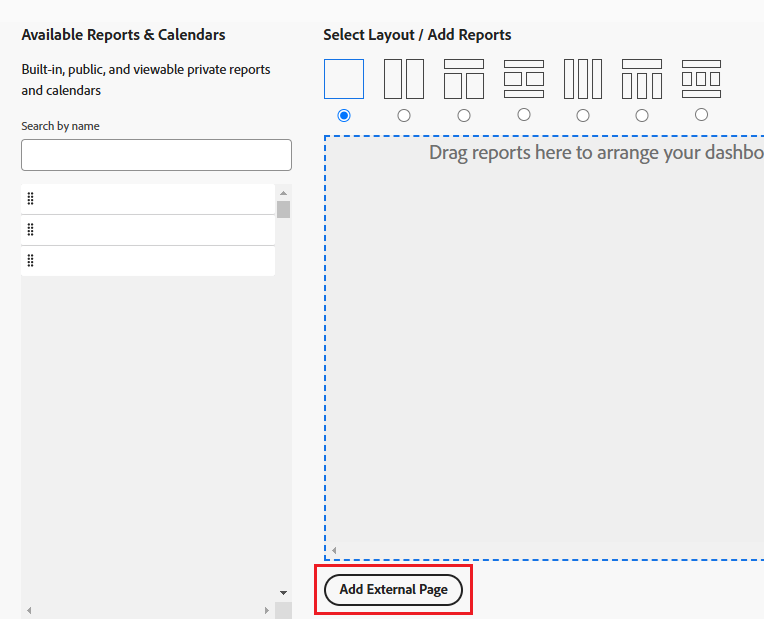

# Embed a request queue in a dashboard

<!-- Audited: 1/2025 -->

You can embed a new request queue in a dashboard to provide direct access to the request queue to your users, without having to go to the Requests area.

For example, if you have a request queue that is open to your entire organization, like a Help Desk Queue, or a PTO Request queue that everyone must access on a regular basis, it might be convenient to insert the request queue directly into one of their dashboards for quick and easy access. The process of setting this up is similar to that of creating an external page on a dashboard.

First, you need to obtain a URL to the request queue. Secondly, you can embed the URL into a dashboard by adding an external page.

## Access requirements

+++ Expand to view access requirements for the functionality in this article. 

<table style="table-layout:auto"> 
 <col> 
 <col> 
 <tbody> 
  <tr> 
   <td role="rowheader">Adobe Workfront package</td> 
   <td> 
Any
 </td> 
  </tr> 
  <tr> 
   <td role="rowheader">Adobe Workfront license</td> 
   <td> 
      
Standard

      
Plan

   </td> 
  </tr> 
  <tr> 
   <td role="rowheader">Access level configurations</td> 
   <td> 
Edit access to Reports, Dashboards, and Calendars
</td> 
  </tr>  
  <tr> 
   <td role="rowheader">Object permissions</td> 
   <td> 
Manage permissions to the dashboard
 </td> 
  </tr> 
 </tbody> 
</table>

For more detail about the information in this table, see [Access requirements in Workfront documentation](/help/quicksilver/administration-and-setup/add-users/access-levels-and-object-permissions/access-level-requirements-in-documentation.md).

+++

## Prerequisites

Both of the following must be created before you can embed a request queue in a dashboard:

* **The dashboard**: For information on creating dashboards, see [Create a dashboard](../../../reports-and-dashboards/dashboards/creating-and-managing-dashboards/create-dashboard.md).

* **The request queue**: For information on creating request queues, see [Create a Request Queue](../../../manage-work/requests/create-and-manage-request-queues/create-request-queue.md)

## Obtain the URL of the request queue {#obtain-the-url-of-the-request-queue}

You can obtain the URL of a request queue in multiple ways, depending on what portion of the request queue you want to expose to the users when they access it from a dashboard.

* [Obtain a link to a specific queue topic with ability to change the request type](#obtain-a-link-to-a-specific-queue-topic-with-ability-to-change-the-request-type) 

* [Obtain a link to a request queue and ability to change the request type](#obtain-a-link-to-a-request-queue-and-ability-to-change-the-request-type) 

* [Obtain a link to a request queue with no ability to change the request type](#obtain-a-link-to-a-request-queue-with-no-ability-to-change-the-request-type)

### Obtain a link to a specific queue topic with ability to change the request type {#obtain-a-link-to-a-specific-queue-topic-with-ability-to-change-the-request-type}

When you share a link to a specific queue topic with other users, the request form opens at the exact queue topic that they need to use to submit the request. This is helpful when users might not be sure which queue topic to choose when logging requests for a specific request queue.

Users can change the request type or choose another topic if they need to. The navigation of the Requests area also displays.

1. Click the **Main Menu** > **Requests** > **New Request**. 
1. Continue selecting topic groups and queue topics until you reach the queue you want to share on the dashboard, if you want to share specific queue. For information about submitting requests, see [Create and submit Adobe Workfront requests](../../../manage-work/requests/create-requests/create-submit-requests.md).

   >[!TIP]
   >
   >Selecting topic groups and queue topics is optional.

1. Click **Share path** in the upper-right corner of the New Request area.

   This copies the link to the request queue or the queue topic as you display it on the screen. Users can update the Request Type or any of the topic groups and queue topics available.

   

### Obtain a link to a request queue and ability to change the request type {#obtain-a-link-to-a-request-queue-and-ability-to-change-the-request-type}

When you share a link to a request type, the request type is selected for the user. This is helpful when users need to choose from multiple topic groups or queue topics for the same request type. Users can change the request type and choose another one. The navigation of the Requests area also displays.

1. Go to a project designated as a request queue.

   For information about creating a request queue from a project, go to [Create a Request Queue](../../../manage-work/requests/create-and-manage-request-queues/create-request-queue.md). 

1. Go to **Queue Details**.
1. Copy the code that you find in the **Direct Access URL** field.

   The code should look similar to the following:

   `https://<yourdomain>.my.workfront.com/requests/new?activeTab=tab-new-helpRequest&projectID=50062d6f000849c95ab3513c0e84a51e&path=`
   
   This is the link to the request queue associated with the selected project. The Request Type is preselected.

   Users can select any topic group or queue topic they need, or they can choose another request type.

   

### Obtain a link to a request queue with no ability to change the request type {#obtain-a-link-to-a-request-queue-with-no-ability-to-change-the-request-type}

When you share a link to a preselected request type, the request type is selected for the user and cannot be changed (it is dimmed). Users can choose the topic groups or queue topics they need. This is helpful when you do not want users to view and select other request types. The navigation of the Requests area does not display.

1. Go to a project designated as a request queue.

   For information about creating a request queue from a project, go to [Create a Request Queue](../../../manage-work/requests/create-and-manage-request-queues/create-request-queue.md). 

1. Go to **Queue Details**.
1. Copy the code that you find in the **Embedded Code** field.

   The code should look similar to the following:

   `<iframe src="https://<yourdomain>my.workfront.com/requests/newRequestEmbedded?projectID=612518c7000404462d3bc9a0bc09fa71" frameborder="0" width="500" height="600"></iframe>`

1. Edit the code to preserve only the information below:

   `https://<yourdomain>.my.workfront.com/requests/newRequestEmbedded?projectID=612518c7000404462d3bc9a0bc09fa71`

   >[!TIP]
   >
   >You can add a `<samp>iframe </samp>` tag when embedding the code in an application other than Workfront.

   This is the link to the request queue associated with the selected project. The Request Type is preselected and cannot be changed.

   Users can select any topic group or queue topic they need for the selected request type. Users cannot select another request type.

   

## Embed a request queue in a dashboard

You can embed a link to the requests queue or to a queue topic nested under a request queue into a dashboard to give users direct access to entering requests.

1. Obtain a request queue URL using one of the methods described in the [Obtain the URL of the request queue](#obtain-the-url-of-the-request-queue) section of this article. 

1. Click the **Main Menu** > **Dashboards** > **New Dashboard**.

1. Type a **Name** for the dashboard. This is a required field.

1. Click **Add External Page**.

   

1. In the **Add External Page** box, edit the following fields:

   * **Name**: enter the name of the request queue as you want it to appear on the dashboard. This is a required field.

   * **Description**: enter a description about that this external page displays. This is not a required field and it is important only for reporting purposes. It does not display in the dashboard.

   * **URL**: paste the URL that you obtained using one of the methods described in Step 1. 
   
   * **Height**: enter the height of the external page. This defines how much space the external page containing the request queue occupies on the dashboard. This is a required field and the default value is 500.

1. Click **Save**. 

1. Click **Save + Close**.

   The request queue displays in the dashboard as a separate dashboard component.

1. (Optional) Click **Dashboard Actions**, then **Edit** to add reports, calendars, or additional external pages to the same dashboard.

   For information about adding components to a dashboard, see [Create a dashboard](../../../reports-and-dashboards/dashboards/creating-and-managing-dashboards/create-dashboard.md).

<!--
<ol data-mc-conditions="QuicksilverOrClassic.Draft mode">
<li value="1"> 
Click the <strong>Main Menu</strong> > Requests >&nbsp;<strong>New Request</strong>. 
 </li>
<li class="preview" value="2" data-mc-conditions="QuicksilverOrClassic.Quicksilver"> 
Continue entering the request.&nbsp;For information about submitting requests, see <a href="../../../manage-work/requests/create-requests/create-submit-requests.md" class="MCXref xref">Create and submit Adobe Workfront requests</a>. 
 </li>
<li value="3"> 
Select the <strong>Request Type</strong> for the queue you would like added to the dashboard.
 </li>
<li value="4"> 
(Optional) Select a Queue Topic and a Topic Group. Depending on how the project manager set up the request queue, the names of these fields are different in each Workfront instance.
 </li>
<li class="preview" value="5" data-mc-conditions="QuicksilverOrClassic.Quicksilver"> 
Click <strong>Share path</strong> to obtain a shared link from the request queue you want to embed on a dashboard.
 
For information about sharing a request queue, see <a href="../../../manage-work/requests/create-requests/share-link-to-request-queue.md" class="MCXref xref">Share a link to a request queue</a>
 </li>
<li value="6"> 
For example, enter a URL similar to one of the following: 
 </li>
</ol>
-->
