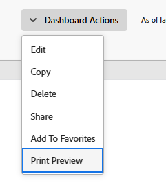

# Export a dashboard

<!-- Audited: 1/2025 -->

You can export a dashboard to a .pdf file using the print options available in your web browser.

>[!NOTE]
>
>When you print content from a webpage, formatting of the content can be affected.  
>For example, the header of a report in a dashboard may be cut off from the rows in a report list.

## Access requirements

+++ Expand to view access requirements for the functionality in this article. 

You must have the following:

<table style="table-layout:auto"> 
 <col> 
 <col> 
 <tbody> 
  <tr> 
   <td role="rowheader"><strong>Adobe Workfront plan</strong></td> 
   <td> 
Any
 </td> 
  </tr> 
  <tr> 
   <td role="rowheader"><strong>Adobe Workfront license</strong></td> 
    <td> 
      
New:

         <ul>
         <li>
Standard
</li>
         </ul>
      
Current:

         <ul>
         <li>
Work or higher
</li>
         </ul>
   </td>
  </tr> 
  <tr> 
   <td role="rowheader"><strong>Access level configurations</strong></td> 
   <td> 
View access to Reports, Dashboards, and Calendars
 </td> 
  </tr> 
  <tr> 
   <td role="rowheader"><strong>Object permissions</strong></td> 
   <td> 
View permissions to the dashboard
 </td> 
  </tr> 
 </tbody> 
</table>

For information, see [Access requirements in Workfront documentation](/help/quicksilver/administration-and-setup/add-users/access-levels-and-object-permissions/access-level-requirements-in-documentation.md). 

+++

## Prerequisites

The dashboard must be created before you can export it.

For information on creating dashboards, see [Create a dashboard](../../../reports-and-dashboards/dashboards/creating-and-managing-dashboards/create-dashboard.md).

## Export a dashboard to a .pdf file:

1. Go to the dashboard you want to export.
1. Click **Dashboard actions**, then select **Print Preview**.

   

   The Print Preview window opens.

1. Click **Print**, then select the appropriate print options based on your web browser to complete the .pdf. file export:

   <table style="table-layout:auto"> 
    <col> 
    <col> 
    <thead> 
     <tr> 
      <th>Web browser</th> 
      <th>Print dialog selections</th> 
     </tr> 
    </thead> 
    <tbody> 
     <tr> 
      <td>Google Chrome</td> 
      <td> 
       <ol> 
        <li value="1">In the <strong>Destination</strong> field, select <strong>Save as PDF</strong>, then modify any other print options you want to change.</li> 
        <li value="2">Click <strong>Save</strong>.</li> 
        <li value="3">(Optional) Edit the <strong>File name</strong>, then select a new folder destination for the file.</li> 
        <li value="4">Click <strong>Save</strong> to save the .pdf file to your hard drive.  </li> 
       </ol> </td> 
     </tr> 
     <tr> 
      <td>Internet Explorer, Microsoft Edge, and Mozilla Firefox</td> 
      <td> 
Note: If you're using Internet Explorer version 11, you may not be able to use Print to PDF functionality without installing a third-party plugin.
 
       <ol> 
        <li value="1">In the <strong>Printer</strong> or <strong>Select Printer</strong> field, select <strong>Microsoft Print to PDF</strong>, then modify any other print options you want to change.</li> 
        <li value="2">Click <strong>Print</strong>.</li> 
        <li value="3">Enter a <strong>File name</strong></li> 
        <li value="4">(Optional) Select a new folder destination for the file.</li> 
        <li value="5">Click <strong>Save</strong>.</li> 
       </ol> </td> 
     </tr> 
     <tr> 
      <td>Safari</td> 
      <td> 
       <ol> 
        <li value="1">In the bottom-left corner, click the drop-down arrow, then select <strong>Save as PDF</strong>.</li> 
        <li value="2">Enter a <strong>File name</strong>.</li> 
        <li value="3">(Optional) Modify other print options you want to change, including selecting a new folder destination for the file.</li> 
        <li value="4">Click <strong>Save</strong>.</li> 
       </ol> </td> 
     </tr> 
    </tbody> 
   </table>
