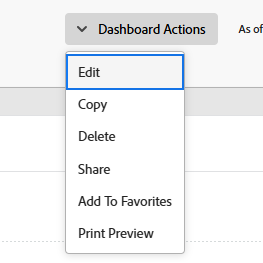
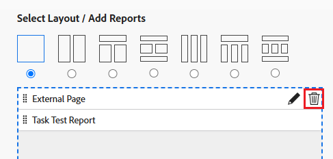

# Remove an External Page from a dashboard

<!-- Audited: 1/2025 -->

You can remove an External Page from a dashboard if it's no longer needed.

However, you cannot delete an external page after it is created in Adobe Workfront. You can delete an external page only using the API. For information about the Workfront API, see [API basics](../../../wf-api/general/api-basics.md). For information about creating external pages, see [Embed an external web page in a dashboard](../../../reports-and-dashboards/dashboards/creating-and-managing-dashboards/embed-external-web-page-dashboard.md).

## Access requirements

+++ Expand to view access requirements for the functionality in this article. 

You must have the following:

<table style="table-layout:auto"> 
 <col> 
 <col> 
 <tbody> 
  <tr> 
   <td role="rowheader"><strong>Adobe Workfront plan</strong></td> 
   <td> 
Any
 </td> 
  </tr> 
  <tr> 
   <td role="rowheader"><strong>Adobe Workfront license</strong></td> 
   <td> 
      
New:

         <ul>
         <li>
Standard
</li>
         </ul>
      
Current:

         <ul>
         <li>
Plan
</li>
         </ul>
   </td> 
  </tr> 
  <tr> 
   <td role="rowheader"><strong>Access level configurations</strong></td> 
   <td> 
Edit access to Reports, Dashboards, Calendars
 </td> 
  </tr> 
  <tr> 
   <td role="rowheader"><strong>Object permissions</strong></td> 
   <td> 
Manage permissions to the dashboard
 </td> 
  </tr> 
 </tbody> 
</table>

For information, see [Access requirements in Workfront documentation](/help/quicksilver/administration-and-setup/add-users/access-levels-and-object-permissions/access-level-requirements-in-documentation.md). 

+++

## Remove an external page from a dashboard

1. Go to the dashboard thatcontains the external page you want to delete.

1. Click **Dashboard Actions**, then click **Edit**.

   

1. On the right side of the screen, locate the external page you want to remove and click the **Delete** icon .

   

1. Click **Save + Close** in the lower-left corner.

   This removes the external page from the selected dashboard. The external page remains in Workfront and can be accessed from a report. For information, see the "View external pages in a report" section in the article [Embed an external web page in a dashboard](../../../reports-and-dashboards/dashboards/creating-and-managing-dashboards/embed-external-web-page-dashboard.md).
