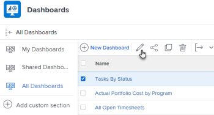

# Remove an External Page from a dashboard

You can remove an External Page from a dashboard if it's no longer needed.

However, you cannot delete an external page after it is created in Adobe Workfront. You can delete an external page only using the API. For information about the Workfront API, see [API basics](../../../wf-api/general/api-basics.md). For information about creating external pages, see [Embed an external web page in a dashboard](../../../reports-and-dashboards/dashboards/creating-and-managing-dashboards/embed-external-web-page-dashboard.md).

## Access requirements

You must have the following access to perform the steps in this article:

<table style="table-layout:auto"> 
 <col> 
 <col> 
 <tbody> 
  <tr> 
   <td role="rowheader">Adobe Workfront plan*</td> 
   <td> 
Any
 </td> 
  </tr> 
  <tr> 
   <td role="rowheader">Adobe Workfront license*</td> 
   <td> 
Plan 
 </td> 
  </tr> 
  <tr> 
   <td role="rowheader">Access level configurations*</td> 
   <td> 
Edit access to Reports, Dashboards,&nbsp;Calendars
 
Note: If you still don't have access, ask your Workfront administrator if they set additional restrictions in your access level. For information on how a Workfront administrator can modify your access level, see <a href="../../../administration-and-setup/add-users/configure-and-grant-access/create-modify-access-levels.md" class="MCXref xref">Create or modify custom access levels</a>.
 </td> 
  </tr> 
  <tr> 
   <td role="rowheader">Object permissions</td> 
   <td> 
Manage permissions to the dashboard
 
For information on requesting additional access, see <a href="../../../workfront-basics/grant-and-request-access-to-objects/request-access.md" class="MCXref xref">Request access to objects </a>.
 </td> 
  </tr> 
 </tbody> 
</table>

&#42;To find out what plan, license type, or access you have, contact your Workfront administrator.

## Remove an external page from a dashboard

1. Click the **Main Menu** icon , then click **Dashboards**. 
1. Select the dashboard from which you want to remove the external page, then click **Edit** .

   

1. On the right side of the screen, locate the external page you want to remove and click the **Delete** icon .

   

1. Click **Save + Close** in the lower-left corner.

   This removes the external page from the selected dashboard. The external page remains in&nbsp;Workfront and can be accessed from a report.&nbsp;For information, see the "View external pages in a report" section in the article [Embed an external web page in a dashboard](../../../reports-and-dashboards/dashboards/creating-and-managing-dashboards/embed-external-web-page-dashboard.md).

